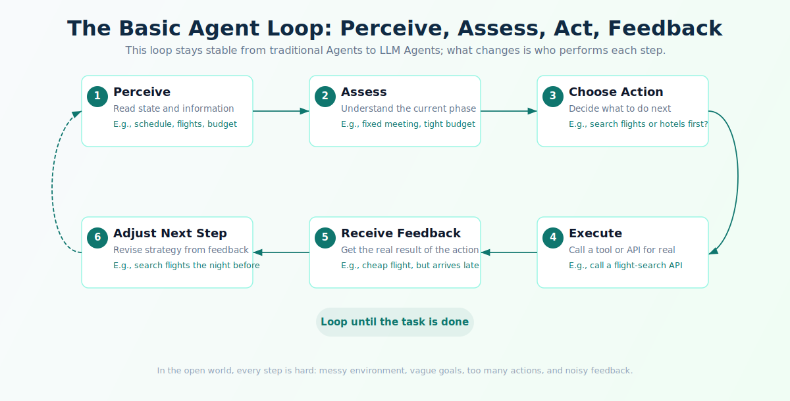

# Lesson II: The Evolution of the Agent Paradigm

## Course Introduction

One of the easiest mistakes to make when learning Agents is to start by asking, "How do I use this framework?" That question quickly throws you into a pile of terms: Tool Use, Function Calling, RAG, Memory, ReAct, Planning, Multi-Agent. Each term sounds important, but it is hard to see how they relate to one another, when you need them, and when they only add complexity.

A better way to learn is to reverse the question:

```text
First ask what problem the system ran into, then ask why a new capability appeared.
```

For example:

- Tool calling did not appear because "models should be able to call APIs." It appeared because applications moved from "answer a question" to "complete a task," and a model that can only talk cannot actually do the work.
- ReAct is important not because it introduced the words Thought, Action, and Observation, but because it put reasoning and action into the same loop: judgment affects action, and action results revise judgment.
- Error correction and reflection did not appear because "the model should check itself." They appeared because errors in multi-step tasks propagate through dependency chains, and a model's internal reasoning cannot replace external verification.
- Planning and Multi-Agent did not appear because they sound advanced. They appeared because long tasks drift, and one agent that owns every role quickly becomes unmanageable.

This lesson is the paradigm layer of the course. Its goal is to help you build judgment. When you see a new Agent technique or product, you should be able to ask:

- Which old problem is it trying to solve?
- What capability does it add to the system?
- Which tasks become easier because of it?
- What new problems does it introduce?

With that mindset, Lesson III will be easier to understand. A minimal Agent needs LLM decision-making, tool interaction, state management, and loop control not because the architecture is fashionable, but because a "smarter model" alone does not solve the whole problem.

This lesson mentions representative papers, research teams, and product milestones, but not to memorize a timeline. Each milestone is placed back into the problem that made it necessary: why the problem became urgent, what the new approach improved, and what new burden it left for later Agent runtimes.

---

## Learning Objectives

By the end of this lesson, you will be able to:

1. **Explain why traditional Agents did not become mainstream in everyday applications**: the core bottleneck was the tension between rule modeling and open-ended environments.
2. **Describe how LLMs changed the decision core of Agents**: the shift from hand-written rules to models that understand goals and make dynamic decisions.
3. **Explain why tool calling emerged**: LLMs can "say" but cannot "do," so Toolformer, Plugins, Function Calling, and MCP connect models to the external world.
4. **Explain why ReAct is a classic framework for understanding Agent loops**: the Thought -> Action -> Observation loop moves Agents from one-shot answers to continuous task execution.
5. **Understand the evolution of error correction and reflection**: distinguish model-internal reasoning from system-external feedback, and explain why correction cannot rely only on self-evaluation.
6. **Explain why Planning and Multi-Agent appeared**: complex tasks need decomposition and division of labor, but each paradigm brings new engineering problems.

---

## Contents

- [Course Introduction](#course-introduction)
- [Learning Objectives](#learning-objectives)
- [Chapter 1: Agents Existed Long Before LLMs, So Why Did They Take Off Now?](#chapter-1-agents-existed-long-before-llms-so-why-did-they-take-off-now)
  - [1.1 How Would You Build a System That Gets Things Done Without an LLM?](#11-how-would-you-build-a-system-that-gets-things-done-without-an-llm)
  - [1.2 The Basic Agent Problem Has Not Changed](#12-the-basic-agent-problem-has-not-changed)
  - [1.3 Where Decisions Come From: RL, Software Agents, BDI, and Classic Agent Types](#13-where-decisions-come-from-rl-software-agents-bdi-and-classic-agent-types)
  - [1.4 Traditional Agents Work in Closed Environments, but Struggle to Scale to Open Tasks](#14-traditional-agents-work-in-closed-environments-but-struggle-to-scale-to-open-tasks)
  - [1.5 Open-Ended Language Tasks Need a New Decision Core](#15-open-ended-language-tasks-need-a-new-decision-core)
- [Chapter 2: The LLM as Decision Core: When Rules Run Out, the Model Judges the Next Step](#chapter-2-the-llm-as-decision-core-when-rules-run-out-the-model-judges-the-next-step)
  - [2.1 The Agent Decision Core Changed](#21-the-agent-decision-core-changed)
  - [2.2 Let the LLM Understand Goals and Judge the Next Step](#22-let-the-llm-understand-goals-and-judge-the-next-step)
  - [2.3 From Fixed Workflows to Dynamic Decisions](#23-from-fixed-workflows-to-dynamic-decisions)
  - [2.4 Being Able to Judge Does Not Mean Being Able to Execute Reliably](#24-being-able-to-judge-does-not-mean-being-able-to-execute-reliably)
- [Chapter 3: Tool Calling: When the Model Can Talk but Cannot Act](#chapter-3-tool-calling-when-the-model-can-talk-but-cannot-act)
  - [3.1 LLMs Can Talk, but They Cannot Act](#31-llms-can-talk-but-they-cannot-act)
  - [3.2 Answering Must Be Connected to External Capability](#32-answering-must-be-connected-to-external-capability)
  - [3.3 Toolformer: Teaching the Model to Use Tools](#33-toolformer-teaching-the-model-to-use-tools)
  - [3.4 ChatGPT Plugins: Turning "AI Can Do Things" into a Product Experience](#34-chatgpt-plugins-turning-ai-can-do-things-into-a-product-experience)
  - [3.5 Function Calling: The Engineering Interface for Tool Use](#35-function-calling-the-engineering-interface-for-tool-use)
  - [3.6 MCP: A Standardization Attempt for Tool Connections](#36-mcp-a-standardization-attempt-for-tool-connections)
  - [3.7 Tool Calling Is a System Mechanism, Not Just an API Call](#37-tool-calling-is-a-system-mechanism-not-just-an-api-call)
- [Chapter 4: ReAct: When Reasoning and Action Need to Enter the Same Loop](#chapter-4-react-when-reasoning-and-action-need-to-enter-the-same-loop)
  - [4.1 One-Shot Answers Cannot Handle Tasks That Change While You Work](#41-one-shot-answers-cannot-handle-tasks-that-change-while-you-work)
  - [4.2 Reasoning and Acting Evolved Separately for a Long Time](#42-reasoning-and-acting-evolved-separately-for-a-long-time)
  - [4.3 ReAct Puts Judgment and Action into One Loop](#43-react-puts-judgment-and-action-into-one-loop)
  - [4.4 Agents Got a Minimal Operating Pattern](#44-agents-got-a-minimal-operating-pattern)
  - [4.5 The Loop Itself Must Be Managed](#45-the-loop-itself-must-be-managed)
- [Chapter 5: Error Correction and Reflection: When the System Needs to Know It Is Wrong](#chapter-5-error-correction-and-reflection-when-the-system-needs-to-know-it-is-wrong)
  - [5.1 Why "Think More" Is Not Enough](#51-why-think-more-is-not-enough)
  - [5.2 Two Layers: Model-Internal Reasoning and System-External Feedback](#52-two-layers-model-internal-reasoning-and-system-external-feedback)
  - [5.3 How Errors Propagate and Grow in Multi-Step Tasks](#53-how-errors-propagate-and-grow-in-multi-step-tasks)
  - [5.4 Put Feedback Mechanisms into the Runtime](#54-put-feedback-mechanisms-into-the-runtime)
  - [5.5 Self-Refine and Reflexion: Reflection Becomes an Agent Capability](#55-self-refine-and-reflexion-reflection-becomes-an-agent-capability)
  - [5.6 From One-Shot Generation to Iterative Improvement](#56-from-one-shot-generation-to-iterative-improvement)
  - [5.7 Correction Must Not Become Self-Comfort](#57-correction-must-not-become-self-comfort)
- [Chapter 6: Planning: When the Task Is Too Long for One-Step-at-a-Time Decisions](#chapter-6-planning-when-the-task-is-too-long-for-one-step-at-a-time-decisions)
  - [6.1 Complex Tasks Are Dependency Chains, Not One-Step Answers](#61-complex-tasks-are-dependency-chains-not-one-step-answers)
  - [6.2 Without a Plan, Agents Drift into Local Optima](#62-without-a-plan-agents-drift-into-local-optima)
  - [6.3 From CoT and ToT to Plan-and-Execute](#63-from-cot-and-tot-to-plan-and-execute)
  - [6.4 Plans Make Long Tasks Progressable, Checkable, and Acceptable](#64-plans-make-long-tasks-progressable-checkable-and-acceptable)
  - [6.5 Plans Need Execution, Inspection, and Replanning](#65-plans-need-execution-inspection-and-replanning)
- [Chapter 7: Multi-Agent: When One Agent Owns Everything, It Owns Nothing Well](#chapter-7-multi-agent-when-one-agent-owns-everything-it-owns-nothing-well)
  - [7.1 One Agent Quickly Becomes a Giant Do-Everything System](#71-one-agent-quickly-becomes-a-giant-do-everything-system)
  - [7.2 Complex Tasks Need Role, Context, and Tool Boundaries](#72-complex-tasks-need-role-context-and-tool-boundaries)
  - [7.3 Role Division, Manager-Worker Structures, and Expert Collaboration](#73-role-division-manager-worker-structures-and-expert-collaboration)
  - [7.4 Capability Scales and Tasks Can Run in Parallel](#74-capability-scales-and-tasks-can-run-in-parallel)
  - [7.5 Collaboration Creates Its Own Complexity](#75-collaboration-creates-its-own-complexity)
- [Chapter 8: A Map of Agent Paradigm Evolution](#chapter-8-a-map-of-agent-paradigm-evolution)
  - [8.1 The Main Evolution Line in One Diagram](#81-the-main-evolution-line-in-one-diagram)
  - [8.2 How to Analyze a New Agent Technology](#82-how-to-analyze-a-new-agent-technology)
  - [8.3 Common Misunderstandings](#83-common-misunderstandings)
- [Exercises](#exercises)
- [Acceptance Criteria](#acceptance-criteria)
- [References](#references)

---

## Chapter 1: Agents Existed Long Before LLMs, So Why Did They Take Off Now?

"Agent" is not a word invented in the LLM era. Long before ChatGPT, researchers in AI and software engineering were already asking the same question: how can a system perceive its environment, make decisions, take actions, and adjust based on results?

If you stretch the history of Agents over a longer period, it does not look like a brand-new concept. It looks more like a technical route that kept replacing its engine. Early Agents relied on rules, state machines, reinforcement learning policies, or BDI mental models. The change after LLMs was not that someone finally "thought of Agents." The change was that systems could, for the first time, hand the job of understanding natural-language goals to a general model.

That history matters because it answers a question many learners ask:

```text
If the basic Agent problem has existed for so long, why did Agents take off only now?
```

The answer is hidden in the limits of traditional Agents.

### 1.1 How Would You Build a System That Gets Things Done Without an LLM?

Imagine a time before LLMs.

You want to build an "automatic business travel assistant." It should arrange flights and hotels based on your calendar, budget, preferences, and company policy.

The system has to handle at least these questions:

- When are you leaving?
- Which flights fit the budget?
- How far is the hotel from the meeting location?
- What price range does the reimbursement policy allow?
- Does the user prefer convenience, low price, or low fatigue?

Without an LLM, engineers have to write rules in advance:

```text
If the meeting starts before 10 a.m., prefer arriving the previous night.
If the flight price exceeds the budget by more than 20%, ask the user to confirm.
If the hotel is more than 3 km from the meeting location, lower its ranking.
...
```

When the rule set is small, this can work. But the fragility is obvious. Once requirements become complicated, rules expand quickly. If the user says, "I do not want the trip to be exhausting, but do not make it too expensive either," the system struggles, because "exhausting" and "too expensive" are not simple fixed fields.

That is the core dilemma of traditional Agents:

```text
The system needs to reason around goals like a person, but engineering forces the world into explicit rules and states.
```

Those two things naturally conflict. Human goals are vague, contextual, and subject to change. Rule systems require every path to be defined in advance. This is not caused by lazy engineers. It is the fundamental tension between rule-driven systems and open-ended language goals.

### 1.2 The Basic Agent Problem Has Not Changed

With or without LLMs, the basic Agent problem is stable. You can summarize it as a loop:



The loop looks simple. In an open real-world setting, every step becomes hard:

- The environment state is complex. Which information is relevant to the current goal?
- The user's goal is vague. What exactly does "not too exhausting" mean?
- There are too many possible actions. Should the system check flights first, hotels first, or company policy first?
- Feedback is not always clear. A flight is cheaper but arrives late. Is that good or bad?

Traditional Agent research tried to formalize these things: translate the messy world into structures that a system can process. Different eras gave different answers, but they all ran into the same ceiling.

### 1.3 Where Decisions Come From: RL, Software Agents, BDI, and Classic Agent Types

Traditional Agents include several important lines of thought. They are not isolated concepts. They are different answers to the same question:

```text
If the system must make decisions by itself, where does the basis for those decisions come from?
```

Here is a compressed map:

| Route | Decision Basis | Suitable Scenarios | Bottleneck |
|---|---|---|---|
| Reinforcement Learning Agents | Learn policies through trial and reward signals | Games, robot control, recommendation policies | Reward functions are hard to design; everyday user tasks cannot tolerate massive trial-and-error |
| Software Agents | Prewritten triggers, rules, and actions | Email filtering, monitoring alerts, enterprise workflow automation | The environment must be narrow and rules must be explicit in advance |
| BDI Model | Belief / Desire / Intention | Closed systems that organize behavior around goals | World state, goals, and plan space must be manually modeled |
| Classic Agent Types | Reflex, model-based, goal-based, utility-based, learning Agents | Building a conceptual map of the Agent problem | The classification is useful, but it does not solve open-language understanding |

These routes are valuable because they surfaced the core Agent problem: a system must perceive the environment, represent state, choose actions, receive feedback, and improve its strategy. That problem framing is still valid today.

But they share one assumption:

```text
The world can be modeled, the action space can be enumerated, and the feedback signal can be defined.
```

Once the task becomes "help me organize this project," "figure out why the service has become slow lately," or "give me a travel plan that is not too exhausting," traditional approaches hit the same bottleneck: the user's goal is expressed in open language, while the system demands clear states, rules, and rewards.

### 1.4 Traditional Agents Work in Closed Environments, but Struggle to Scale to Open Tasks

This does not mean traditional Agents failed. They work very well in many closed environments:

- **Games**: state, actions, and rewards are relatively clear. AlphaGo can beat the strongest human players on a 19x19 board.
- **Industrial control**: sensors, controllers, and feedback signals are clearly defined. A temperature-control system does not need to understand natural language.
- **Enterprise automation**: processes are stable and rules can be written in advance. An approval flow in an ERP system does not need to improvise.
- **Operations scripts**: triggers and actions are often fixed. "If CPU is above 90%, add one machine."

Everyday user tasks are different. A user may say:

```text
Help me figure out why this project has been slow lately.
```

Behind that sentence there may be code, logs, databases, network requests, product changes, deployment environments, and user behavior. You cannot write all the rules in advance. Worse, the user may not fully know what "slow" means: longer response time, a page that freezes, lower throughput, or slower developer workflow?

So the core limit of traditional Agents is not that they have "no intelligence." In their own domains, they can be extremely capable. Their limit is this:

```text
They struggle to understand open-ended language goals at low cost and turn those goals into executable decisions.
```

You can imagine a traditional Agent as an excellent chess program. It is powerful inside the board. But once the board is removed, it no longer knows what to do. Its intelligence is locked inside rules and strategies that do not transfer well to open tasks.

### 1.5 Open-Ended Language Tasks Need a New Decision Core

Traditional Agents left behind an important question, one that was almost impossible to answer before LLMs:

```text
If the user's goal cannot be fully converted into rules, what should the Agent's decision core be?
```

Before LLMs, engineers had only a few options: write more rules, train a domain-specific model, or narrow the task scope. Each path avoided the real demand: users wanted a general decision-maker that could understand natural-language goals.

LLMs changed the situation. They gave systems much stronger natural-language understanding, common-sense reasoning, and task interpretation. This does not mean LLMs are perfect. They have many problems, and we will discuss them throughout this course. But their arrival changed the core Agent question from:

```text
How do we write all the rules?
```

to:

```text
How do we let the model judge the next step from the goal and context?
```

That may sound like a wording change, but its engineering meaning is fundamental. "Write the rules" asks engineers to predict all situations in advance. "Let the model judge" lets the system handle tasks that engineers did not predefine. The first approach is closed and deterministic but weak in open environments. The second is open and flexible, but it introduces a new set of engineering challenges.

---

## Chapter 2: The LLM as Decision Core: When Rules Run Out, the Model Judges the Next Step

### 2.1 The Agent Decision Core Changed

LLMs did not make all Agent problems disappear. They changed the most important layer: the decision core.

Chapter 1 explained the central bottleneck of traditional Agents: open-language goals are hard to prewrite as rules. Chapter 2 asks the next question:

```text
If the rules cannot cover everything, can the system hand "understand the goal and judge the next step" to the model?
```

After GPT-3 in 2020, few-shot learning showed that models could understand task formats. Chain-of-Thought later showed that models could handle more complex problems through intermediate reasoning. At that point, LLMs were no longer only answer generators. They began to look like a usable general decision core: able to understand goals, interpret context, and attempt to judge what should happen next.

This does not mean the model is always right. Quite the opposite: models often judge incorrectly, and Agent engineering exists largely to manage those failures. The shift is in the decision mechanism itself:

| Dimension | Traditional System | LLM Agent |
|---|---|---|
| Goal understanding | Depends on predefined fields and intent labels | Understands natural-language goals directly |
| Next-step choice | Determined by process or rule | Judged by the model based on context |
| Task coverage | Narrow and stable | More open and general |
| Failure mode | Rule does not cover the case, so the system fails directly | Model misjudges, hallucinates, or behaves unstably |
| Engineering focus | Write rules and workflows | Manage context, tools, state, and control boundaries |

So an LLM is not just a stronger chatbot. It gives Agents a chance to move from **rule-driven** to **goal-driven** behavior. The difference is like the difference between a vending machine and a human assistant: the first responds only to predefined buttons; the second can understand a natural request, even though it may occasionally misunderstand.

But this only solves half the problem. A model may judge that the next step is "check the logs," but that does not mean it can actually check logs. It may judge that an order system should be queried, but that does not mean it has permission, an interface, or a way to feed the execution result back. The next evolution step is moving from "can judge" to "can act." That is tool calling.

### 2.2 Let the LLM Understand Goals and Judge the Next Step

In an LLM Agent, the model usually takes on several responsibilities. Understanding them helps you locate exactly where the LLM sits in an Agent system.

#### Goal Understanding

Users do not always give precise task descriptions. The model has to turn vague intent into an actionable goal.

For example:

```text
User: This project is a bit messy. Help me clean it up.
```

The model has to infer that this might mean:

- Inspect the directory structure.
- Find duplicate or obsolete files.
- Understand the main modules.
- Suggest a cleanup plan.
- Ask for confirmation before modifying files.

This requires common sense, an understanding of what "messy" means in a software project, and an ability to map "clean up" to file-system-level actions. The model may not guess perfectly, but it can at least begin moving in the right direction instead of rejecting the request as undefined.

#### Context Interpretation

An Agent does not only read the user's latest sentence. It also sees current files, conversation history, tool results, error logs, and task progress. The model must combine this information into a judgment about the current state.

This is much harder than answering a single question. In answer mode, the model only needs the user's question and its own knowledge. In Agent mode, it has to track a changing information space and decide which pieces matter for the next decision.

#### Next-Step Decision

The central Agent question is always:

```text
What should happen now?
```

The next step might be to answer the user, read another file, call a search tool, run a test, ask for confirmation, or stop. The quality of this decision determines whether the Agent can finish the task. More importantly, the decision is contextual: the model has to consider what it has seen, what it has already done, and what is still missing.

#### Result Interpretation

Tool results are rarely the final answer. The model has to interpret them and decide whether they are enough to support the next step.

For example, when a test fails, the model must determine whether the failure is a syntax error, an assertion failure, a missing environment dependency, or an outdated test. Each failure type requires a different follow-up action.

### 2.3 From Fixed Workflows to Dynamic Decisions

LLMs make many tasks productizable that were previously difficult to express as fixed workflows.

For example:

```text
Research the latest trends in this industry.
```

An Agent might:

1. Break down the question. What are the key dimensions of this industry?
2. Search for sources. Which sources are credible?
3. Judge source quality. Is this analysis data-backed or just opinion?
4. Read pages and extract key facts.
5. Synthesize views across sources.
6. Notice missing information and search again.
7. Generate a report.

This is not a fully fixed process. Different search results lead to different next steps. If information is insufficient, the Agent should continue. If sources conflict, the Agent should compare them and judge credibility.

This is the core difference between an LLM Agent and a normal workflow:

```text
Workflow fits tasks with stable steps: you know A -> B -> C is correct.
Agent fits tasks with a clear goal but an uncertain path: you know where you want to go, but the route may change.
```

The choice should not depend on whether "Agent sounds more advanced." It should depend on the task. If the steps are predictable, a workflow is often more reliable, faster, and cheaper. An Agent's advantage is not that it looks smart. Its advantage is that it can handle tasks where the path is not fully known in advance.

### 2.4 Being Able to Judge Does Not Mean Being Able to Execute Reliably

Once the LLM becomes the decision core, new hard problems appear immediately:

| New Problem | What It Looks Like | Capability Needed Later |
|---|---|---|
| Missing facts | The model does not know real-time information, private data, or current system state | Tool calling, RAG, database connections |
| No ability to act | The model can only output text, not execute real tasks | Tool Use, Function Calling |
| Unstable state | In a multi-step task, it forgets what happened earlier | State, Memory, Trace |
| Uncontrolled loops | It keeps searching, repeats tool calls, or never stops | Loop control, stop conditions |
| Error propagation | A wrong earlier step becomes the basis for later steps | Correction, reflection, evaluation, guardrails |
| Risky actions | The model may delete files, send messages, or exceed permissions | Permission, human-in-the-loop |

These problems cannot be summarized as "the model is not smart enough." Even a very smart model is not a useful Agent if it cannot access current data, execute actions, or remember what happened in previous steps.

This idea will run through the rest of the course:

```text
The LLM is the decision core of an Agent, but it is not the whole Agent system.
```

A good decision core is necessary, but far from sufficient. The Agent runtime must handle tool connections, state management, loop control, error handling, and safety boundaries. The rest of this lesson shows how those pieces entered the Agent paradigm.

> If you are wondering what "runtime" means, keep this intuition for now: **the runtime is like the Agent's operating system. The model makes decisions; the runtime manages execution.** Lesson III will define it more precisely.

---

## Chapter 3: Tool Calling: When the Model Can Talk but Cannot Act

Tool calling was the first Agent capability to become clearly engineered. Its motivation is direct: **the model is good at talking, but it cannot do anything by itself.**

That sounds simple. Just connect a few APIs, right? But tool calling affects much more than API integration. It defines the relationship between the model and the external world, the boundary between decision and execution, and how tools are discovered, described, called, monitored, and governed.

### 3.1 LLMs Can Talk, but They Cannot Act

Early LLMs were like intelligent people with no hands.

You could say:

```text
Help me find out why the tests in this project are failing.
```

The model might answer:

```text
You should run the test command, inspect the error logs, and locate the related files.
```

The advice may be correct, but it is advice, not action. The model did not actually run tests or read logs. The same applies to order lookup, flight booking, and data analysis: knowing what should be done is not the same as touching the real system.

This separation between thought and action was the biggest bottleneck for LLM applications. A company wants to use an LLM for customer service, but it cannot check order status. A user wants an assistant, but it cannot book a flight. An analyst wants insights, but the model cannot read real-time data.

Tool calling addresses that gap:

```text
Users do not only want "tell me how to do it." They want "do it for me within controlled boundaries."
```

### 3.2 Answering Must Be Connected to External Capability

The knowledge stored in an LLM's parameters has several natural limits, and bigger models do not erase them:

- **It is not real-time**: after training, the world keeps changing. The model does not automatically know the latest events, inventory, or order status.
- **It is not private**: the model does not know your company's database, project files, or internal documents unless the system gives it access.
- **It is not precise execution**: the model can describe a calculation, but doing arithmetic through text generation is like replacing a calculator with mental math.
- **It does not change the world**: text output does not automatically send email, edit files, create tickets, or call business systems.

An Agent system therefore needs a clear split:

```text
The model understands the goal and judges the next step.
Tools fetch facts, execute actions, and return results.
```

This boundary matters. **The model should not pretend that it queried a database, ran code, or checked an API.** It should generate a tool-call request. The runtime executes the real action and returns the result. This is an architectural issue, not a matter of trust. Let the model do semantic understanding and decision-making; let deterministic systems handle execution and permission control.

### 3.3 Toolformer: Teaching the Model to Use Tools

Once people understood that LLMs needed external capabilities, the direct engineering approach was to write external rules: tell the model what tools exist and when to call them. That raised a new question:

```text
Is tool use merely an external rule imposed on the model, or can the model learn it as a behavior?
```

This question has practical consequences. If a model can call tools only because a prompt forces it to, tool use is fragile. Change the prompt, scenario, or model version, and behavior may change. If the model can learn when it needs a tool, tool use becomes a more stable internalized capability.

Meta AI's Toolformer, released in February 2023, moved in this direction. Instead of starting with a full tool platform, it asked: can a model learn when to insert API calls, how to construct arguments, and how to continue generation after seeing results?

Toolformer's key insight was:

```text
Tool use can also be a language pattern.
```

The self-supervised process can be simplified into three steps:

1. Let the model generate candidate API calls inside text.
2. Execute the API and check whether the result improves prediction of the following text.
3. Keep useful call examples and fine-tune the model on them.

This proved an important point:

```text
Tool use is not only a capability bolted onto the model by an external system. It can also become a learned behavior pattern.
```

That is important for Agents because the model itself must often decide whether it needs external information or can answer directly. But Toolformer was more of a research paradigm than a developer interface. It did not solve permissions, failure handling, tool trust, or high-risk action confirmation. Those problems continued into product and API layers.

### 3.4 ChatGPT Plugins: Turning "AI Can Do Things" into a Product Experience

Toolformer answered a research question: can a model learn tool use? Product builders faced a more urgent question:

```text
How do ordinary users experience AI as something that can do work, not just answer?
```

Users quickly moved from "answer my question" to "complete my task": search current news, find flights and hotels, order food, read a knowledge base, run calculations, call third-party services. In March 2023, OpenAI released ChatGPT Plugins, bringing external capabilities into the mainstream chat interface and changing the public intuition that LLMs were only chat tools.

A plugin exposed two kinds of information:

- **A model-facing capability description**: what the plugin can do and when it is appropriate.
- **A system-facing interface description**: available APIs, parameters, and authentication.

This let the model "see" available tools in a conversation and request tool calls when needed. Early plugin forms included browsing, code interpretation, retrieval, and third-party service plugins.

Plugins changed the public intuition:

```text
AI is no longer only generating text. It can connect to the external world.
```

That opened a door for the whole Agent field. Users and developers saw the combined power of model + tools in one chat entry point. But Plugins also exposed engineering problems: tool descriptions must be accurate, calls need permission boundaries, users need visibility into external access, and third-party tools introduce privacy, authorization, and supply-chain risks.

Plugins later stopped being the only form of tool integration. Their historical importance is that they brought "LLM connected to the outside world" into large-scale product experience.

### 3.5 Function Calling: The Engineering Interface for Tool Use

Plugins proved the product experience of "AI can do things," but they were tied to the ChatGPT plugin ecosystem. Developers needed a lower-level and more stable interface to connect their own functions, databases, internal systems, and external APIs to LLM applications.

For example, in your own application you may want the model to create orders, extract structured fields from text, query a database, call a CRM system, or trigger an internal workflow. That requires something more controllable than a plugin store.

In June 2023, OpenAI introduced Function Calling in the API. Compared with Plugins, it was closer to **interface standardization**. Developers could declare function names, descriptions, parameter schemas, and execution logic in their own applications. The model would then generate structured call requests.

The basic flow is:

```text
Developer defines the tool name, description, and parameter schema
    -> Model decides whether to call the tool based on the user goal
    -> Model generates structured arguments, usually JSON
    -> Runtime validates the arguments
    -> Runtime executes the real function or API
    -> Tool result returns to the model
    -> Model decides the next step or produces the final answer
```

One design choice is crucial:

```text
The model does not execute the function directly. It generates a structured intent to call it.
```

Execution happens inside the developer's system.

Why? Because of truth and safety:

- Model output is unreliable. It may calculate parameters incorrectly, invent a nonexistent order ID, or name a function that does not exist.
- Letting the model "pretend" to execute removes the chance for external verification.
- Keeping execution in the developer's system means database results are real, dangerous actions can be permissioned, and every tool call can be monitored and audited.

This expresses a core engineering philosophy:

```text
The model decides what to do; the runtime executes how to do it.
```

That division lets the LLM focus on semantic understanding and decision-making, while deterministic systems handle exact execution. Almost every later Agent framework inherits this principle.

Function Calling turned tool use from a product feature into a developer interface. But it did not remove complexity. Developers still have to handle schema design, argument validation, retry logic, tool-result trust, permission control, high-risk action confirmation, traces, and evaluation.

### 3.6 MCP: A Standardization Attempt for Tool Connections

After Function Calling addressed how a model expresses a tool call, engineering teams quickly hit the next problem:

```text
Every model provider, application, and tool server has its own connection format.
```

That is like a world where every electrical device has a different plug. It slows down the ecosystem. If developers use multiple model providers, they maintain multiple tool-description formats. If they want an Agent to connect to many tools and data sources, they write integration code for each one.

At the end of 2024, Anthropic released **MCP (Model Context Protocol)** to address a more fundamental question: how can Agents connect to arbitrary data sources and tools without a custom integration every time?

MCP was inspired by **LSP (Language Server Protocol)**. LSP lets any editor support many programming languages through a standard client-server protocol. Editors do not need to implement every language feature themselves; language servers follow the protocol. MCP aims to give Agents a similar client-server architecture for tools and data sources.

MCP defines standardized models such as Resources, Prompts, and Tools. Its goal is to make tool and data-source connections more portable across hosts and ecosystems. It represents an important shift. Tool calling has moved beyond:

```text
Can the model call a function?
```

and toward:

```text
How are tools discovered, described, authorized, called, logged, and governed?
```


### 3.7 Tool Calling Is a System Mechanism, Not Just an API Call

Tool calling moves LLMs from "can talk" to "can act," but it immediately creates new engineering problems:

| New Problem | What It Looks Like | Later Lesson |
|---|---|---|
| Tool definition | The model misunderstands what a tool can do or where its boundary is | Lesson IV |
| Tool selection | It fails to use a tool, uses one unnecessarily, or picks the wrong one | Lesson IV |
| Argument generation | Wrong types, missing required fields, invented objects | Lesson IV |
| Execution failure | API timeout, permission denied, oversized result, external service error | Lesson IV / VI |
| Safety | Wrong deletion, unauthorized query, wrong message sent, real-world side effect | Lesson IV / VI / VII |
| Observability | Users and developers cannot see why the model called a tool | Lesson VI / VII |

It is useful to break tool calling into three subproblems:

1. **Tool selection**: when 100 tools are available, how does the Agent choose the right one? This is a balance between semantic matching and efficiency.
2. **Argument filling**: the Agent has to infer function arguments from conversation context and tool descriptions. Some arguments may be missing and require a follow-up question.
3. **Tool composition**: complex tasks often require several tools in sequence, such as search -> analyze -> write report -> send email. At that point, tool use begins to overlap with planning.

Tool calling solves the problem that LLMs cannot act. It does not solve when to act or how to continue after acting. That brings us to ReAct.

---

## Chapter 4: ReAct: When Reasoning and Action Need to Enter the Same Loop

If you had to choose one highly influential paper in the Agent field, many researchers would point to ReAct. Its importance is not that it introduced an elaborate theory. Its importance is that it joined two lines that had often been studied separately: **the model reasons in text, and it keeps revising its judgment through environment feedback.**

ReAct is a classic framework for understanding Agent execution loops. Its core is not a specific API or product name. It is an operating pattern:

```text
Reasoning + Acting
```

Reasoning and action are interleaved so that each feeds the other.

In October 2022, Google Research and Princeton released *ReAct: Synergizing Reasoning and Acting in Language Models*. Its contribution was to combine two capabilities that already existed separately: step-by-step reasoning from Chain-of-Thought, and external interaction through actions or tools. ReAct did not invent reasoning or acting. It made them feed each other in one loop.

### 4.1 One-Shot Answers Cannot Handle Tasks That Change While You Work

Consider this request:

```text
Find out why the tests in this project are failing.
```

A model that only gives one-shot answers may say:

```text
You should run the tests, inspect the error logs, and check the related code.
```

That is advice, not problem solving. The model is guessing instead of interacting with real state.

A system that only calls tools but does not reason may mechanically do this:

```text
Run tests -> print a long log -> stop
```

It gets information, but it does not judge which file matters next or explain the cause. It is an executor with no understanding.

Real tasks require a loop:

1. Judge what information is missing.
2. Act to obtain that information.
3. Observe the result.
4. Revise the judgment based on the new information.
5. Continue until the system can answer or should stop.

This cannot be "think everything first, then act," and it cannot be "act blindly, then analyze." It must be alternating, dynamic, and adjusted after each result.

### 4.2 Reasoning and Acting Evolved Separately for a Long Time

ReAct is not an isolated prompting trick. It stands at the intersection of two capability lines.

The first line was **reasoning**: let the model analyze a problem in text, write intermediate steps, and then answer. Chain-of-Thought is the representative work.

The second line was **acting**: let the model output an action or call a tool to obtain information from an external environment.

This separation made sense in early research. Reasoning work asked whether the model could think through a problem. Acting work asked whether the model could interact with the outside world. But once Agent tasks appeared, each line revealed its limit.

#### Reasoning: From Direct Answer to Intermediate Steps

The early pattern was:

```text
Question -> Answer
```

This works for simple questions. But for multi-step tasks, the model may skip important steps, assume something false, and still produce a fluent answer.

Chain-of-Thought changed the pattern:

```text
Question -> Intermediate steps -> Answer
```

This lets the model decompose complex problems into smaller judgments. It improves performance on math, commonsense reasoning, symbolic reasoning, and some complex QA tasks.

But CoT still happens inside text. A model can write a beautiful reasoning chain while never checking whether the tests really fail, whether the latest webpage says something different, whether an API is currently available, or whether a file actually exists.

So reasoning helps the model think, but it does not answer:

```text
How do the model's thoughts get verified against the real environment?
```

#### Acting: From Tool Calls to External Reality

The other line moved from the opposite direction. If text-only reasoning is not enough, let the model touch the external world.

Tool calling, plugins, and Function Calling moved LLMs from "generate text only" toward "request actions":

```text
User goal -> Model decides to call a tool -> Runtime executes the tool -> Result returns
```

This was critical. The model can search the web, query databases, run code, read files, and call business APIs. It no longer has to say "you should run tests"; the system can actually run them.

But action alone is not an Agent. After a tool returns, the system must still decide:

- What does this result mean?
- Is it enough to answer the user?
- Should the next step be more investigation, a different tool, a user question, or stopping?
- What should happen if the tool fails, returns nothing, or conflicts with another source?

If a system only acts, it is just someone pressing buttons without understanding why.

#### Why the Two Lines Must Merge

An Agent task is neither pure reasoning nor pure acting.

For "find out why the tests are failing," the process may look like:

```text
Reason: I need to know where the failure occurs.
Act: Run tests.
Observe: The error points to auth/session.spec.ts.
Reason: This may involve session expiration logic.
Act: Read the implementation file.
Observe: expiresAt uses seconds, while the test passes milliseconds.
Reason: Now the root cause can be explained.
```

Each step depends on the previous result. Reasoning chooses the next action. Action results revise the next reasoning step. You cannot plan every step upfront because external results have not arrived. You also cannot call a batch of tools blindly because results must be interpreted.

ReAct's key insight is to translate this human problem-solving rhythm into an LLM-executable protocol:

```text
Let judgment trigger action. Let action results return to context. Let new context change the next judgment.
```


### 4.3 ReAct Puts Judgment and Action into One Loop

A simplified ReAct process looks like this:

```text
Thought: I need to know where the test failure is.
Action: RunTests["npm test"]
Observation: Two tests failed. The error points to auth/session.spec.ts.

Thought: The error may involve session expiration. I should read the implementation.
Action: ReadFile["src/auth/session.ts"]
Observation: expiresAt uses seconds, but the test passes milliseconds.

Thought: I can now explain the root cause and suggest a fix.
Final Answer: The test fails because the timestamp units are inconsistent...
```

There are three key parts:

- **Thought** expresses the current judgment: why this action, what is known, and what is missing.
- **Action** lets the model affect the environment or obtain external information.
- **Observation** brings tool results back into context so the next judgment can change.

Products do not always show Thought to users. What matters is that the system has an internal structure like this:

```text
Model judges next step -> Tool executes -> Result is fed back -> Model continues judging
```

The deeper meaning is that the model is no longer reasoning on an island. It reasons while interacting with the external world. Every observation may change its direction; every judgment may trigger a new action. That is what turns an LLM from an answering machine into a problem-solving system.

### 4.4 Agents Got a Minimal Operating Pattern

ReAct matters not because every product must print Thought text, but because it clearly shows the **minimal operating pattern** that separates an Agent from a chatbot:

```text
Judge next step -> Call a tool or act -> Receive observation -> Judge again -> Stop
```

This is the minimal loop we will implement in Lesson III.

You can think of ReAct as the Agent's minimal behavior grammar. It is not a production system. Production systems need state management, error handling, loop control, permission boundaries, and user interaction. But ReAct makes the runtime's responsibilities visible, just as grammar does not make you a writer but is still necessary for writing.

ReAct's meaning can be summarized as:

- It puts reasoning, action, and observation into one loop.
- It lets the Agent adjust based on external feedback instead of continuing blindly.
- It gives a prototype for the minimal runtime loop.
- It exposes the next engineering problem: the loop itself has to be managed.

### 4.5 The Loop Itself Must Be Managed

ReAct is a paradigm, not a production system. It gives a loop structure but does not define its boundaries.

It raises several later problems:

| Problem | Explanation | Later Lesson |
|---|---|---|
| Stop condition | When should the Agent finish? How does it know enough is enough? | Lesson III / VI |
| Loop control | What if it keeps calling the same tool or circles around the same issue? | Lesson III / VI |
| Tool failure | How should the loop handle timeouts, errors, or irrelevant results? | Lesson IV / VI |
| Context growth | Observations keep accumulating until the context window fills up | Lesson VI |
| State management | Which information enters the next decision? Which only goes into logs? | Lesson III / VI |
| User control | Should high-risk actions require confirmation? Can the user redirect mid-task? | Lesson IV / VII |

One challenge runs through all of these:

```text
When one step in the loop is wrong, how does the system detect and correct it?
```

ReAct gives the skeleton, but the skeleton does not correct itself. Thought can be wrong, Action can fail, Observation can be incomplete. That leads to error correction and reflection.

---

## Chapter 5: Error Correction and Reflection: When the System Needs to Know It Is Wrong

ReAct gives an Agent an action loop, but the loop does not guarantee correctness. In multi-step tasks, errors are normal: the model may misunderstand the goal, a tool may return an unexpected result, external information may conflict with internal knowledge, and the user may change requirements mid-task.

This chapter does not ask whether the model can "think again." It asks a deeper question:

```text
How does the system know it is wrong, and how does it turn that discovery into a useful correction?
```

We will start from why model-internal reasoning is not enough, then build a two-layer reliability framework, then explain the evolution from Self-Refine to Reflexion. The core principle is simple: correction must rely on real signals, not self-comfort.

### 5.1 Why "Think More" Is Not Enough

Suppose an Agent needs to modify code. It reads a file, proposes a change, and edits the code.

If the model misunderstands the requirement in the first step, such as interpreting "optimize performance" as "simplify the code," everything later may build on the wrong understanding. The more confidently it proceeds, the further it moves in the wrong direction.

You might think:

```text
Then let the model think for more steps.
```

That can help, but it is not enough. Many errors cannot be found by thinking longer:

- Whether code really compiles requires running a compiler.
- Whether tests pass requires running tests.
- Whether an API is available requires an actual call.
- Whether a database query is correct requires connecting to the real database.
- Whether a user accepts a plan requires user confirmation.

Model-internal reasoning cannot replace external verification. This is not just a model-quality problem. It is an information problem. **The model can reason only from information it has; some information exists only through interaction with the external world.**

### 5.2 Two Layers: Model-Internal Reasoning and System-External Feedback

Distinguishing these two layers is central to Agent reliability.

**Model-internal reasoning** means the model handles complexity before generating an answer or decision: breaking down steps, comparing paths, and noticing local contradictions. It happens during generation and uses context plus the model's learned knowledge. It is fast, flexible, and general. Its limit is that it can be internally consistent but externally wrong.

**System-external feedback** means the runtime collects signals outside the model to decide whether a result is actually usable. It uses tool results, validators, compilers, tests, and user feedback. It is closer to the real world and more reproducible. Its cost is engineering work: tests, validators, monitors, and feedback channels must be built.

| Dimension | Model-Internal Reasoning | System-External Feedback |
|---|---|---|
| Where it happens | During model generation | Inside the Agent runtime |
| Based on | Context and model capability | Tool results, validators, tests, user feedback |
| Strength | Fast, flexible, general | Verifiable, reproducible, closer to reality |
| Limit | Can be logically coherent but factually wrong | Requires engineering design and cost |
| Examples | CoT, ToT, model self-review | Compiler errors, failing tests, schema validation, user rejection |

A reliable Agent needs both layers. Only relying on internal reasoning creates confident errors. Only relying on external feedback gives the system no ability to understand goals and make tradeoffs. The key is to place external checkpoints where the model is likely to be wrong.

### 5.3 How Errors Propagate and Grow in Multi-Step Tasks

In multi-step tasks, an error does not just sit still. It propagates and grows along the dependency chain.

Imagine an Agent writing a competitor analysis:

- First, it confuses information from Company A and Company B.
- Then it builds a feature comparison on top of that confusion.
- Then it gives product recommendations based on the wrong comparison.
- The final report looks structured and persuasive, but the core facts are wrong.

The problem is not grammar or formatting. It is this:

```text
An error flows through a dependency chain, and each step's output becomes the next step's input.
```

The more carefully later steps reason from a bad premise, the more dangerous the result becomes. The same happens in code tasks: read the requirement wrong -> edit the wrong file -> run incomplete tests -> mistake a symptom for the root cause -> fix one issue while introducing another.

Without correction mechanisms, an Agent walks forward without knowing that the first step was already off course.

### 5.4 Put Feedback Mechanisms into the Runtime

To stop error propagation, the system must add verifiable feedback mechanisms to the runtime. These mechanisms do not depend on whether the model "feels right." They use external signals to constrain the model.

Common feedback signals include:

| Feedback Mechanism | Purpose | Boundary |
|---|---|---|
| Schema validation | Check fields, types, and enum values; block malformed structured output | Proves format validity, not semantic correctness |
| Tool execution feedback | Return real results, error codes, timeout, permission errors, empty results | Feedback must be specific; "failed" alone is not useful |
| Tests and validators | Use compilers, tests, and rules to judge whether output is usable | Quality depends on coverage |
| User confirmation | Require human approval for deletion, sending, payment, production config | Adds interaction cost, but handles real-world risk |
| Model self-review or evaluator model | Check omissions, contradictions, quality, or use a separate model for evaluation | Useful as auxiliary signal, not a replacement for external verification |

The most important principle is:

```text
The model saying "fixed" does not count. A verifiable signal must say the result is usable.
```

For code, passing tests is more credible than the model's explanation. For business actions, permissions and user confirmation matter more than confidence. For tool calls, real return values are more reliable than remembered API documentation.

### 5.5 Self-Refine and Reflexion: Reflection Becomes an Agent Capability

Feedback signals answer what signals can be used. The next question is:

```text
How do we organize those signals into a systematic correction process inside the Agent loop?
```

Self-Refine and Reflexion, both from 2023, answered this at two different scales.

**Self-Refine** focuses on improving one output. The model first generates a draft, then plays a critic role to identify problems, then rewrites using the critique. Its value is separating creation from criticism, which is more effective than the vague instruction "check your answer." Its limit is also clear: if the model has a systematic blind spot, the same model in a critic role may still miss it.

**Reflexion** places reflection inside the Agent loop:

```text
Task -> Reasoning -> Action -> Observation -> Reflection -> Memory -> Next reasoning step
```

It lets the Agent analyze why the previous step succeeded or failed, what lesson should be remembered, and how that lesson should influence the next attempt. The Agent does not start from zero every time; it accumulates experience within the task.

The two ideas are not competitors. Self-Refine is closer to "make this answer better." Reflexion is closer to "let the execution process learn as it goes." Together, they pushed a shift from one-shot generation toward runtime improvement.

### 5.6 From One-Shot Generation to Iterative Improvement

With correction and reflection mechanisms, an Agent can handle more uncertainty in real tasks. It no longer has to hand in the first output. It can iterate based on feedback.

For code repair:

```text
Edit code -> Run tests -> Tests fail -> Analyze failure -> Adjust strategy -> Run again -> ...
```

For report writing:

```text
Generate draft -> Check required dimensions -> Notice missing pricing data -> Search again -> Update report -> ...
```

This shift matters. The Agent moves from a generator to an improver. Each failure narrows the problem space. Each correction moves closer to a usable result. The system is no longer merely trusting the model; it is using real signals to constrain it.

### 5.7 Correction Must Not Become Self-Comfort

Correction sounds attractive, but it can fail if feedback signals are weak. Common traps include:

- **Over-optimistic self-review**: the model defends its own answer instead of challenging it.
- **Vague evaluation standards**: each revision moves in a different direction and never converges.
- **Incomplete tool feedback**: the tool only says "failed," so the model cannot tell whether to change tools, change arguments, or change strategy.
- **Insufficient test coverage**: passing tests does not mean untested problems do not exist.
- **Endless revision**: the Agent always thinks it can improve and never delivers.
- **Goal drift**: a bug fix becomes a broad refactor because the correction loop loses the original target.

The point is not to reflect more. The point is to reflect at the right time, on the right problem, with the right signal.

Future Agent runtimes will rely more on combined observable signals:

```text
model reflection + tool verification + test feedback + user confirmation + trace observability
```

No single signal is enough. Only cross-checking multiple signals lets the system distinguish real errors from unnecessary self-doubt.

Correction makes each step of the Agent loop more reliable. But it does not answer a different question: when the task itself is long and steps depend on one another, is next-step judgment enough? ReAct is good at choosing the next action from the current observation. But if a task has a dozen steps and step 3 determines whether step 7 is possible, "walk and see" will drift. That is the problem Planning addresses.

---

## Chapter 6: Planning: When the Task Is Too Long for One-Step-at-a-Time Decisions

Planning and reflection solve different dimensions of the same Agent loop. Reflection makes single-step decisions more reliable. Planning makes multi-step paths more controllable. Together they answer this question:

```text
How can a ReAct-style loop avoid losing control on large tasks?
```

### 6.1 Complex Tasks Are Dependency Chains, Not One-Step Answers

Suppose you ask an Agent:

```text
Research three competitors, compare their positioning, features, pricing, and growth strategy, then give recommendations for our product.
```

If the Agent starts searching directly in ReAct mode, several failures are likely:

- It researches the first competitor in depth because that information is easiest to find, then starts writing conclusions too early.
- It collects many facts but never defines consistent comparison dimensions.
- It forgets pricing or growth strategy and focuses only on features.
- It loses track of which source supports which claim.
- The conclusion disconnects from the research and becomes impression-based.

This is not because the model cannot write. The task itself has structure:

```text
Choose competitors -> Define comparison dimensions -> Collect sources -> Organize facts -> Compare horizontally -> Make recommendations
```

Each step depends on the previous one. If comparison dimensions are not defined before research, the collected facts will not compare cleanly. If facts are not organized before conclusions, the recommendations will be weak.

### 6.2 Without a Plan, Agents Drift into Local Optima

ReAct is good at dynamic exploration, but for long tasks with complex dependencies, pure next-step judgment has typical failure modes.

#### Local Optimum

The Agent sees information that is easy to handle and over-focuses on it, forgetting the larger goal.

#### Missing Constraints

Long tasks contain multiple requirements. Later steps may forget some of them. A user asks for positioning, features, pricing, and growth strategy; the final answer discusses only features and pricing because those were easiest to find.

#### Wrong Step Order

Some tasks require standards before research, impact analysis before code changes, and scope before execution. If the order is wrong, earlier work may be wasted.

#### Hard to Accept

Without a plan, it is hard to know what has been done, what remains, and when the task is complete. The Agent may continue forever or stop too early.

Planning's core value is:

```text
Build the task structure first, then execute.
```

That "first" matters. Planning is cheaper than execution. Changing an outline takes minutes; rewriting a finished draft can take hours. In Agent systems, spending tokens on structure early can avoid much larger execution waste later.

### 6.3 From CoT and ToT to Plan-and-Execute

The evolution of Planning can be seen in three steps: first make the model write intermediate reasoning, then let it compare multiple reasoning paths, then separate planning and execution into runtime roles.

**Chain of Thought** addresses "do not jump straight to the answer." It gives complex reasoning a scaffold, but still usually follows one path. If the first step is wrong, later steps may complete the wrong path more convincingly.

**Tree of Thoughts** addresses "there is not only one path." At key points, it generates multiple candidate steps, evaluates them, chooses promising branches, and can backtrack. This improves exploration but increases model calls and cost.

**Plan-and-Execute** moves Planning from prompt technique to runtime structure. Many systems introduce a division:

```text
Planner: creates the task plan.
Executor: executes each step and returns results.
```

For the competitor research task, a plan might be:

```text
Plan:
1. Identify three major competitors.
2. For each competitor, collect official pages, pricing pages, and recent news.
3. Organize facts by positioning, features, pricing, and growth strategy.
4. Compare competitors horizontally and mark gaps.
5. Give recommendations for our product.
```

The Planner owns the global structure and dependencies. The Executor focuses on doing the current step well. They do not need to fight for attention in the same context.

### 6.4 Plans Make Long Tasks Progressable, Checkable, and Acceptable

Planning makes long tasks manageable:

- The target is clearer: each step states what to do and what completion means.
- Dependencies are explicit: the system knows which step must finish before the next begins.
- Intermediate outputs are checkable: the plan itself becomes a checklist.
- Users can see what the Agent is doing: the plan provides transparency.
- The system can judge completion: compare progress against the plan.

### 6.5 Plans Need Execution, Inspection, and Replanning

Planning introduces its own engineering problems:

- **The plan may be wrong from the start**: it looks complete but misses a key step, such as defining target users before competitor analysis.
- **The plan may not execute**: missing data, permission issues, or tool failures require adjustment.
- **The plan may be overcomplicated**: forcing Planning onto a simple task adds cost and failure points.
- **Planning and execution may drift apart**: the Planner writes a nice plan, but the Executor discovers reality does not match its assumptions.

Reliable Planning is not:

```text
Write a plan once, then follow it blindly.
```

It is:

```text
Plan -> Execute -> Inspect -> Replan -> Continue
```

This explains why later lessons discuss Chains, Routers, ReAct loops, Plan-and-Execute, Graphs, and other patterns. Different tasks need different organization structures. No single pattern fits everything.

Planning helps one Agent handle complex task structure. But it does not solve another bottleneck: when one Agent is forced to be product manager, security engineer, coder, writer, and operator at the same time, context, tools, and evaluation standards conflict inside one execution unit. That leads to Multi-Agent.

---

## Chapter 7: Multi-Agent: When One Agent Owns Everything, It Owns Nothing Well

Planning solves the problem that long tasks drift when the Agent only decides one step at a time. Multi-Agent solves a related problem from another angle: **when one Agent is given too many different roles, its context, tools, and goals conflict.**

The issue is not simply that the Agent is weak. The issue is that "own everything" often means "perform nothing consistently well." This is similar to separation of concerns in software engineering: split responsibilities so each unit works with the context, tools, and standards most relevant to it.

### 7.1 One Agent Quickly Becomes a Giant Do-Everything System

Imagine an Agent responsible for a product release:

- Analyze requirements.
- Design a solution.
- Write code.
- Write tests.
- Review security.
- Write documentation.
- Prepare release notes.
- Monitor production results.

If one Agent owns all of it, it has to act as product manager, architect, frontend engineer, backend engineer, test engineer, security engineer, technical writer, and operator.

That creates hard problems:

- **Too much context**: every role adds specialized information. The context window is not infinite.
- **Too many tools**: a product manager and an operator need very different tools. A huge tool list lowers selection accuracy.
- **Conflicting goals**: product management pushes user value; security pushes risk reduction. These goals can conflict.
- **Limited parallelism**: one Agent works sequentially, even when tasks could run in parallel.
- **Inconsistent output standards**: code requires precision, documentation requires clarity, security review requires exhaustive risk thinking.

These problems come from one execution unit owning too many different responsibilities. In Agent systems, this also involves context windows, tool permissions, communication protocols, and result aggregation.

### 7.2 Complex Tasks Need Role, Context, and Tool Boundaries

Human teams do not usually make one person responsible for everything. Division of labor reduces complexity and lets each role do better within its domain.

Agent systems can use the same logic.

A coding Agent only needs to focus on what file to edit, how to run tests, and how to fix type errors. Its context is compact and its tools are focused.

A review Agent focuses on bugs, security risk, missing tests, and architectural regressions. Its context is a diff; its tools may include static analysis and security checks.

A documentation Agent focuses on whether users can understand the feature, whether concepts are accurate, and whether examples are complete. It does not need every implementation detail.

These roles need different context, tools, and evaluation standards. Separating them does not merely add complexity. It lowers complexity through boundaries.

The core Multi-Agent question is:

```text
How do we split a complex task among multiple bounded Agents that collaborate?
```

### 7.3 Role Division, Manager-Worker Structures, and Expert Collaboration

Since 2023, Multi-Agent exploration has produced many forms. The shared design idea is:

```text
Do not force one model in one context to play every role at once.
```

Stanford and Google Research's **Generative Agents** (April 2023) showed how simulated characters with memory, reflection, and planning could produce social behavior. Microsoft Research's **AutoGen** (August 2023) framed collaboration among multiple LLM Agents as conversation. **CrewAI** (early 2024) packaged roles, tasks, tools, and processes into a team-like developer experience.

Common forms include:

#### Role Division

Different Agents receive different roles, goals, contexts, and tool sets:

- Research Agent: collects and analyzes information.
- Planning Agent: decomposes tasks and manages dependencies.
- Coding Agent: modifies code and focuses on implementation details.
- Review Agent: checks risk, bugs, and edge cases.
- Writer Agent: turns results into clear documentation.

Each Agent has a narrower goal, more focused context, and more precise tools. The system is not "one omniscient Agent does everything," but "several focused Agents each do their part."

#### Manager-Worker Structure

A Manager Agent decomposes the task and assigns work. Worker Agents complete subtasks:

```text
Manager: This feature can be split into API, frontend, tests, and docs.
Worker A: Modify the API.
Worker B: Modify the frontend.
Worker C: Add tests.
Worker D: Write documentation.
Manager: Merge results and check consistency.
```

This resembles a software team with a project manager and engineers. The Manager does not need every implementation detail, but it must know how to split the task and combine results.

#### Expert Collaboration

Different Agents independently evaluate the same proposal from different perspectives:

- A performance expert checks latency and scalability risk.
- A security expert checks permission and data risk.
- A product expert checks user value.
- An engineering expert checks implementation complexity.

This fits high-stakes decisions. Multiple perspectives are more likely to catch blind spots from a single perspective.

### 7.4 Capability Scales and Tasks Can Run in Parallel

The value of Multi-Agent is not simply "more Agents means more power." The value is structural:

- **Clearer roles**: each Agent knows its responsibility boundary.
- **More controllable context**: each Agent loads only information relevant to its job.
- **Better tool permission isolation**: a code-editing Agent and an email-sending Agent should not have the same permissions.
- **Parallel subtasks**: API and frontend changes can proceed at the same time.
- **Stage-by-stage acceptance**: each role's output can be checked separately.
- **Separation of execution and review**: the Agent that writes code is not the same Agent that reviews it.

A product-release pipeline might become:

```text
Requirements Agent -> Design Agent -> Implementation Agent -> Review Agent -> Documentation Agent -> Release Check Agent
```

Each stage has clear input and output. When something fails, the system can trace it to the responsible stage.

### 7.5 Collaboration Creates Its Own Complexity

Multi-Agent is not a universal answer. As the number of Agents grows, new problems appear:

| Problem | What It Looks Like |
|---|---|
| Coordination cost | Agents must pass state and results. Without design, communication can become noisy and expensive |
| Unclear responsibility | When the final output is wrong, it may be unclear whether Planner, Worker, or Reviewer failed |
| Information loss | A 50-page analysis may be compressed into three sentences before the next Agent sees it |
| Conflict handling | A security Agent says "do not ship," while a product Agent says "must ship"; who decides? |
| Higher cost | Multiple Agents call models and tools separately, increasing token and execution cost |
| Hard debugging | Traces are scattered across execution units |

So the practical future of Multi-Agent is not "the more Agents the better." It is:

```text
clear roles, explicit boundaries, traceable communication, verifiable outputs
```

Many production systems combine Multi-Agent with Graphs, Workflows, and Human Review instead of letting a group of Agents chat freely. Agent collaboration needs engineering constraints, just as human teams need clear responsibilities and communication rules.

---

## Chapter 8: A Map of Agent Paradigm Evolution

This lesson has followed the main evolution line of the Agent paradigm up to the end of 2024. Now we can connect the pieces.

### 8.1 The Main Evolution Line in One Diagram


After 2025, the industry continued moving in three directions. First, reasoning models internalized more planning, checking, and long-chain reasoning into the model layer. Second, coding agents, deep research products, and computer-use agents pushed tools, permissions, state, recovery, and evaluation toward production-grade runtimes. Third, MCP, A2A, orchestration frameworks, and evaluation platforms tried to reduce the integration cost between Agents and external systems.

When you analyze these new directions, return to the map in this lesson:

```text
Which old problem do they solve, and which layer receives the new complexity?
```

### 8.2 How to Analyze a New Agent Technology

When you see a new Agent framework, paper, or product feature, use these questions to locate its value.

#### Step 1: What Old Problem Does It Solve?

Do not first ask whether it is advanced. Ask:

- Does it solve tool calling? Can the model touch the real world?
- Does it solve long-task planning? Does the model know where to start and where to stop?
- Does it solve state management? Does the model remember what happened?
- Does it solve error feedback? Can the system detect and correct mistakes?
- Does it solve Multi-Agent collaboration? Are role boundaries and communication efficient?

#### Step 2: Which Layer Does It Improve?

Agent systems have several layers:

- **Model layer**: the model itself becomes better at reasoning or tool use. CoT and ToT mainly affect reasoning patterns.
- **Interface layer**: how the model expresses tool calls and structured output. Function Calling and MCP belong here.
- **Runtime layer**: how the system executes, records, controls, and recovers. ReAct loops, Plan-and-Execute, and Reflexion belong here.
- **Product layer**: how users perceive, confirm, and trust the Agent. Plugins affected this layer strongly.
- **Organization layer**: how multiple Agents or humans collaborate. AutoGen and CrewAI belong here.

#### Step 3: What New Problem Does It Introduce?

Every capability upgrade creates new problems. **Seeing the new problem is how you know you understand the old solution.**

- More tools make selection harder.
- More complex plans make execution drift more likely.
- More reflection can become self-comfort or endless revision.
- More Agents increase coordination cost.
- More automation makes safety boundaries more important.

### 8.3 Common Misunderstandings

These are the traps this lesson has repeatedly warned against.

#### Misunderstanding 1: An Agent Is Just a Stronger Chatbot

A chatbot answers. An Agent continuously decides and acts around a goal. The difference is not merely capability level; it is the operating mode of the system.

#### Misunderstanding 2: Adding Tools Means You Have an Agent

Tool calling is only one part of an Agent. Without state management, loop control, and feedback handling, tool calling can become a one-shot API wrapper: it looks like an Agent but lacks the core Agent loop.

#### Misunderstanding 3: More Complex Planning Is Always Better

Simple tasks do not need complex plans. Over-planning adds cost and failure points. Deciding whether a task needs Planning is an important Agent engineering judgment.

#### Misunderstanding 4: Correction Means Asking the Model to Criticize Itself

Useful correction should rely as much as possible on external real signals: tests, compiler results, tool returns, and user confirmation. Pure self-review easily turns into self-confirmation. Model-internal reasoning is necessary but not sufficient; system-external feedback is what supports reliability.

#### Misunderstanding 5: Multi-Agent Is Always Stronger Than Single-Agent

Multi-Agent is valuable only when role boundaries are clear, communication is traceable, and outputs are verifiable. If coordination cost exceeds the benefit of division of labor, a single Agent is better.

#### Misunderstanding 6: ReAct Is Just a Prompt Format

ReAct is not merely adding Thought / Action / Observation to a prompt. It is an operating paradigm: reasoning and action interleave in one loop, and the model keeps reasoning through interaction with the external world. Many systems that do not expose Thought still follow the same internal logic.

#### Misunderstanding 7: Larger Models Automatically Make Agents Reliable

Better reasoning helps decision quality, but Agent reliability depends heavily on system design: external feedback, state management, loop control, permissions, and observability. A weaker model inside a well-designed runtime may be more reliable than a stronger model with no feedback mechanism.

---

## Exercises

### Exercise 1: Retell the Lesson with "Problem -> Solution -> New Problem"

In your own words, explain the evolution logic of these capabilities:

1. Traditional Agents
2. LLM decision core
3. Tool calling
4. ReAct
5. Error correction and reflection, including Self-Refine and Reflexion
6. Planning
7. Multi-Agent

For each capability, write at least three sentences:

- What problem existed before it appeared?
- What solution did it provide, and what was the core insight?
- What new problem did it introduce?

### Exercise 2: Analyze a Technical Announcement

Find an Agent-related technical announcement or product update. Analyze it with these questions:

- Which old problem does it solve?
- Does it belong to the model layer, interface layer, runtime layer, product layer, or organization layer?
- What cost does it reduce?
- What capability does it improve?
- What risk does it introduce?
- Which chapter of this lesson is it most related to?
- If you placed it in the evolution map from this lesson, near which row would it appear?

### Exercise 3: Code Reading: Find the ReAct Loop in an Agent

Find an open-source Agent project, such as [smolagents](https://github.com/huggingface/smolagents) or a similar project. Read the core loop code, usually a `run()` or `_step()` method, and answer:

1. Where is Thought represented? Is it explicit text or implicit decision-making?
2. Where is Action represented? How are tools called and executed?
3. Where is Observation represented? How do tool results return to the decision loop?
4. How are errors handled? Is there reflection or retry?
5. What is the stop condition? How does the Agent know it is done?
6. How does this implementation differ from your understanding of the Agent loop after this lesson?

---

## Acceptance Criteria

After completing this lesson, you should be able to:

- [ ] Explain without looking anything up why traditional Agents struggle with open-language tasks, including the conflict between rule modeling, state modeling, and open environments.
- [ ] Distinguish Toolformer as research, ChatGPT Plugins as product experience, Function Calling as an engineering interface, and MCP as a protocol attempt.
- [ ] Draw the ReAct `Thought -> Action -> Observation` loop and explain why it was a milestone: reasoning and action feed each other.
- [ ] Clearly distinguish model-internal reasoning from system-external feedback, with examples showing why "let the model think more" cannot replace external verification.
- [ ] Explain Self-Refine's author-editor pattern and Reflexion's episodic memory mechanism, including what each solves and where each is limited.
- [ ] Explain why correction cannot rely only on model self-review, and name at least three common traps of self-review failure.
- [ ] Give examples of tasks where Planning is useful and tasks where it is unnecessary, and explain what CoT, ToT, and Plan-and-Execute each solve and leave unsolved.
- [ ] Name three core values of Multi-Agent and at least three practical risks.

---

## References

### Key Papers

- Language Models are Few-Shot Learners (GPT-3)
  <https://arxiv.org/abs/2005.14165>
- Chain-of-Thought Prompting Elicits Reasoning in Large Language Models
  <https://arxiv.org/abs/2201.11903>
- ReAct: Synergizing Reasoning and Acting in Language Models
  <https://arxiv.org/abs/2210.03629>
- Toolformer: Language Models Can Teach Themselves to Use Tools
  <https://arxiv.org/abs/2302.04761>
- Tree of Thoughts: Deliberate Problem Solving with Large Language Models
  <https://arxiv.org/abs/2305.10601>
- Self-Refine: Iterative Refinement with Self-Feedback
  <https://arxiv.org/abs/2303.17651>
- Reflexion: Language Agents with Verbal Reinforcement Learning
  <https://arxiv.org/abs/2303.11366>
- Generative Agents: Interactive Simulacra of Human Behavior
  <https://arxiv.org/abs/2304.03442>
- AutoGen: Enabling Next-Gen LLM Applications via Multi-Agent Conversation
  <https://arxiv.org/abs/2308.08155>
- Artificial Intelligence: A Modern Approach (Russell & Norvig)
  <http://aima.cs.berkeley.edu/>

### Official Documentation and Product Materials

- OpenAI ChatGPT Plugins
  <https://openai.com/index/chatgpt-plugins/>
- OpenAI Function Calling
  <https://openai.com/index/function-calling-and-other-api-updates/>
- OpenAI Agents SDK
  <https://openai.github.io/openai-agents-python/>
- Model Context Protocol (MCP)
  <https://modelcontextprotocol.io/>
- Anthropic: Building Effective Agents
  <https://www.anthropic.com/engineering/building-effective-agents>
- LangGraph Documentation
  <https://langchain-ai.github.io/langgraph/>
- AutoGen Documentation
  <https://microsoft.github.io/autogen/>
