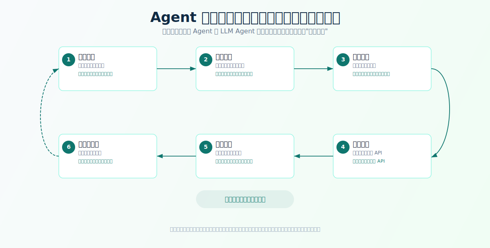

# Course II: Agent Paradigm Evolution

## Introduction to the curriculum

Learning Agent's easiest pit is coming up and asking, "How does a frame work." It'll soon be exposed to a number of terms: Tool Use, Function Calling, RAG, Memoory... every word looks important, but it's hard for you to judge the relationship between them, and you don't know when it should or should not be.

Better learning is the reverse:

```text
Ask what problems the system has encountered and see why new capabilities have emerged.
```

For example:

- The tools are called not because "models should be able to call API" but because the application scenes go from "answer questions" to "work." The models can only say but they can't do it.
- Rect is important not because it introduces the three words Thought/Action/Observation, but because it places the reasoning and actions that were often discussed separately in the same circle: let the judgement influence the action, let the outcome of the action, in turn, revise the judgement.
- Mistakes and reflections arise not because "models should be allowed to check their mistakes", but because errors in multi-step missions spread along the chain of dependence, and the model's own reasoning cannot replace external validation.
- ...

This class is called "Performance Understanding Level". Its goal is to build your judgment: when you see a new Agent technology or product, you ask the right question:

- What old problem does it solve?
- What does it put into the system?
- What tasks does it make easier?
- What new problems does it pose?

With this problem awareness into course three, it's easier for you to understand why the smallest Agent needs LLM decision-making, tool interaction, state management and circulation control, rather than just a "smarter model."

The course refers to a number of dissertations, research teams and product nodes, but they are not used to stack time lines. Each node goes back to the question at the time: why was the problem getting sharper at that time, what was the new scheme going on, and what was the new problem left for later Agent Runtme.

---

## Learning objectives

After this lesson, you will be able to:

1. **Explains the tradition, Agent.**: The contradiction between rule modelling and an open environment is a fundamental bottleneck.
2. **Description of how LLM changed the core of Agent's decision-making**: a paradigm shift from "manual rule" to "model understanding of objectives and dynamic decision-making".
3. **To explain why the tool calls appear**: LLM "will say but won't do" Toolformer/Plugins/Function Calling to connect models to the outside world.
4. **Explains why React is the classic framework for understanding the Agent loop**: Thugt → Action Observation feedback loop to get Agent from "one-off answer" to "continuing mission."
5. **Interprets the evolutionary logic of error and reflection**: separates the internal reasoning of the model from the external feedback of the system, and understands why errors cannot be corrected by the model alone.
6. **Description of the background to the emergence of Planning and Multi-Agent**: complex tasks require dismantling and division of labour, but each paradigm presents new engineering problems.

---

## Contents

- [Introduction to the curriculum](#introduction-to-the-curriculum)
- [Learning objectives](#learning-objectives)
- [Chapter 1: Agent existed long ago. Why is it now?](#chapter-1-agent-existed-long-ago-why-is-it-now)
  - [1.1 When there is no LLM, how does it work?](#11-when-there-is-no-llm-how-does-it-work)
  - [1.2 Agent's basic questions have never changed.](#12-agents-basic-questions-have-never-changed)
  - [1.3 Decision-making is based on RL, software Agent, BDI and classic classification](#13-decision-making-is-based-on-rl-software-agent-bdi-and-classic-classification)
  - [1.4 Workable in closed environments and difficult to expand in open missions](#14-workable-in-closed-environments-and-difficult-to-expand-in-open-missions)
  - [1.5 Open language world requires a new core of decision-making](#15-open-language-world-requires-a-new-core-of-decision-making)
- [Chapter 2: LLM Decision Center - When the rules are not finished, the model begins to judge the next step](#chapter-2-llm-decision-center---when-the-rules-are-not-finished-the-model-begins-to-judge-the-next-step)
  - [2.1 The core of Agent ' s decision-making has changed](#21-the-core-of-agent-s-decision-making-has-changed)
  - [2.2 LLM takes on target understanding and next judgment](#22-llm-takes-on-target-understanding-and-next-judgment)
  - [2.3 Moving from fixed processes to dynamic decision-making](#23-moving-from-fixed-processes-to-dynamic-decision-making)
  - [2.4 The judgement is not equivalent to reliable execution.](#24-the-judgement-is-not-equivalent-to-reliable-execution)
- [Chapter 3: Tools call - when models say, but do not do](#chapter-3-tools-call---when-models-say-but-do-not-do)
  - [3.1 LLM will say, but won't do](#31-llm-will-say-but-wont-do)
  - [3.2 Response capacity must connect external capacity](#32-response-capacity-must-connect-external-capacity)
  - [3.3 Toolformer: let the model learn to use tools](#33-toolformer-let-the-model-learn-to-use-tools)
  - [3.4 ChatGPT Plugins: turning "AI works" into a product experience](#34-chatgpt-plugins-turning-ai-works-into-a-product-experience)
  - [3.5 Fund Calling: Engineering interface for tool calls](#35-fund-calling-engineering-interface-for-tool-calls)
  - [3.6 MCP: A standardized attempt to connect tools](#36-mcp-a-standardized-attempt-to-connect-tools)
  - [3.7 Tool call is a set of system mechanisms](#37-tool-call-is-a-set-of-system-mechanisms)
- [Chapter 4: Reform - When reasoning and action need to enter the same cycle](#chapter-4-reform---when-reasoning-and-action-need-to-enter-the-same-cycle)
  - [4.1 One-time responses cannot address changing mandates](#41-one-time-responses-cannot-address-changing-mandates)
  - [4.2 Protracted separation of reasoning and action In.](#42-protracted-separation-of-reasoning-and-action-in)
  - [4.3 React Put judgment and action in the same cycle](#43-react-put-judgment-and-action-in-the-same-cycle)
  - [4.4 Agent has a minimum running mode](#44-agent-has-a-minimum-running-mode)
  - [4.5 Cycles themselves need to be managed](#45-cycles-themselves-need-to-be-managed)
- [Chapter 5: Error resolution and reflection -- when the system needs to know it's wrong](#chapter-5-error-resolution-and-reflection----when-the-system-needs-to-know-its-wrong)
  - [5.1 Let the model think more why it's not enough.](#51-let-the-model-think-more-why-its-not-enough)
  - [5.2 Two-tier capability: internal model reasoning and external system feedback](#52-two-tier-capability-internal-model-reasoning-and-external-system-feedback)
  - [5.3 How mistakes are spread and amplified in multi-step missions](#53-how-mistakes-are-spread-and-amplified-in-multi-step-missions)
  - [5.4 The feedback mechanism is put into operation](#54-the-feedback-mechanism-is-put-into-operation)
  - [5.5 Self-Refine and Reflexion: Rethinking the capacity to become Agent's built-in](#55-self-refine-and-reflexion-rethinking-the-capacity-to-become-agents-built-in)
  - [5.6 From "one generation at a time" to "repeated improvement."](#56-from-one-generation-at-a-time-to-repeated-improvement)
  - [5.7 Mistake cannot become self-consolation](#57-mistake-cannot-become-self-consolation)
- [Chapter 6: Planning - When the task is too long, one step at a time is not enough](#chapter-6-planning---when-the-task-is-too-long-one-step-at-a-time-is-not-enough)
  - [6.1 Complex tasks are not a one-step response, but a chain of dependency](#61-complex-tasks-are-not-a-one-step-response-but-a-chain-of-dependency)
  - [6.2 No plan, Agent is easy to move locally and halfway.](#62-no-plan-agent-is-easy-to-move-locally-and-halfway)
  - [6.3 From COT, TOT to Plan-and-Execute](#63-from-cot-tot-to-plan-and-execute)
  - [6.4 The plan allows long missions to move forward, detectable, acceptable](#64-the-plan-allows-long-missions-to-move-forward-detectable-acceptable)
  - [6.5 Plans need to be implemented, inspected and reprogrammed](#65-plans-need-to-be-implemented-inspected-and-reprogrammed)
- [Chapter 7: Multi-Agent -- When it matters, it doesn't.](#chapter-7-multi-agent----when-it-matters-it-doesnt)
  - [7.1 An Agent will soon become a giant system of everything.](#71-an-agent-will-soon-become-a-giant-system-of-everything)
  - [7.2 Complex tasks require roles, context and instrumental boundaries](#72-complex-tasks-require-roles-context-and-instrumental-boundaries)
  - [7.3 Role Division, Manager-Enforceor and Expert Collaboration](#73-role-division-manager-enforceor-and-expert-collaboration)
  - [7.4 Capacities can be expanded and mandates can be parallel](#74-capacities-can-be-expanded-and-mandates-can-be-parallel)
  - [7.5 Collaboration itself creates complexity. degrees](#75-collaboration-itself-creates-complexity-degrees)
- [Chapter 8: Paradigm evolution overview](#chapter-8-paradigm-evolution-overview)
  - [8.1 A picture of the main lead lead.](#81-a-picture-of-the-main-lead-lead)
  - [8.2 How to analyse a new Agent technology](#82-how-to-analyse-a-new-agent-technology)
  - [8.3 Common error zones](#83-common-error-zones)
- [After-school exercises](#after-school-exercises)
- [Acceptance and inspection standards](#acceptance-and-inspection-standards)
- [References](#references)

---

## Chapter 1: Agent existed long ago. Why is it now?

"Agent" is not the word that came out of the llm era. Back in AI and software engineering, people are asking the same question: how does a system perceive the environment, make decisions, act and adjust itself to results?

If the history of Agent is extended, it's not like a new concept that suddenly emerges, it's more like a technological route of changing engines. Early Agent relies on rules, state machines, enhanced learning strategies, or BDI mental models; the changes that have taken place since LLM are not "at last thought of Agent" but the first chance the system has had to turn to a universal model for "understanding the goals of natural languages."

It is important to understand this evolution, because it answers many questions: **If Agent's basic question had been raised long ago, why did it not break out?** The answer lies in the fundamental limits of traditional Agent.

### 1.1 When there is no LLM, how does it work?

Go back to an era without LLM.

You want to be an "automated travel assistant". It needs to help you arrange flights and hotels according to your schedule, budget, preferences and corporate policy.

The system should at least deal with:

- When are you leaving?
- Which flights are budget-compliant?
- How far is the hotel from the conference?
- What are the prices allowed in the company's reimbursement policy?

...

In the absence of LLM, the system depends on the engineer writing the rules in advance:

```text
If the meeting arrives by 10 a.m., priority is given to arriving the previous night.
If the flight cost exceeds the budget,%,User confirmation is required.
If the hotel is more than 3 km from the meeting place, the recommended priority is lowered.
...
```

When there are few rules, such systems can work. But you can feel how vulnerable it is -- once the demand becomes more complex, the rules expand rapidly. The user says, "I don't want to be too busy, but don't be too expensive," and the system is hard to handle because "too busy" and "too expensive" are not simple fixed fields to capture.

This is the core dilemma of traditional Agent:

```text
The system needs to judge the goals as human beings do, but engineering must tear the world apart into clear rules and states.
```

It's a natural contradiction. The expression of a person ' s objective is vague, dependent and subject to change at any time; the rule system requires that every path be predefined. This contradiction is not caused by an engineer's lazyness. It's an irreconcilable tension between the rule-driven system and the open-language goal.

### 1.2 Agent's basic questions have never changed.

With or without LLM, Agent's basic problem is stable. You can summarize it in a loop:



This cycle looks simple, but it's very difficult to open up to the real world:

- The state of the environment is too complex (what information is relevant to the current target?)
- The user target is too vague.
- Maybe too much.
- Feedback is not always clear.

The traditional Agent approach has been directed towards finding ways to formalize these things— translating the blurred world into structures that the system can handle. Researchers from different ages have given different answers, but they all face the same ceiling.

### 1.3 Decision-making is based on RL, software Agent, BDI and classic classification

There are several important ideas in traditional Agent. They are not isolated concepts, but answers to the same question from different times:

```text
If the system has to make its own decisions, where does it come from??
```

Several routes can be compressed into a table:

| Route | Basis for decision-making | It suits the scene. | Card Point |
|---|---|---|---|
| Enhanced Learning | Learning strategies through error testing and reward signals | Game, robot control, recommended strategy | Incentive functions are difficult to design and ordinary user tasks cannot be tested in large numbers |
| Software | Prewritten triggers, rules and actions | Mail filtering, surveillance alarms, business process automation | The environment must be narrow enough and the rules must be written in advance. |
| BDI Model | Belif / Désiré / Intension: Faith, wish, intent | We need a closed system around target behavior. | The state of the world, target and planned space need to be modelled manually. |
| Classic Agent Category | Levels of capacity such as reflection, models, targets, utility, learning | Create Agent problem map | Clear classification, but does not automatically resolve open language understanding |

The value of these routes is that they tear out the core issues of Agent: system awareness of the environment, state of expression, choice of action, receipt of feedback, strategies for improvement. The framework for this issue remains valid today.

But together they depend on one premise:

```text
The world can be modelled, action space can be counted and feedback signals defined.
```

Once the mission becomes, "Do me a favor on this project" and see why it's slowing down lately, "Give me a less dramatic travel programme," the traditional approach encounters the same bottleneck: The user goal is open language, but the system requires clarity of status, rules and rewards.

### 1.4 Workable in closed environments and difficult to expand in open missions

If you read here, you might think, "Traditions, Agent, have all failed?"

Nope. They are effective in many closed environments:

- **Game environment**: state, action, reward is clearer. AlphaGo can defeat the best player on the board of 19x19.
- **Industrial controls**: Sensors, controllers, feedback signals are clearly defined. A temperature control system does not need to understand natural languages.
- **Enterprise automation**: processes are stable and rules can be prepared in advance. The approval process in the ERP system does not need to be performed.
- **Logistic script**: trigger conditions and processing actions are relatively fixed. "If CPU is over 90%, expand a machine."

This is not the case for ordinary users. The user will say:

```text
Help me see why this project has been slow lately.
```

This sentence may be followed by codes, logs, databases, network requests, product changes, deployment environments, and user behaviour. It's hard for you to finish all the rules in advance. Worse still, users themselves may not fully know what "lower" means -- is the response time long? Is it a page card? Is the overall amount of vomiting down?

So the fundamental limit of traditional Agent is not "no intelligence." They are very smart in their respective areas of expertise. Their limitations are:

```text
It is difficult for them to understand open language goals at a low cost and to translate them into enforceable decisions.
```

You can imagine tradition as a very good chess program: It's strong in the board, but once it's turned over, it doesn't know what to do. Its intelligence is locked into rules and strategies and it is difficult to migrate to open missions.

### 1.5 Open language world requires a new core of decision-making

Traditional Agent left an important question that was almost impossible to answer before LLM emerged:

```text
If the user's target is not fully regulated, what should be the core of Agent's decision-making??
```

Before LLM emerged, engineers had only a few paths: either to continue writing more rules, or to train specialized models for specific areas, or to limit tasks to a very narrow range. Each path is avoiding the real problem — users want a decision maker **who has a common understanding of natural language objectives.** After LLM came along, things changed. It gives the system, for the first time, a strong ability to understand natural language, common sense reasoning and mandate interpretation. It's not that ILM is perfect -- it's got a lot of problems, and we'll discuss it in detail later. But its emergence made Agent's core issue from:

```text
How to write all the rules.?
```

Turned into:

```text
How to make the model judge the next step according to the objective and context?
```

This shift sounds just different, but its engineering implications are fundamental. The "rules" require engineers to prejudge all situations in advance; "let the model judge" means that the system can run tasks that the engineers did not anticipate. The former are closed, definitive but powerless to open the world; the latter are open and flexible, but they present entirely new engineering challenges.

---

## Chapter 2: LLM Decision Center - When the rules are not finished, the model begins to judge the next step

### 2.1 The core of Agent ' s decision-making has changed

LLM didn't make all Agent's problems disappear, but it changed Agent's most critical layer: **The decision core.** Chapter I already speaks of the fundamental points of traditional Agent: the goal of open language is difficult to write in advance. Chapter II goes on to answer a more specific question:

```text
If the rules don't go through, can the system hand over "understanding the goal and judge the next step" to the model??
```

After 2020, a small sample of GPT-3 learning showed that models could understand mission formats; Chain-of-Thought further explained that models could address more complex issues through intermediate reasoning. At this point, LLM is no longer just an answerer, but is beginning to be like a common core of decision-making that is available: it understands objectives, explains context and tries to judge what to do next.

It is not that the model must be right — on the contrary, it is often wrong — that is the core issue to be addressed by the whole Agent project. But the change is in **the decision-making mechanism itself**:

| Dimensions | Traditional systems | LLM Agent |
|---|---|---|
| Target understanding | Reliance on predefined fields and intended categories | Direct understanding of natural language objectives |
| Next Option | By process or rule | Based on a model combined with context |
| Task Overwrite | Small and stable. | More open, more universal |
| Failed Mode | Rules not covered (direct failure) | Model error, hallucinations, instability. |
| Engineering focus | Write rules and processes | Manage context, tools, status and control borders |

So LLM is not simply "enhanced Chatbot". It gives Agent the opportunity to move from **"rules drive" to** "target drive." It's like the difference between a vending machine and a human assistant. The former can only respond to predefined buttons, while the latter can understand your oral requests, even though the latter occasionally get wrong.

But it only settled in half. The model can judge that "the next step should be a log" does not mean that it can really check a log; it can judge that "the order system needs to be called" or that it has privileges, interfaces, execution results to fill in. The next step of Agent's evolution is to move from "judging" to "doing" -- that's what chapter III is about.

### 2.2 LLM takes on target understanding and next judgment

In LLMAgent, models usually carry out several types of duties. Understanding these duties will help you to see more clearly the exact location of LLM in the Agent system.

#### Target understanding

Users do not always give a clear mission statement. Models need to convert vague targets into actionable targets.

For example:

```text
The user said, "This project is a little messy.
```

The model will judge that this may mean:

- View the directory structure first.
- Find duplicate or obsolete documents.
- Understanding key modules.
- Gives advice on organizing.
- The changes will be made after confirmation.

This process requires common sense, an understanding of what "discretion" may mean in the context of the software project, and an understanding of what sort of operation "collating" corresponds to at the file system level. The model may not be right at once, but it can at least move in that direction instead of simply refusing to say, "I don't understand your instructions."

#### Context Interpretation

Agent looks not only at the user but also at a set of context: current files, historical conversations, tool returns, error logs, task progress. Models need to combine this information to form a judgement on the current state.

It's a lot more complicated than simply answering a question. In response mode, the model needs only to focus on the user ' s questions and its own knowledge; in Agent mode, the model needs to keep track of a dynamic information space and identify which information is most important for current decision-making.

#### Next decision-making

Agent, the key question is always:

```text
What should we do now??
```

The next step could be to answer the user, continue reading the file, call for search, perform testing, request user confirmation or stop the task. The quality of this decision depends directly on Agent's ability to complete his mission. And more importantly, it's "looking ahead" -- models need to consider what they see, what they've done before, what they've done.

#### Results interpretation

The data returned by the tool is not usually the final answer. The model will also explain the results and determine whether it is sufficient to support the next step.

After a test failed, for example, the model needs to be judged by a blunder: a grammatical error? An assertion of failure? Environmental dependence? Or has the test itself expired? Different types of failures require different follow-up actions, and models must distinguish.

### 2.3 Moving from fixed processes to dynamic decision-making

LLM makes it possible for many tasks that were difficult to produce in the past.

For example:

```text
Help me study the latest trends in a certain industry.
```

Agent can:

1. Dismantling — what is the critical dimension of the industry?
2. Search information — which sources are more credible?
3. To judge the quality of the information — is the analysis supported by data or is it pure?
4. Read pages — extract key facts.
5. Refining point of view - cross-source comparison.
6. Missing — key information added.
7. Generates the report.

This process is not a fully fixed one. If the search results differ, the next step will be different; if the information is found to be insufficient, Agent needs to continue to look for it; if information conflicts are discovered, Agent needs to compare the source and judge credibility.

This is the core difference between LLM Agent and normal Workflow:

```text
Workflow Tasks suitable for step stabilization——You know from A to B to C must be right.
Agent Suitable for a mission with a clear target but not a fully defined path——You know where to go, but it might take a detour.
```

The choice should not depend on "Agent is not more advanced" but on the characteristics of the mission itself. If the steps of a mission are predictable, the workflow tends to be more reliable, faster and cheaper. Agent's advantage is not "it looks smarter," but it can handle tasks with uncertain paths.

### 2.4 The judgement is not equivalent to reliable execution.

When LLM became the centrepiece of decision-making, new problems arose — and each was a hard one:

| Emerging issues | Performance | Capacity for follow-up needs |
|---|---|---|
| It's not enough. | Model does not know real time information, private data or current system state | Tool call, RAG, database connection |
| Can't move. | Models can only output text, not real tasks. | Tool Use、Function Calling |
| It's unstable. | You forget what you've done on a multistep mission. | State、Memory、Trace |
| The cycle is out of control. | Keep checking, re-routing, delays. | Loop Control、Stop Condition |
| Error Dissemination | One wrong move, one wrong move. | Retrospect and reflection, Evaluation, Guardrails |
| Risk Actions | Models can miss files, mistransmit messages, override operations | Permission、Human-in-the-loop |

The common denominator of these problems is that none of them can be summed up by models that are not smart enough. A smarter model, which is still not a useful Agent if it does not have access to real-time data, does not implement actions and does not remember what was done in the first few steps.

So here's a very important idea that goes through the entire course:

```text
LLM It is the decision center of Agent, but not the complete Agent system.
```

A good decision-making core is a necessary but far from sufficient condition. Agent Runtme's problem — tool connectivity, state management, circulation control, error processing, secure borders — is the skeleton that makes the core of decision-making truly useful. The rest, essentially, is adding bricks to the skeleton.

> Read that you might wonder what "Runtime" is. Here's a hunch: **You can interpret Runtime as the "operating system" of Agent -- the model is for decision-making, Runtime for execution.** Course III will provide a precise definition and roll-out. Now it's just to read down with that impression.

---

## Chapter 3: Tools call - when models say, but do not do

Tool Call (Tool Use) is the first clearly engineered capability in Agent 's evolution. It appears in a very straightforward context: **the model is a good word, but nothing can be done.** That sounds like a simple question -- take a few APIs. But look at it carefully, the actual impact of the tools called is far more profound than "accelerating API". It involves the relationship between models and the outside world, the boundaries of decision-making and implementation, and how tools are found, described, mobilized and governed. We're going from research to product to engineering interface, and we're going through this line completely.

### 3.1 LLM will say, but won't do

The early LLM was like a smart but "no hands."

You said:

```text
Help me check why this project failed.
```

It may answer:

```text
You can run the test command, check the error log, and then locate the relevant files.
```

This recommendation may be right, but it is "recommendation," not "action". The model does not actually run tests and does not read the log. The same applies to order queries, booking of tickets, data analysis: the model knows what to do and does not mean that it has real access to the real system.

This state of "separation of ideas" is the biggest bottleneck in limiting LLM applications. The company wanted to use it as a passenger service, but it could not find out the order status; it wanted to use it as an assistant, but it could not book your tickets; it wanted to use it for analysis, but it could not read real-time data. There is a huge gap between the knowledge of models (know how a mission should be done) and the action of models (do it really work).

This is the gap that the tool calls for:

```text
It's not "Tell me what to do," but "Do it for me within a controlled border."
```

### 3.2 Response capacity must connect external capacity

There are several natural limitations to LLM's knowledge of parameters, and these limitations are not something that can be solved by "a bigger model":

- **Not in time**: The world continues to change after model training is completed. It does not automatically know the latest events, the latest inventory, the latest order status.
- **Private**: The model does not know your company's database, project documents, internal files - these never entered its training set.
- **Inaccurately executed**: The model can describe the computational steps, but it is calculated using the term "generated text" as if you can replace the calculator with a mind calculation -- big questions can easily go wrong.
- **No world change**: model output text does not automatically e-mail, change files, create worksheets or call business systems. It operates in linguistic space and cannot touch the real state of the physical or digital world.

Therefore, Agent must clearly separate two types of capabilities:

```text
The model is responsible for understanding the objectives and judging the next step (decision-making level).
The tool is responsible for obtaining facts, executing actions and returning results (executive level).
```

This border is very important. **The model should not pretend to have checked the database, nor should it pretend to have run the code.** It should generate tools to call requests for real actions by Runtime and then return the results to the model. This is not a question of trust, but a question of architecture — of having models do what models do best (syntax understanding and decision-making) and of having certainty systems do what they do best (exact execution and control of authority).

### 3.3 Toolformer: let the model learn to use tools

When we realize that LLM has to connect to external capabilities, the most direct engineering approach is to write rules outside the system, tell the models what tools they have and when they should be called. But this raises a new problem:

```text
Whether it's the rule of the outside system to press the model, or whether it's an act that the model itself can learn.?
```

This is not a philosophical game — it has important engineering implications. If the model can only be called correctly under the "compulsory" of an external hint, then the call is fragile: a set of hints, a scene, a model version, can change the call behaviour. If the model itself learns when to call a tool, then it is a more stable and internalized ability.

Meta AI, published in February 2023, Toolformer, is a step forward on this issue. It's not a complex tool platform first, but it's a study of whether models can put "when to call API, how to continue writing" in their own generation mode.

The key insight for Toolformer is that **tools can also be used as a language mode.** Models can learn in text sequences "when to insert API calls, how to construct parameters, how to use return results to continue generation", without necessarily relying entirely on external hard code rules.

Its self-monitoring process can simply be understood as three steps:

1. Lets the model generate candidate API calls in the text.
2. Practically implement API to see if the return results make subsequent text predictions less difficult.
3. Only helpful call samples are retained for fine-tuning models.

This proves one important thing:

```text
The use of tools is not only the ability of external systems to add to models, but can also be the mode of behaviour learned from models.
```

It's critical for Agent, because the model itself needs to judge whether "I need external information right now" or "I can answer directly." However, Toolformer is more of a research paradigm than the interface most directly accessible to ordinary developers; it also does not fully address engineering issues such as access, failure processing, tool credibility and high-risk action confirmation. These issues will continue at the product and interface levels.

### 3.4 ChatGPT Plugins: turning "AI works" into a product experience

Toolformer answers the research question: can models learn to use tools? Another more pressing problem quickly arose on the product side:

```text
How do ordinary users really feel about AI not just answering, but doing things??
```

The user's expectations for LLM quickly expanded from "response to questions" to "help me do my job": checking real-time news, checking airline hotels, ordering meals, reading the company's knowledge base, running calculations, calling for third-party services. In March 2023, OpenAI released ChatGPT Plugins, bringing these outside capabilities into the mainstream chat portal, breaking the cognitive boundaries of "LLM just chat tools".

A plugin needs to expose two types of information to the model:

- **Capability description for model orientation**: what can this plugin do and when it will fit?
- **System-oriented interface description**: which APIs, what parameters, and how to authenticate.

This allows models to "see" the tools available in the dialogue and initiate calls when needed. Early plugins include browsers, code interpretors, retrieval plugins and various third-party service plugins.

Plugins changed the general perception of LLM:

```text
AI It is no longer just the generation of text, but the ability to connect to the outside world.
```

This step opens a door to the whole Agent field: Users and developers are beginning to see the combination of Model + Tools in the same chat portal. However, it also exposes engineering problems: tools need to be accurately described, access requires privileges and secure boundaries, users need to know when the model is accessing external services, and third-party tools entail privacy, ultra vires and supply chain risks.

Plugins was no longer the only form, but its historical significance was to push LLM to the outside world to the mass product experience.

### 3.5 Fund Calling: Engineering interface for tool calls

Plugins proved "AI can do something" product experience, but it's more than ChatGPT's own plugin ecology. What the developers really need is a more bottom-up, more stable interface, with their own functions, databases, internal systems and external API access to any application using LLM.

In your own application, for example, you want models that create orders based on user requests, extract structured fields from text, search databases, call the CRM system and trigger internal workflows. This requires a lower, more manageable interface than the "plug-in store".

In June 2023, OpenAI launched the Fund Calling in API. Compared to Plugins, it is more like standardization of an **interface**: Developers can no longer simply bring tools to the ChatGPT product, but can declare functions, parameters and implementation logic in their own applications, allowing models to generate structured calls.

The basic process of Function Calling is:

```text
Developer defines tool name, description and parameters
 → The model determines whether to call the tool according to the user target
 → Model generation structured parameters (JSON)
 → Runtime Verify Parameters
 → Runtime Execute a real function or API
 → Tool results returned to the model
 → Model continues to judge the next step or generate the final answer
```

There is a very critical design choice here: **The model is not a direct execution function, it is a structured call intention.** Real implementation takes place in the developers' system.

Why is it designed like this? This is because of **authenticity and security**:

- The output of the model is unreliable - it may miscalculate parameters, create non-existent order numbers, or give a function name that appears reasonable but does not actually exist.
- Letting the model pretend that it's executed is tantamount to abandoning all opportunities for external validation.
- Keeping enforcement rights in the developer ' s hands means that the database query returns the real result; that dangerous operations (transfers, deletions) can be controlled with permission; and that each tool call is monitored and audited by the developer.

This design embodies a fundamental engineering philosophy:

```text
Models are responsible for judging what to do, Runtime how to do.
```

This division of labour allows LLM to focus on semantic understanding and decision-making in which it specializes, and to turn precise implementation to a certainty system. This principle was subsequently inherited by almost all Agent frameworks as a central clue to the Agent architecture.

Faction Calling turned the tool from "product capacity" to "developer interface." It does not eliminate complexity, however, and developers still have to deal with Schema design, parameter validation, re-test logic, the credibility of tool results, rights control, high-risk action confirmation, and how Trace and Evaluation cover the tool links.

### 3.6 MCP: A standardized attempt to connect tools

When Function Calling solved the problem of "how the model expresses the tools to call," the engineering community quickly hit the bottom level:

```text
Each model provider, each application, each tool server has its own connection.
```

It's like every appliance in a world has its own power plug-in standard — a huge resistance to ecological development. Developers need to maintain multiple tool description formats if they use multiple model providers at the same time; if Agent is to connect different tools and data sources, it needs to write an integrated code for each.

At the end of 2024, Anthropic released **MCP (Model Context Protocol, Model Context protocol)** to try to solve a more fundamental question: How to connect Agent to any data source or tool without having to reassemble each time?

MCP design inspiration from **LSP (Language Server Protocol)**. LSP allows any editor to support a smart tip for any programming language - the editor does not need to write a plugin for each language. It simply needs to achieve the LSP client and the language server has to follow the LSP protocol. MCP aims to enable any Agent to use any tool and data source through a standardized client-server structure.

MCP has defined standardized data models such as Researches, Prompts, and Tools, which attempt to connect tools and data sources into an open standard across hosts and tools. It represents an important change: the tool-calling evolution has moved further from "the ability of models to call functions" to:

```text
How tools are found, described, authorized, called, documented and governance?
```


### 3.7 Tool call is a set of system mechanisms

The tool calls for LLM to "go" from "go" to "do," but it immediately brings new engineering problems. These questions are not solved by "one more API":

| Emerging issues | Performance | Follow-up courses |
|---|---|---|
| Tool definition issues | Models don't know what tools can do, or misinterpret tool boundaries. | Course IV |
| Tool selection problem | No, no, no, no, no, no, no. | Course IV |
| Parameter Generation Problem | Parameter type error, missing required entries, non-existent objects | Course IV |
| Implementation failure | API Timeout, Insufficient Permissions, Too Long Results, External Service Error | Course IV/ VI |
| Security | Error deleting files, overstepping queries, sending false messages, triggering real world effects | Lesson IV/ Course VI/ Course VII |
| Observable issues | Users and developers do not know why the model calls this tool | Course VI/ VII |

It would be more helpful to untangle the three sub-issues that the tool calls:

1. **Tool selection**: When there are 100 tools available, how does Agent judge which one to use? This is essentially a question of semantic matching and efficiency balance.
2. **Parameter Fill**: Agent needs to " guess" the parameters for the function from the context of the dialogue and the tool description. Parameters may come from historical dialogue, may require multi-step reasoning to be established, or may be missing for user follow-up.
3. **Tool combination**: Complex missions often require sequential calls for multiple tools — first searching for information, then analysing, then generating reports and then sending mail. This has actually entered the realm of planning issues.

The tool calls to solve the problem of "LLM unable to act", but the problem of "when, how to continue after action." That leads to rect.

---

## Chapter 4: Reform - When reasoning and action need to enter the same cycle

If you want to select a paper that has a profound impact on the Agent field, many researchers point to React. Not because it introduces a complex theory, but because it brings together two routes that have often evolved in isolation: **The model is reasoned in the text and the judgement continues to be revised in environmental feedback.** REACT is the classic framework for understanding the Agent run cycle. Its core is not a specific API or a frame name, but a way to run:

```text
Reasoning + Acting
```

That is, the combination of reasoning and action that feed each other.

In October 2022, Google Research and Princeton jointly published Rect: Synergy Reasoning and Acting in Language Models. The importance of this paper is that it brings together two capabilities that were already present at the time: the step-by-step reasoning demonstrated by Chain-of-Thought, and the operational capability of models to mobilize external environments or tools. Rect's contribution is not to invent "adjection" or "action", but to feed each other in the same cycle.

### 4.1 One-time responses cannot address changing mandates

Let us use a specific example to feel this.

Suppose you ask Agent:

```text
Help me figure out why this project failed.
```

A model that answers only once might say:

```text
You should run the tests, then look at the error log, then check the relevant codes.
```

This is a recommendation, not a solution. Models are speculating on the answer rather than interacting with reality.

A system that only calls tools but does not reason can be mechanically implemented:

```text
Run Test → Output a large section log → End
```

It received information, but did not determine which document should be read next, nor did it explain the error. It's like an assistant who can only follow orders but can't think.

The real task requires:

1. To judge what is missing.
2. Take action to obtain information.
3. Observation of the results of operations.
4. Adjusting judgement to new information.
5. Continue this cycle until sufficient answers are answered or should stop.

This process cannot be "all thought before all action" or "all action before all analysis". It must be interchangeable, dynamic and adjusted for each step.

### 4.2 Protracted separation of reasoning and action In.

React is not an isolated technique because it stands at the intersection of two capacities that have developed. Before it, the researchers ' exploration of LLM capabilities was broadly divided into two lines:

- **Delineation line**: let the model analyse the problem in the text, write the middle step and give the answer. The representation is Chain-of-Thought.
- **Line of action**: let the model export an action or call a tool to obtain information from the environment.

This division of labour was natural in the early stages of the study: the reasoning line proved whether the model was capable of thinking. It is clear that the line of action first demonstrates whether the model interacts with the external environment. But as soon as the Agent mission emerged, it became clear that the two lines were short-boarded.

#### Line of reasoning: from direct response to intermediate steps in writing

The most common way to use LLM early is through direct questions and answers:

```text
Problem → Answer
```

This is enough for simple questions, but once the task requires multi-step judgement, the model can easily "jump." It may come directly to conclusions without exposing the judgement in the middle; it may also be the first step that is wrong, and the latter answer is still fluent and makes the error seem more credible.

Chain-of-Thought emerged, and it was the problem that was solved. It allows the model to write the middle reasoning process:

```text
Problem → Intermediate steps → Answer
```

This brings about an important change: the model is no longer forced to leap to conclusions, but can decomplicate complex issues into smaller judgements. This "writing the thinking process" will significantly improve performance on mathematical issues, common sense reasoning, symbolic reasoning and some complex questions and answers.

But the COT border is clear: it still happens inside the text. The model can write a beautiful chain of reasoning, but it is based only on context and knowledge of the model. It doesn't know if the test really failed, what the latest information is on the web page, whether an API is currently available, or what's really in the file system.

So the line of reasoning solved part of the question of whether the model can figure it out, but it didn't:

```text
What the models think, how to be verified by the real environment.?
```

If there is only reasoning, the model is trapped in its own parameters and context. It has no access to the latest facts, is easily deduced on the basis of false assumptions and is unaware of the true state of the external environment. Like someone in a room, no matter how logical, it was impossible to know whether it was raining outside.

#### Lines of action: from the ability to access tools to the outside world

Another line moves in the opposite direction: since the model does not rely solely on text reasoning, it is exposed to the outside world.

Tool calls, plugins, Funding Calling, mechanisms like this, which push LLM from "only generate text" to "can initiate action":

```text
User Targets → Model Decision Caller → Runtime Implementation tool → Return Result
```

This step is crucial. The model can finally search_web pages, search databases, run codes, read_files, call business API. It doesn't just say, "You should run the test," but it does make the system run the test; it doesn't just say, "You should check the price," but it does.

But the line of action has its own limitations. A tool call does not equal Agent. The tool brings the information back. The system needs to be judged:

- What does this result mean?
- Is it enough to answer user questions?
- Should the next steps continue, change tools, ask the user, or stop?
- If tools fail, returns empty and information conflicts, how should they be adjusted?

If there's only action, the system is like a man who pushes the button. It can run tests, open web pages, call API, but it doesn't know why, or how the tool results should change the next strategy.

#### Why must the two lines go together?

The real Agent mission is neither pure reasoning nor pure action.

Take the example of "Find out why the project failed":

```text
First of all, I need to know where it went.
Reaction: run tests.
Re-observation: Error pointing at auth/session.spec.ts.
Recomprehension: The problem may be linked to the logic of the session.
Reaction: Read corresponding documents.
Rewatch: Time stamp units are inconsistent.
Then again, it is possible to explain the causes.
```

Each step here depends on the outcome of the previous step. The reasoning determines the next action, which, in turn, is recast. You can't finish all the steps at the outset because the external results have not yet appeared; nor can you just use a bunch of tools because the results need to be understood and screened.

The way in which humans solve complex problems is never simply "debate" or simply "action" — it is a combination of the two. You have a problem, think about it and then check the information; change your mind when you see new information; and take the next step. The reasoning and actions are input-outputs, creating a dynamic cycle.

The key insight of Rect is to translate this human problem resolution rhythm into a text agreement that LLM can implement: **Let the judgement trigger the action, let the outcome go back to context and influence the next judgement.**

### 4.3 React Put judgment and action in the same cycle

A simplified rect process is as follows:

```text
Thought: I need to know where the test went.
Action: RunTests["npm test"]
Observation: There were 2 tests that failed, with errors pointing to auth/session.spec.ts.

Thought: The error is related to the logic of the session, and I should read about it.
Action: ReadFile["src/auth/session.ts"]
Observation: The code uses a second time stamp, but the test passes to a millisecond time stamp.

Thought: It is now possible to explain the reasons for the failure and to make recommendations for repair.
Final Answer: The test failed because of a time difference...
```

This cycle has three key points:

- **Thought** lets the model express its current judgment -- why this action, what it knows, what it lacks.
- **Action** allows models to influence the external environment or access external information — not just "what to do," but really do.
- **Observation** Puts the results of the tool back in context and influences the next judgement -- external information is no longer simply "outputed" and then thrown away, but is an input for the next round of decision-making.

The actual product does not necessarily show Thought to the user. It is important to have similar structures within the system:

```text
Model judgment next → Tool execution → Turn it back in. → The model continues to judge.
```

The underlying significance of this model is that **the model is deduced not on the island but in its continuous interaction with the outside world.** Every observation may change the direction of its thinking, and every reflection may trigger new action. It turns LLM from an answer machine to a problem solver.

### 4.4 Agent has a minimum running mode

Rect is important not because all products have to output the thoughtt text, but because it clearly shows Agent's minimum **running mode from Chatbot to Agent**.

It turns the one-off answer into:

```text
The next step. → Call tools or actions → Receiving observation → Keep judging. → Stop
```

This is the smallest Agent closed ring to be achieved in course three.

You can interpret React as the "minimal behavior syntax" of Agent. It is not the same as a production system — a production system that requires more state management, error processing, circulation control and user interaction — but it allows us to see what it is to manage. It's like learning basic grammar rules doesn't mean you can write good, but you don't know that they can't write good.

React can be summed up as:

- Put reasoning, action, observation in the same cycle so that they feed each other.
- Let Agent adjust the next step based on external feedback, not a road to the dark.
- It gives a minimum run-time prototype, and the next generation's Agent framework is almost built on this core cycle.
- The problem of follow-up works has been exposed — the cycle itself needs to be managed, and that is what is to be said in the next chapter.

### 4.5 Cycles themselves need to be managed

Rect is itself a paradigm, not a production system. It gives a circular structure, but does not define the boundaries of the cycle.

It raises many follow-up questions:

| Problem | Annotations | Follow-up courses |
|---|---|---|
| Conditions for discontinuation | Agent, when should it end? How does it know "Enough"? | Course III/ VI |
| Cycle control | What if we keep calling the same tool, turning around on the same issue? | Course III/ VI |
| Tool Failed | Tools overtime, error reporting, return of irrelevant results — how does the cycle work? | Course IV/ VI |
| Context swells | Observation is growing, and the context window won't let go. | Course VI |
| Status Management | What information enters the next round of decision-making? Which only logs? | Course III/ VI |
| User control | Do we need to confirm the high-risk action? Can users change course? | Course IV/ VII |

Among these issues, there is a cross-cutting challenge: **How can the system detect and amend when a step in the cycle is wrong?** React gives the circulatory skeleton, but the skeleton itself has no ability to correct -- Thought can be misjudged, Action can fail, Operation can be incomplete. This will require the capacity to speak in the next chapter: correction and reflection.

---

## Chapter 5: Error resolution and reflection -- when the system needs to know it's wrong

React gave Agent a loop, but the loop itself was not guaranteed. In multi-step missions, errors are normal rather than unusual: models misread targets, tools return to unintended outcomes, external information conflicts with internal knowledge, and user needs may also change.

The answer to this chapter is not "Model can't think about it again" but a deeper question:

```text
How does the system know it's wrong and translate this discovery into a valid correction??
```

We're going to build a framework for two layers of capability, starting with "why there's not enough internal reasoning in the model," and then we're going to start the Reflection evolution story -- from the "author + editor" model of Self-Refine to the Reflexion scenario, and finally we're going to put together a core principle: the error must depend on real signals and not become self-consolation.

### 5.1 Let the model think more why it's not enough.

Agent is supposed to change a code. It reads the file first, then gives the modifications, and then edits the code.

If, in the first step, the model misreads the need — for example, to interpret "optimise performance" as "simplified code" — it may be based entirely on a misperception. The more confident the model is, the farther it goes, the deeper it goes.

You might think:

```text
Then let the model think a few more steps.?
```

It helps, but not enough. The reason for this is that many mistakes are not discovered "over time":

- Whether the code can really be compiled requires running the compiler -- the model does not count.
- Whether or not the test is passed requires running the test -- the model "likes" does not count.
- API availability requires a real call -- model "Remember" of API documents that may be obsolete.
- The correctness of the database query may be the faulty structure of the table that requires a connection to the real database — the model "supposition".
- The user's acceptance of a particular scheme requires confirmation that the user preference for the model "specify" may be incorrect.

The strong internal reasoning of the model is no substitute for external validation. This is not a question of modelling capacity, but of access to information. **The reasoning within the model is always based on information it already has, some of which can only be obtained through interaction with the outside world.** You put a man in a room, no matter how logical he is, and he can't know if it's raining outside.

### 5.2 Two-tier capability: internal model reasoning and external system feedback

A clear distinction between these two layers of capability is key to understanding Agent's reliability. This is also one of the most important conceptual frameworks of the course. **The model's internal reasoning** refers to its ability to better address complex issues, split steps, compare paths and detect local contradictions before generating answers or decisions. It occurs during model generation and is based on context and the model ' s own knowledge. It has the advantage of being fast, flexible and broad-based. Its limitations are that it may be self-conforming internally but that it is not — logically, but the premise is wrong. It's like a student who wrote a perfect reasoning process on the paper, but the subject is wrong. **The external feedback of the system** refers to the collection of signals from outside the model while running to determine whether the current results are actually available. It occurs in Argentina and is based on tool results, certifiers, compilers, test frames and user feedback. It has the advantage of being closer to the real world and not relying on models to feel right. Its limitations are the need for engineering design and cost inputs -- you need to build a test system, verify logic, monitor the chain.

The distinction can be summarized as follows:

| Dimensions | Model internal reasoning | External system feedback |
|---|---|---|
| Organisation | During Model Generation | Agent Runtme |
| Basis | Context and modelling capacity | Tool results, certifiers, tests, user feedback |
| Strengths | Quick, flexible, broad. | Closer to the real world, verifiable, reversible. Current |
| Limits | Maybe it's easy, but it's wrong. | Need for engineering design and cost input |
| Typical representation | COT, TOT, Model self-assessment | Compiler error, failed test, failed Schema verification, rejected by user |

A reliable Agent needs these two layers of capacity to match. The system is prone to "confident error" by internal reasoning alone — every step of the way is very good, but the direction is biased. Through external feedback alone, the system lacks the ability to understand objectives and judge trade-offs — it may mechanically repair a bug, but it is not aware that the bug is worth repairing. The key is not to choose one side, but to allow external feedback to set up checkpoints where models may be wrong and intervene in a timely manner.

### 5.3 How mistakes are spread and amplified in multi-step missions

After understanding the difference between these two layers of capability, look at a more dangerous phenomenon in multi-step missions: mistakes do not just sit there and stay there, but spread and zoom in **along the mission chain.** Assuming Agent is writing a competition analysis:

- First step, it confuses the information of Company A and Company B. It's not a big mistake in itself -- it's just Zhang Li.
- Second, it is based on a functional comparison of confused information. The comparative analysis itself may be very detailed and of impeccable logic, but the basis of the comparison is wrong.
- Step three, it gives product advice based on an erroneous comparison. The recommendations appear reasonable and well-justified, but the facts are already contaminated.
- The final report appears to be structured and well-documented, but the core facts are wrong — and the error has been "cleaned" and made very difficult to detect.

These are not simple formatting errors or grammatical errors, but **"Effects spread along the chain of dependence, the output of each step being the next input"**. One wrong step, the more serious the next steps are, the more dangerous they will be — because they will bury the error deeper.

The same is true in the code job: Error reading needs bludgeoning files blunder testing didn't run all the way to see an error and thought it was the root cause of the problem of repairing A. Every step, the problem is one layer more.

If the system doesn't have a correction mechanism, Agent is like a man walking with his eyes closed. He may have taken the first step in the direction, but he had no idea until he hit the wall. And every step he's taken is making the impact of crashing walls worse.

### 5.4 The feedback mechanism is put into operation

To prevent error transmission, the system must operate with a verifiable feedback mechanism. These mechanisms do not rely on models, do they feel right, but rather on external signal binding models.

Common feedback signals can be divided into five categories:

| Feedback mechanisms | Role | Key borders |
|---|---|---|
| Schema Verify | Check fields, types, numbers, intercept structured output errors | It can only prove that the format is valid, not that the semantics are correct. |
| Tool implementation feedback | Returns real results, error codes, timeout, insufficient permissions, empty results, etc. | The feedback must be specific enough to return to "failure" without decision-making value. |
| Test and certifier | Use the compiler, test, rule check to determine whether the result is available | The quality of feedback from the test overwhelms, and the problems not covered by the test are still missing. |
| User confirmation | Manual confirmation of high-risk actions such as deletion, dispatch, payment, production configuration | It increases the cost of interaction, but it deals with real world risks. |
| Model self-assessment / specialized assessor | Check for omissions, contradictions, quality problems, or use another model to separate generation and evaluation | It can only be used as an auxiliary signal, not as a substitute for external validation. |

The most important of these are:

```text
The model says "fixed" doesn't count. Verified signal says it works.
```

For code tasks, the test is more credible than a model interpretation; for business actions, privileges and user confirmation are more important than model confidence; for tools to be called, the real return result is more reliable than the API document in the model memory.

### 5.5 Self-Refine and Reflexion: Rethinking the capacity to become Agent's built-in

The feedback mechanism answered "what signals are available". But the next question is: **How can we organize these signals into a systematic correct process that makes them an integral part of the Agent run cycle?** Self-Refine and Reflexion of 2023 answered the question on two scales. **Self-Refine** Focusing on improvements in single output: Mr. made a first draft, then the model pointed out the problem with the "reviewer" role, and finally rewritten on the basis of criticism. It's worth separating "creation" and "criticism" from a general "check your answer." The limitations are also clear: if the model is systematically blind, a different role for the same model may be invisible. **Reflexion** puts reflection in the Agent cycle:

```text
Tasks → Arguments → Action → Observation → Reflection → Memory → Next round of reasoning.
```

It allows Agent to analyse why the last step was successful, why it failed, what experiences to remember, and to include the reflection in scenario or semantic memories. This way, Agent does not start from scratch every time, but builds experience in the current mission.

The two are not competitive. Self-Refine is more like, "Reflexion is better." Together, they drive a change: the model is no longer just a one-time result, but it can be continually modified by using feedback during its operation.

### 5.6 From "one generation at a time" to "repeated improvement."

With the above-mentioned mechanisms of correction and reflection, Agent can address the uncertainty of more real tasks. It's no longer just a "one-off output" but can be based on feedback.

For example:

```text
Modify Code → Run Test → Test failed → Analysis of causes of failure → Adjustment Policy → Run again → ...
```

For example:

```text
Generate first draft → Check to overwrite all dimensions → Lack of price information found → Additional Search → Update report → ...
```

This shift is important. It means that Agent went from "generator" to "improvement" -- It can become better and better in the course of its operation, rather than handing over the results of the first edition in a static manner. Every step of failure is narrowing the question, and every amendment is approaching the right answer. The system no longer merely believes in models, but is using real signal binding models.

### 5.7 Mistake cannot become self-consolation

The correction mechanism sounds good, but if feedback signals are unreliable, it can also be problematic. The most common types of traps are six:

- **The model self-assessment is overly optimistic**: the model tends to justify its answer rather than challenge it.
- **Evaluation criteria are too vague**: each change is made in a different direction and will never recede.
- **The results of the tool are incomplete**: return "failed" only, and the model is unable to judge whether to change the tool, adjust the parameters or change the strategy.
- **The test coverage is inadequate**: the test was passed and does not mean that the problem not detected does not exist.
- **Infinite amendment**: Agent has always felt that it can be changed and finally delivered.
- **Target drift**: repairing deviating from original tasks, for example, from "change a bug" to "reconstruct the whole module".

The point is not to "rethink" much, but **at the right time, to reflect on the right issues, to use the right signals.** The future Agent Runtme will rely more on observable combination signals:

```text
Model reflection+ Tool validation+ Test feedback+ User confirmation+ Observable Trace
```

No single signal is enough to support a reliable correction. Only when multiple signals cross-check can the system really distinguish between "mistakes that require correction" and "unnecessary self-doubt."

The error makes every step of Agent's cycle more reliable, but it doesn't answer another question: **When the task itself is long and there is a complex dependency between steps, is "the next step" enough?** React is good at choosing the next step on the basis of current observations, but if the mission has more than a dozen steps and the output of the third step determines whether or not the seventh step can be done, relying solely on "a step at a time". That's what Planning's gonna do -- not make every step more right, but make the entire path structured.

---

## Chapter 6: Planning - When the task is too long, one step at a time is not enough

Planning and the errors and reflections in the previous chapter address the different dimensions of the same core cycle. The error makes one-step decisions more reliable and Planning makes multi-step paths more manageable. Together, they answer one question: **React gives a circle of action, how can it not get out of control in front of a big mission?**

### 6.1 Complex tasks are not a one-step response, but a chain of dependency

Suppose you let Agent do one thing:

```text
Help me study three competitions, compare their positioning, functions, prices and growth strategies, and finally give advice on our products.
```

If Agent starts searching directly in Rect mode, several problems can arise:

- Only the first one was checked and the conclusion started -- because the first one was the most informative, and the model was sucked in.
- A great deal of information was examined but not a uniform comparative dimension — information formats varied from one competition to another, and there was no direct comparability.
- Forget price and growth strategies — looking at them only focuses on functionality and positioning.
- Quoted from confused sources - do not remember which information came from which source.
- The conclusions are disconnected from previous research materials — conclusions are based on "impressions" rather than on systematic organization.

This is not because the model does not write, but because the task itself is structured:

```text
Identify the competition. → Define comparative dimensions → Information-gathering → Collapse the facts. → Horizontal comparison → Formulation of recommendations
```

Each step relies on the first. If the dimensions of the comparison are collected without a clear definition, it is impossible to cross-reference what has been recovered; if the facts are not completed, the conclusions are not solid enough.

### 6.2 No plan, Agent is easy to move locally and halfway.

Rect is good at dynamic exploration -- it allows Agent to adjust the next step to current observations. But if the task is long and depend on complex relationships, there are several typical models of failure that rely on "the next judgment":

#### Local best

Agent sees an easy message, and it moves around, ignoring global goals. For example, to find details of only one competition, an over-analysis of the competition began, forgetting to look at the other two.

#### Missing constraints

Long missions usually have multiple requirements. The model may forget certain constraints in subsequent steps. For example, the four dimensions of "positioning, functionality, price, growth strategy" are required by users, and only the functions and prices are written at the end — because these two dimensions are the most accessible.

#### Wrong step order

Some mandates must define criteria before information is gathered; the scope of the impact is understood before changes are made. If the order is reversed, the work done may be in vain.

#### Hard to accept.

Without a plan, it would be difficult to judge which steps, what is needed and when the task will be completed. Agent may have done it all the time, or may have stopped in an incomplete state.

The core value of Planning is to solve these problems:

```text
The structure of the mandate will be developed before implementation is advanced.
```

The word "first" is all that matters. The cost of the plan is much lower than the cost of implementation — it takes 10 minutes to revise the outline and it may take hours to modify the draft already prepared. The same is true in the Agent scenario: to allow models to spend some of the Token planning structures first, a large number of ineffective implementations and back to work could be avoided.

### 6.3 From COT, TOT to Plan-and-Execute

The evolution of Planning can be seen in roughly three steps: let the model write intermediate reasoning, then let the model compare multiple reasoning paths, and finally dismantle the plan and execution into a running-time structure. Each step addresses the problems left behind by the previous step. **Chain of Thought** solves "Don't jump": let the model write the middle step and give the answer. It allows complex reasoning to have scaffolds, but still essentially follows a path; if the first step goes astray, the later the error becomes more complete. **Tree of Thoughts** solves more than one path: Multiple candidate steps are generated at key nodes, and after assessment, a more promising path is selected, retrospectively if necessary. It enhances the ability to explore complex issues, but at the expense of multiple calls for models, which are significantly more costly. **Plan-and-Execute** moves Planning from hint techniques to running time structure. Many systems introduce a critical division of labour:

```text
Planner: Sir is part of the mission plan.
Executor: Each step was carried out as planned and the results returned.
```

For example, for competition research missions:

```text
Plan:
1. 3 major competitions identified.
2. Networks of officials, price pages and news materials were collected for each competition.
3. The tables are organized by four dimensions of positioning, functionality, price, growth strategy.
4. Horizontal comparisons, identifying differences and gaps.
5. Provide targeted advice.
```

At the time of execution, Planner is responsible for generating this structure, and Excelctor gradually completes every step and records the state after each step. Planner can adjust the plan after receiving feedback if a step of implementation fails (e.g., when there is too little information on a competition).

The advantage of this division of labour is that **planning and implementation have different concerns.** Planner is thinking of global structures and dependencies; Excelctor is concerned about how this step should be done. The two do not need attention in the same context.

### 6.4 The plan allows long missions to move forward, detectable, acceptable

The immediate effect of Planning is to make long missions manageable:

- Mission objectives are clearer — what is done and to what extent is accomplished at each step.
- Steps depend on greater clarity — knowing that they have been completed — to begin the next step.
- Intermediate products are easier to examine — the plan itself is a checklist.
- It is easier for users to know what Agent is doing - the plan provides transparency.
- It is easier for the system to judge whether a mission has been completed — to check against the plan.

### 6.5 Plans need to be implemented, inspected and reprogrammed

Planning also brings new problems, which are very real in the project:

- **The plan may have been wrong at the outset**: it appears to be structured in such a way that key steps, such as competitive analysis, have been omitted to define the target user group.
- **The plan may not be implemented**: the original plan needs to be adjusted in the event of lack of information, inadequate authority and failure of tools.
- **The plan may be overly complicated**: simple tasks impose Planning, which increases costs and failure points.
- **Plan and implementation may be out of line**: Planner is well written and Execuator works off the target because the planning assumptions were overturned by the real environment.

So the future is more reliable. Planning isn't "one-off writing and then doing it," but:

```text
Planned → Implementation → Inspection → Replanning → Continue
```

This explains why follow-up courses involve different models such as Chain, Router, Rect Loop, Plan-Execute, and Graph. Different mandates require different organizational approaches and no model is suitable for all scenarios.

Planning allows individual Agent to manage more complex mission structures. But it didn't solve another dimension bottleneck: **when an Agent was pushed into too many different characters -- – Both product managers and safety engineers, writing both codes and documents – the context, tools and evaluation criteria conflict internally.** This is not a problem of "failure plans", but a problem of "nothing matters." This leads to Multi-Agent.

---

## Chapter 7: Multi-Agent -- When it matters, it doesn't.

The last chapter of Planning solves "the task is too complicated to drift." Multi-Agent solves another dimension of the same problem: **When an Agent is pushed into too many different character roles, context, tools and targets conflict internally.** Not Agent's not strong enough, but "do whatever" itself leads to "do nothing." This insight is compatible with the "segregation of focus" in the software project: to separate the different functions so that each implementation module deals only with its most relevant context, tools and evaluation criteria.

### 7.1 An Agent will soon become a giant system of everything.

Suppose you want an Agent to finish your product release:

- Analysis of needs.
- Design programme.
- Write the code.
- Write the test.
- Make security checks.
- Write the document.
- Statements are prepared for publication.
- Monitor the results.

If all were given to an Agent, it would need to play the following roles: product manager, architect, front-end engineer, back-end engineer, test engineer, safety engineer, technical writer, transport engineer.

This raises several hard questions:

- **The context is too big**: all role information is inserted into the same context window, and the model starts "forgotten". Agent's context window is not unlimited, and each additional character has an additional proprietary message.
- **There are too many tools**: the tools needed by product managers and those required by transport engineers are completely different. 100 tools stacked together, and the accuracy of the model selection tool decreased significantly.
- **Focus conflict**: product managers pursue user values and safety engineers seek to minimize risks, both of which are naturally charged. The same model addresses these conflicts in the same context and can easily create confusion.
- **Hard to parallel**: Only one thing to do at a time. Demand and code can go hand in hand, but one Agent can only come one by one.
- **Output standards are not consistent**: the code should be accurate, the document should be easy to understand, the security audit should be comprehensive — a model must switch between different standards and quality is difficult to stabilize.

These problems are not caused by the lack of "models" but by the fact that "an implementation unit has taken on too many different responsibilities". It is consistent with the focus separation principle in the software project, but there are also context windows, tool privileges, communication protocols and results in the Agent system that summarize these running times problems.

### 7.2 Complex tasks require roles, context and instrumental boundaries

The human team will not let one take responsibility for everything. Not because one cannot do it at all, but because the division of labour can reduce the complexity of each role and allow each to do the best in his or her own field.

The same logic applies to the Agent system.

A code achieves Agent only needs to be concerned about how the current file is modified, how the test runs, how the type error is fixed. Its context is compact and its tools focused.

A code review of Agent requires attention: do you have bugs, do you have security risks, do you have tests, do you have structural degradation? Its context is code diff, a static analysis and security scan.

A document Agent needs to be concerned about whether users can read it, whether the concept is accurate and whether the examples are complete. It does not need to know the details of the internal realization of the code, but simply how to explain the function.

These roles require different contexts, different tools and different evaluation criteria. The separation of their responsibilities does not increase complexity, but **reduces complexity through borders**.

The central question for Multi-Agent is:

```text
How to tear a complex task to multiple Agent collaborations with borders?
```

### 7.3 Role Division, Manager-Enforceor and Expert Collaboration

Since 2023, the exploration of Multi-Agent has resulted in a variety of forms, with a common design approach: **Do not let a model play all roles in the same context.** Just as real teams do not allow the same person to produce, structure, develop, test, review and publish at the same time, the Agent system also needs to visualize the role boundaries.

Stanford and Google Research **Generative Activities**(April 2023) show how many role models with memory, reflection and planning capabilities shape social behaviour. The Microsoft Institute **AutoGen**(August 2023) has developed a collaborative framework for dialogue among LLM Agents, the core design of which is to collaborate through multiAgent dialogues. **CrewAI** (early 2024) further packaged "roles, tasks, tools, processes" as a development experience closer to teamwork.

Several common patterns are as follows:

#### Role segregation

Defines different roles for different players, each with its own goals, context and tool set:

- Research Agent: Collecting information, focusing on search and analysis.
- Planning Agent: Development of a plan to focus on dismantling and dependency.
- Coding Agent: Executing code changes, focusing on details.
- Review Agent: Checking risks, focusing on problems and borders.
- Writer Argentina: Collapse the document, focus on readability and accuracy.

Each Agent has a narrower goal, a more focused context and a more precise tool. Not "an all-knowing Agent does everything," but "many focused Agent does his job."

#### Manager - Executer

One Manager Agent is responsible for dismantling and assigning tasks, and several Walker Agent is responsible for carrying out specific sub-tasks:

```text
Manager: This requirement can be split into four pieces of API, front-end, test, document.
Worker A: Modify API realization.
Worker B: Modifys the front-end code.
Worker C: Additional tests.
Worker D: Writes the document.
Manager: Summarize results and check consistency.
```

This model looks like the project manager of the software team + the engineer structure. Manager does not need to know the details of each sub-mission, but needs to know how the task is broken down and the results consolidated.

#### Expert collaboration

Agent independently assesses the same programme from different angles and then gathers comments:

- Performance experts look at performance risks.
- Security experts look at privileges and data risks.
- Product experts look at user values.
- Engineering specialists see complexity achieved.

This is appropriate for the task of high-quality decision-making. Collisions of multiple perspectives make it easier to find blind spots of a single perspective.

### 7.4 Capacities can be expanded and mandates can be parallel

Multi-Agent's benefits are not just human power, but systemic:

- **The role is clearer**: each Agent knows his/her duties, does not cross borders and does not miss out.
- **The context is more manageable**: each Agent only needs to load information relevant to itself and does not forget key information because the context is too long.
- **Tool privileges are easier to isolate**: Security-sensitive Agent has different levels of access, Agent for code change and Agent for mail should not have the same privileges.
- **Multiple sub-tasks can be parallel**: API changes and front-end changes can be carried out simultaneously without having to wait for one completion before starting another.
- **Complex tasks can be received in stages**: the output of each role can be independently checked instead of waiting until the problem is discovered.
- **Review and enforcement can be separated**: codewriters and code examiners are not the same Agents, avoiding the blind zone of "self-appraisal".

For example, a product release process can be transformed into a streaming line:

```text
Needs Analysis → Program Design → Agent → Review Agent → Document → Organisation
```

Each stage has a clear input output, and there are problems that can be traced clearly to which point.

### 7.5 Collaboration itself creates complexity. degrees

Multi-Agent is not a panacea. When the number of Agent increases, new questions follow:

| Problem | Performance |
|---|---|
| Coordination costs | There is a need to pass the state and the results between Agent. The communication link between N and Agent is O (N2) level, which, if not designed, produces a lot of "challenging." |
| I don't know. | When the final output went wrong, did you not know which Agent was responsible -- was Planner wrong, or Worker wrongly executed, or did the Reviewer slip? |
| Missing information | The key details were dropped when the sub-mission results were aggregated -- a 50-page analysis was compressed into three words to the next Agent |
| Conflict management | Agent gives the contrary advice -- safety experts say no, product experts say yes, who's in charge? |
| Cost increases | Multiple Agent calls models and tools each, total Token consumption may be far more than Agent |
| Debugging difficulties | Trace is scattered in multiple implementation units, and the sorting of questions involves jumping between different Agent logs |

So the more practical Multi-Agent direction of the future is not "the more Agent the better", but:

```text
Roles are clear, borders are clear, communications are traceable and results are validated.
```

Many production systems combine Multi-Agent with Graph, WorldFlow, Human Review, rather than allowing a group of Agents to talk freely. Collaboration between Agent needs to be constrained by elaborate engineering, just as human teams need clear lines of responsibility and communication norms.

---

## Chapter 8: Paradigm evolution overview

The main artery of the Agent paradigm evolution until the end of 2024. Now we tie all the clues together.

### 8.1 A picture of the main lead lead.


After 2025, the focus of the industry continued in three directions: first, resoning Models further internalize some planning, inspection and long-chain reasoning capabilities to the model level; second, products such as coding angent, Deep Research, Computer-use agent, recovery and evaluation move tools, privileges, status, recovery and evaluation to the production level; and third, MCP, A2A, framework development and evaluation platforms continue to attempt to reduce the integration costs of Agent working with external systems. In understanding these new directions, it is still possible to return to the chart of the course: which old problems have they solved and which floor have they moved to?

### 8.2 How to analyse a new Agent technology

Later on you see a new Agent framework, paper, or product function that can be used to determine its location and value:

#### Step 1: What is it addressing?

Don't ask if it's advanced.

- Does it solve the problem of tool calls?
- Does it address long-term mission planning? (Do models know where to start and where to end?)
- Does it solve the problem of state management?
- Does it solve the problem of wrong feedback? (Does the system detect and correct errors?)
- Does it solve the problem of multiple Agent collaborations? (Is the role boundaries and communication efficiency resolved?)

#### Step 2: What level does it place capacity?

At least these are the layers of the Agent system, and different technologies solve different layers of problems:

- **Model layer**: The model itself is more reasoned or more accessible (e.g. COT, ToT impact model).
- **Interface Layer**: how models express tools to call and structure outputs (e.g. Function Calling, MCP impacts interface standards).
- **Runtime Layer**: How the system is implemented, recorded, controlled, restored (e.g. React Loop, Plan-and-Execute, Reflexion affects operating structures).
- **Product layer**: how users perceive, confirm and trust Agent (e.g. Plugins affect user perception).
- **Level of organization**: how many Agents or humans work together (e.g. AutoGen, CrewAI influences collaborative models).

#### Step 3: What new problems does it pose?

Any increase in capacity poses new problems. **Seeing new issues means you really understand old solutions.** - The more tools, the harder the choice.

- The more complex the plan is, the easier it is to be implemented.
- The more reflection is, the more likely it is to fall into self-consolation or infinity.
- The more Agent, the harder it is to coordinate.
- The greater the automation, the greater the importance of secure borders.

### 8.3 Common error zones

The eight error zones were repeatedly highlighted in this lesson and are set out here as "a guide to hole avoidance":

#### Mistake One: Consider Agent a stronger Chatbot

The core of Chatbot is the answer. At the heart of Agent is continuous decision-making and implementation around objectives. The fundamental difference between the two is not "power and power," but "systems run differently".

#### Mistake two: Thinking with tools is Agent.

Tool call is only part of Agent. Without state management, circulation control and feedback processing, the tool call easily becomes a one-time API packaging - looks like Agent but does not have the core capacity of Agent.

#### Wrong three: Thinking that Planning is as complicated as possible

Simple tasks do not require complex plans. Excessive Planning increases costs and fails points. Determining whether a mission requires Planning is an important decision in the Agent project.

#### Mistake Four: Thinking that a mistake is a self-criticism.

A truly valuable correction and reflection should rely as much as possible on external real signals — test results, compile results, return tools, user confirmation. Pure model self-assessment can easily become self-identification. Remember the two tiers of competency framework: internal reasoning within the model is necessary but not sufficient, and external feedback from the system is the guarantee of reliability.

#### Error 5: Think Multi-Agent must be better than Single-Agent

Multi-Agent is only valuable when the role boundaries are clear, communication is traceable and results are verifiable. If the cost of collaboration exceeds the benefits of division of labour, single Agent is a better option.

#### Wrong six: Think that React is just a Prompt writing

Rect means more than "Thought/Action/Observation" in the hint. It is an operational paradigm — one in which reasoning and action are interwoven in the same cycle, and in which models continue to reason in their interaction with the outside world. A lot of non-visibility output for the Agent system, the underlying logic is still React.

#### Wrong seven: the bigger the model, the more dependable it is.

The enhanced ability of models to reason contributes to the quality of decision-making, but Agent's reliability depends more on the design of the system-- • External feedback, state management, circulation control. An Agent with a weaker model but well designed by Runte may be more reliable than an Agent with the strongest model but without feedback mechanisms.

---

## After-school exercises

### Practice one: repeat lessons with "problems, solutions, new questions."

Please repeat in your own words the evolutionary logic of:

1. Traditional Agent
2. LLM Decision-making Caucus
3. Tool Call
4. ReAct
5. Correction and Reflection (including Self-Refine and Reflexion)
6. Planning
7. Multi-Agent

At least three words per ability:

- What was the problem before it appeared?
- What solutions does it offer? What's the core insight behind it?
- What new problems does it pose?

### Practice II: Analyse a technical bulletin

Find an Agent-related technical bulletin or product update to analyze this set of questions:

- What old problem does it solve?
- Is it a model layer, interface layer, Runtme layer, product layer or tissue layer?
- What's it cost?
- What has it improved?
- What risks does it introduce?
- Which chapter of this class is most relevant?
- If you put it in the curriculum, what line does it come near?

### Practice III: Code Reading - Find an Agent Reciral

Find an open source Agent project (recommended)[smolagents](https://github.com/huggingface/smolagents)Or something like that, reading its core loop code (usually one `run() ` or ` _step()`) and then answer:

1. Where's the code against text?
2. Where's the code for action? How are tools mobilized and implemented?
3. Where does the code correspond to? How can the results of the tool go back to the decision-making cycle?
4. How did you handle the error in the code? Is there a mechanism for reflection or retesting?
5. What are the conditions for stopping? How do you know it's done?
6. What difference does this make when you're finished with this class?

---

## Acceptance and inspection standards

After this class, you should be able to:

- [ ] No information to explain why it is difficult in open language missions — it is possible to identify contradictions between rule modelling, state modelling and open environment.
- [ ] Distinguishing the different positioning of Toolformer (research), ChatGPT Plugins (products), Funding Calling (engineering interfaces) and MCP (agreements).
- [ ] Draw React `Thought → Action → Observation` Cycle, explain why it is a milestone — how reasoning and action feed each other.
- [ ] A clear distinction between "model internal reasoning" and "system external feedback" capabilities is an example of why "let the model think more" is not a substitute for external validation.
- [ ] Explain the "author + editor" model of Self-Refine and the scenario memory mechanism of Reflexion, indicating what they address and what their limitations are.
- [ ] Explain why the correction cannot be based on model self-assessment alone — at least three typical traps of model self-assessment failures can be cited.
- [ ] Examples of what Planning is appropriate for, what it is not for, what it is, what COT, ToT, Plan-and-Execute addresses and what it leaves behind.
- [ ] Describe the three core values of Multi-Agent and at least three actual risks.

---

## References

### Key papers

- Language Models are Few-Shot Learners(GPT-3)

<https://arxiv.org/abs/2005.14165>

- Chain-of-Thought Prompting Elicits Reasoning in Large Language Models

<https://arxiv.org/abs/2201.11903>

- ReAct: Synergizing Reasoning and Acting in Language Models

<https://arxiv.org/abs/2210.03629>

- Toolformer: Language Models Can Teach Themselves to Use Tools

<https://arxiv.org/abs/2302.04761>

- Tree of Thoughts: Deliberate Problem Solving with Large Language Models

<https://arxiv.org/abs/2305.10601>

- Self-Refine: Iterative Refinement with Self-Feedback

<https://arxiv.org/abs/2303.17651>

- Reflexion: Language Agents with Verbal Reinforcement Learning

<https://arxiv.org/abs/2303.11366>

- Generative Agents: Interactive Simulacra of Human Behavior

<https://arxiv.org/abs/2304.03442>

- AutoGen: Enabling Next-Gen LLM Applications via Multi-Agent Conversation

<https://arxiv.org/abs/2308.08155>

- Artificial Intelligence: A Modern Approach(Russell & Norvig)

<http://aima.cs.berkeley.edu/>

### Official documents and product information

- OpenAI ChatGPT Plugins

<https://openai.com/index/chatgpt-plugins/>

- OpenAI Function Calling

<https://openai.com/index/function-calling-and-other-api-updates/>

- OpenAI Agents SDK

<https://openai.github.io/openai-agents-python/>

- Model Context Protocol(MCP)

<https://modelcontextprotocol.io/>

- Anthropic: Building Effective Agents

<https://www.anthropic.com/engineering/building-effective-agents>

- LangGraph Document

<https://langchain-ai.github.io/langgraph/>

- AutoGen Document

<https://microsoft.github.io/autogen/>
