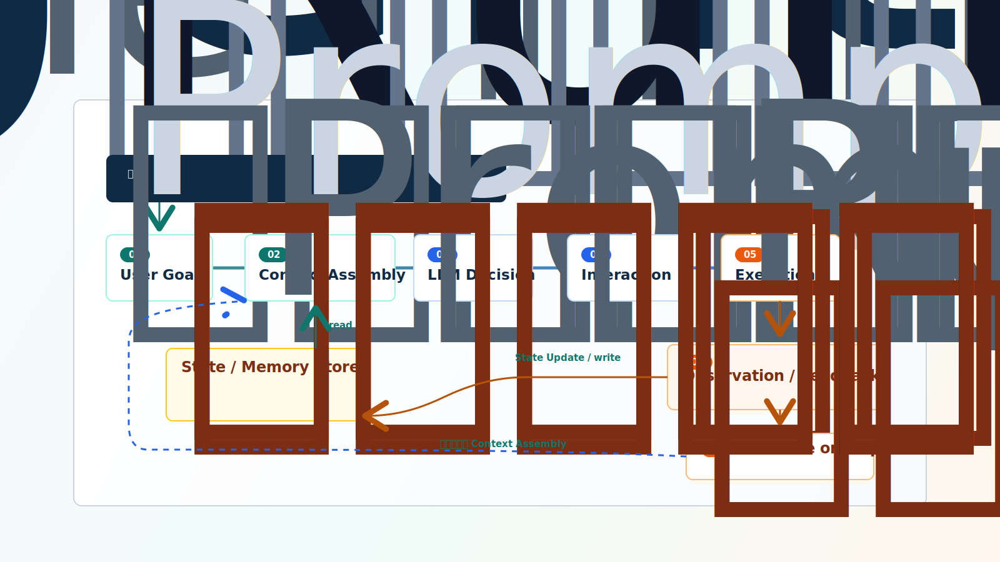

# Lesson III: Minimal Agent closed loop

## Introduction to the curriculum

Course one shows you the true shape of the Agent product, course two explains why the Agent paradigm evolved today. In course three, the focus of learning goes from "understanding the concept" to "manage the structure".

This class answers a very specific question:

```text
What exactly makes up a minimal but complete Agent?
```

Many learners fall into two error zones. The first error was to think of Agent as "a stronger LLM" -- thinking that if the model was strong enough, Agent would be automatically reliable. The second area of error is the reverse -- thinking that it is necessary to add all RAG, Memory, Planning, MCP, Multi-Agent.

Both judgements are inaccurate.

The first problem is that the LLM is essentially a "next Token predictor". It can do amazing reasoning in linguistic space, but it can't check its own databases, run its own codes, judge for itself, "I've done a few steps, what to do next." The equivalent of Agent to a stronger LLM is the equivalent of a more intelligent brain -- a brain that is the core, but without hands, without eyes, without memory, without a mechanism to judge when to stop.

The second problem is that those capabilities are really important, but they are not the premise that Agent exists, but rather the expansion of Agent in a particular direction. It's like a man doesn't have to be an athlete to walk, and an Agent doesn't need access to RAG and Multi-Agent to work.

The core points of this course are:

```text
Agent = Prompt (behavior definition) + LLM decision-making + tool/environment interaction + State (state management) + loop control
```

This formula has five, which can be seen in two layers: **Prompt is the defined layer** -- And it decided before the cycle started, "What's this Agent, how does it think, how does it output?" And the last four are **Runtime Layer** -- they make Agent really work in the cycle.

The formula is not to define the full capacity of all Agent products, but to capture the smallest closed circle -- the simplest structure that can run, do multi-step missions, be controlled to stop. The tool mechanisms in the follow-up course, RG / Memoory, Planning / Workflow Pattersons, Harness, Evaluation, Guardrails, are all continuing to expand around this closed circle.

---

## Learning objectives

After this lesson, you will be able to:

1. **Explain why the smallest Agent can't only understand the essence of LLM**, including that it doesn't know that it's an Agent
2. **Draws the smallest Agent running links** — Quite clear `Prompt → User Goal → Context Assembly → LLM Decision → Interaction → Observation → State Update → Continue or Stop`
3. **Understands the role of Prompt in Agent** -- Knows why Prompt is the "source code" of Agent, which defines the behaviour, format and boundaries of Agent
4. **Distinguishing core modules from connect points** — understand why Context Assembly, Observation is a link-to-non-core module
5. **Understands the role of state (state) management** -- Know what information needs to be stored independently of LLM and why context windows cannot be used as the only state store
6. **Design of circulatory control rules** — including cessation conditions, maximum steps, overtime, repeat detection and failure to exit
7. **Plan for the minimum RealAgent realization** -- defines Prompt, Tools, Status, Trade, Error Processing and Testing Tasks

---

## Contents

- [Introduction to the curriculum](#introduction-to-the-curriculum)
- [Learning objectives](#learning-objectives)
- [Chapter One: Why is the smallest Agent?](#chapter-one-why-is-the-smallest-agent)
  - [1.1 Nature of LLM: An extremely strong "Next Token Predictor"](#11-nature-of-llm-an-extremely-strong-next-token-predictor)
  - [1.2 LLM will say, but will not do](#12-llm-will-say-but-will-not-do)
  - [1.3 LLM will judge, but will not remember.](#13-llm-will-judge-but-will-not-remember)
  - [1.4 LLM can reason but cannot control its own borders](#14-llm-can-reason-but-cannot-control-its-own-borders)
  - [1.5 LLM is a universal engine but doesn't know it's Agent.](#15-llm-is-a-universal-engine-but-doesnt-know-its-agent)
- [Chapter II: Minimum Agent Composition](#chapter-ii-minimum-agent-composition)
  - [2.1 Core formula](#21-core-formula)
  - [2.2 Prompt: Definition of conduct](#22-prompt-definition-of-conduct)
  - [2.3 LLM Decision-making](#23-llm-decision-making)
  - [2.4 Tools/environment interface](#24-toolsenvironment-interface)
  - [2.5 Status management](#25-status-management)
  - [2.6 Cycle control](#26-cycle-control)
- [Chapter III: Minimum operating links](#chapter-iii-minimum-operating-links)
  - [3.1 Minimum closed ring map](#31-minimum-closed-ring-map)
  - [3.2 Summary of links: a chain of five components](#32-summary-of-links-a-chain-of-five-components)
  - [3.3 Prompt Engineering: Agent's Source Code](#33-prompt-engineering-agents-source-code)
  - [3.4 User Goal: from vague intent to actionable target](#34-user-goal-from-vague-intent-to-actionable-target)
  - [3.5 Context Assembly: What models should see](#35-context-assembly-what-models-should-see)
  - [3.6 LLM Decision: What next](#36-llm-decision-what-next)
  - [3.7 Interaction & Exchange: Really do](#37-interaction-exchange-really-do)
  - [3.8 Operation / Feedback: Returning results to loop](#38-operation-feedback-returning-results-to-loop)
  - [3.9 State Update: Write about what happened in this round into State](#39-state-update-write-about-what-happened-in-this-round-into-state)
  - [3.10 Continue or Stop: Know when to stop](#310-continue-or-stop-know-when-to-stop)
  - [3.11 Correct location for State storage](#311-correct-location-for-state-storage)
  - [3.12 Distinction between core modules and connecting points](#312-distinction-between-core-modules-and-connecting-points)
  - [3.13 Engineering principles behind the minimum closed ring](#313-engineering-principles-behind-the-minimum-closed-ring)
- [Chapter 4: Realization of the smallest RectAgent](#chapter-4-realization-of-the-smallest-rectagent)
  - [4.1 Why the first no-recommended framework is achieved](#41-why-the-first-no-recommended-framework-is-achieved)
  - [4.2 Fake code structure](#42-fake-code-structure)
  - [4.3 Tool design](#43-tool-design)
  - [4.4 Trace Record](#44-trace-record)
  - [4.5 Base error management](#45-base-error-management)
  - [4.6 Test mission design](#46-test-mission-design)
- [After-school exercises](#after-school-exercises)
- [Acceptance and inspection standards](#acceptance-and-inspection-standards)
- [References](#references)

---

## Chapter One: Why is the smallest Agent?

In course two, we said that LLM is the core of Agent's decision-making, but not the full Agent system. This chapter pulls this conclusion closer to the point where you can see: **If only LLM, a system that looks like Agent would be stuck.**

The key to understanding this problem is not to devalue the capacity of LLM, but to accurately understand the essence of LLM. The essence of it determines what it is good at, what it is not good at -- and the Agent system is putting "prosthesis" on LLM in a direction that is not good at.

### 1.1 Nature of LLM: An extremely strong "Next Token Predictor"

LLM, regardless of its size and reasoning, has not changed its basic working mechanism: based on the previous text, it predicts the next most likely to be Token.

This mechanism has created an amazing ability — to understand complex instructions, to write beautiful articles, and to step by step on mathematical questions. However, it also delineates the natural boundary to be used by the model: **The model itself will not perform external actions.** It can generate text or a structured tool to call intent, but true access to files, query databases, running codes, writing results is still out of the model for Runtime and tool layers. The model can be relied upon in a single call, but only in the context of this request.

In the language of course two: LLM ' s internal reasoning is strong, but it lacks internal feedback from the system. And it's exactly what Agent needs to interact with the outside world on a continuous basis — getting new information, implementing actions, observing results, adjusting strategies. It's not possible to create the next text.

### 1.2 LLM will say, but will not do

Suppose you say to a pure LLM system:

```text
Help me check why this project failed.
```

It may answer:

```text
You can run the test command, check the error log, and then locate the relevant files.
```

The answer may be entirely correct, but it is only recommendation **, not action**. The model does not really run the tests, does not read the log, does not check the code. It's like a man trapped in a room who can tell you how the outside world works, but cannot reach out to touch anything.

If you want to be Agent, at least the system can:

- Reads the project document.
- Execute the test order.
- Receive test results.
- Determines the next step based on erroneous information.
- If necessary, the user is stopped or requested to intervene.

Each requires a mechanism other than the "generated text" — someone to actually carry out the action and get the results back.

### 1.3 LLM will judge, but will not remember.

LLM's memory depends entirely on the context of this request. It does not itself have a durable mission state of application of automatic succession — the next call of the model cannot reliably know what happened in the last time if Runtime does not re-invent goals, history, tool results.

This is hard for multi-step missions. Assuming that a mission takes 5 steps to complete, the return of the tool for each step is long. By step 4, the context window may have been plugged in by the first three steps. Even worse, the study has found that LLM's attention to information in the middle of the context is significantly lower than at the beginning and end -- the "lost in the Middle" phenomenon. The user at the beginning of the mission said, "Don't move the production environment." If it happens in the middle of the context, Agent might forget it at step 5.

So Agent can't manage the state just by "throwing history into context." It requires a state storage independent of LLM, managed by Runtme — the reservation, the compression, the injection. That's what state management does.

> If you read this, you might ask-- **Runtme what is it?** It has been mentioned repeatedly earlier: the state of the tube, the tools to implement it, the cycle is controlled by it. You can interpret Runtme as Agent's **operating system**. It's like operating systems managing CPU, memory, disk, process scheduling -- it doesn't write documents, make tables; Runtme management storage, tool execution, loop control, permission verification, Trade records -- it doesn't do semantic reasoning, it doesn't generate text. <br>
More precisely: **Agent structure, all parts of the "certainty duty" fall within Runtme.** The LLM output is uncertain (the same prompt two calls may have different results), but whether the tool is implemented, whether the parameters are valid and whether the number of steps is excessive — these judgments must be definitive and auditable. Runtme is the level of infrastructure that carries out these definitive duties. You will see it again and again in each follow-up course - in Course 4 it is the registration and competence centre for tools, in Course 5 it is the reader for Memoory, in Course 6 it is the Harness/observable skeleton, and in Course 7 it is the point of implementation of the failure recovery and safety strategy.

### 1.4 LLM can reason but cannot control its own borders

LLM naturally tends to "continue to produce". It does not know when to stop, when to ask for help and when its actions have become a cycle of death.

If you let a pure LLM system work in a loop, it may:

- The same tool has been repeatedly called because it makes similar decisions every time it sees a similar context.
- It's a reasonable choice to try again indefinitely after a mistake, because it doesn't know that "release" is also.
- After the mission has been completed, it continues to operate redundantly because it does not have the concept of "finished" — it just generates the next Token.
- High-risk actions are still carried out in cases of uncertainty because it does not have the capacity to "risk judgement" — it sees a probability distribution, not a consequence.

So Agent can't just rely on the LLM's judgment to manage his operational boundaries. Cycle control must be left to Runte — Runte sets hard limits (maximum step, time over time, double detection) and LLM makes decisions within the bounds. This is not a model of mistrust, but rather a role of "decision" and "exercise border" that is best suited to them.

### 1.5 LLM is a universal engine but doesn't know it's Agent.

The first three limitations — which cannot be done, cannot be recorded, cannot be controlled — are the limits of the capacity of LLM. But there is a more fundamental question: the LLM's **identity boundary**.

LLM is a universal text generator when it leaves the plant. It's trained to "renew the text," not "exercise multi-step." If you go straight to a naked LLM and say, "Look at today's weather and what to wear according to weather advice," it doesn't automatically call the weather API, analyze the results, and then give advice -- it only generates a text that looks like a recommendation.

The authors of the Rect paper have done a key experiment to prove this: the same frozen PLM-540B model, **the general question-and-answer tip and the react style few-shot trajectories, showing a difference**. It's not the model getting stronger -- it's Prompt telling the model how it should be done.

```text
Regular question and answer reminder: LLM → Generate a text (may be recommendations, may be answers, may be fabrications)
ReAct Style tip: LLM → Learn to press → Action → Observation Orbital advance.
```

Prompt solves the problem: **Turns the universal engine into a specific type of Agent.** It defines three things:

- **Role**: Who are you and what are your goals?
- **Behavior protocol**: how do you think?
- **Output format**: what every step of your output should look like so that Runtme can be reliably analyzed

In other words, the first three limitations are the question of "LLM's lack of capacity," and this limitation is the question of "LLM doesn't know what its role is." Together, four questions point to the five components of the smallest Agent -- Prompt defines "what to do "Agent," the latter four components actually make it work.

---

## Chapter II: Minimum Agent Composition

In the last chapter, the LLM four "no" -- can't do it, can't remember, can't control it, don't know they're Agent. This chapter corresponds each "not" to a specific system component. These five components together are the smallest Agent skeleton.

### 2.1 Core formula

```text
Agent = Prompt (behavior definition) + LLM decision-making + tool/environment interaction + State (state management) + loop control
```

Five parts are not necessary. This formula says not that all Agent can have these five parts, but that: **If not even these five, it cannot be a minimum integrity.** | Composition | Address which limitations of LLM | What if it's missing? |

|---|---|---|
| Prompt | "I didn't know I was Agent." | LLM doesn't know what role to play and what agreement to follow. |
| LLM Decision-making | - This is an enhanced object. | The system doesn't understand open targets. |
| Tools/environment interface | "I'll say no." | The system can only say no. |
| State Management | ♪ Will judge not to remember ♪ | The system can't work continuously, forget what it's done. |
| Cycle control | "I can reason not to control the boundary." | The system is easily out of control, dead or unable to complete multiple steps. |

These five components are not separate blocks. They are connected by the running link, forming a closed ring. Before turning to the operational link (chap. III), we understand what each component is responsible for.

### 2.2 Prompt: Definition of conduct

> **Terminology: Prompt** in the Agent context is not "just a hint". It is a structured **behavioural definition document** — defining Agent's identity, reasoning protocols, tools available, output formats and boundary behaviour. In the follow-up course, each Agent (course V) has its own Prompt, and Prompt's version management and evaluation (course VI) also revolves around this "source code". **Please establish an accurate understanding of Prompt in this section: it's Agent's "Procedure", not "Remark".**

The central problem that Prompt solved was that **LLM was a universal engine, not knowing that it was Agent.** You have to tell it clearly — who you are, how you think, what tools you can use, what your output must look like.

In the smallest Agent, Prompt usually contains the following levels (section 3.3 will be spread out one by one):

| Level | Contents | Questions answered |
|------|------|-----------|
| Identity Level | System programme: role description, overall objective | "Who am I?" |
| Protocol Layer | Thought/Action/Observation Cycle Format | "How do I think and act?" |
| Tool Layer | Name, use, parameters, call format of available tools | "What can I use?" |
| Constraint Layer | Output format requirements, cessation conditions, secure borders | "What's my limit?" |
| Example Layer | Few-shot example, church model boundary behaviour | "What about this?" |

A key engineering judgment: **Prompt is not "write and forget."** It is the only source of definition of the act of Agent. When Agent's performance did not match expectations, the first thing to check was Prompt -- isn't the role definition vague? Did the tool description confuse the model? Is there a lack of examples of a border situation? Okay, Prompt is an iterative, not a one-time right.

Prompt and what is to be said later is the upstream/downstream relationship: **Prompt is the static template (framework), and Context Assembly is dynamic fill (data).** In each cycle, Context Assembly fills the current State (target, history, tool results) in the Prompt template to generate the full context that LLM actually sees.

### 2.3 LLM Decision-making

LLM decision is Agent's brain. Its duty is to answer a question that every cycle has to face:

```text
What should be done next based on the current context and state?
```

Specifically, the model requires judgement:

- What is the target of the user?
- What do you know? What's missing?
- The next step is to call the tool, give the answer, ask the user for a supplement, or acknowledge the failure?
- If so, which tool? What parameters?
- Has the current task been completed?

In the smallest Agent, LLM decision-making should usually output structured results rather than any natural language. For example:

```text
decision_type: call_tool
tool_name: read_file
arguments:
  path: notes.md
reason: Read user-specified documents to complete wrap-up tasks
```

Why the emphasis on structure? Because Runtme needs to know exactly what the model wants to do to decide whether to allow it. If the model is produced in the natural language, "I think we should read the file," Runtme is hard to decipher in a reliable way -- each person's expression is different, and the same model may be different at different times. The structured output removed this ambiguity.

Here is an important engineering principle that runs through the entire course:

```text
The model is responsible for proposing the next step, Runtime is responsible for judging whether it can be implemented.
```

Models are good at understanding semantics and making decisions, but they should not have final enforcement powers. The enforcement authority remains in Runte, which can verify whether the instrument exists, whether the parameters are legal and whether the operation is within a secure border. It's not a model of mistrust -- it's a separation between "decision" and "authorization".

### 2.4 Tools/environment interface

Tools/environment interactions are Agent's hands and eyes.

Tools allow Agent to: read documents, write them, search API, execute codes, search information, search databases, access business systems.

Environmental feedback allowed Agent to know whether the tool had been successful, what results had been returned, whether errors had been made and whether the next step needed to be adjusted.

In the smallest Agent, tools can be very simple. You don't need to start accessing complex tool platforms. Example of minimum tool:

| Tools | Use | Risk level |
|---|---|---|
| `read_file` | Read local text files | Low |
| `write_file` | Writing local files | Medium |
| `search_text` | Search for keywords in a set of texts | Low |
| `calculate` | Perform simple calculations | Low |
| `fetch_api` | Call an open API | Medium |

A key design detail: **The return result of the tool should be structured and not just an original string.** If the tool only returns "failed", the model cannot judge whether it should be replaced by a tool, adjusted parameters or changed strategy. If the tool returns the complete error code and cause, the model may make a smarter next decision.

Course IV will discuss in depth the definition, selection, implementation, authority and security of tools. This lesson only requires understanding: the tool is an external interactive point in the closed circle - It's the only way for models to enter the real world from "language space."

### 2.5 Status management

> **Terminology: State (state)** is a core concept that cuts across the follow-up course. Runtime maintained in each cycle `state ` The object recorded Agent, "What has been done, where is it now, what more needs to be done." The results of the implementation of the tools for course four, the completion of course five, the continuation of course five, the recovery of Harness Trace for course six, and the breakdown of course seven, all around.` state` Expand. **Please establish an accurate understanding of State in this section.**

Status Management made Agent move from "one-round questions and answers" to "multi-step assignments." The central problem it addresses is that the context window of **LLM cannot and should not be the only State storage.**

A minimum Age field to maintain at least:

- User target.
- Current number of steps.
- Historical messages (or compressed summaries).
- Tools mobilized and their results.
- Intermediate findings and findings.
- information sources
- Reason for discontinuation (if any).

There is an important conceptual distinction here: **State (state) is not equal to long-term memory.** In this course, State primarily refers to information that needs to be saved while the current task is running - Its life cycle is this task. The long-term Memoory is a cross-task, cross-conference information accumulation (user preference, historical experience) that is part of the fifth course and is not a mandatory option for the minimum closed circle.

The smallest State object can be long:

```text
# State Example: A structured run-time status object
task:
  goal: "Read notes.md and summarize it as five points."
  step_count: 2
  max_steps: 8
  history:
    - user_goal
    - decision_read_file
    - observation_file_content
  tool_results:
    - tool: read_file
      status: success
      summary: "Read 1200 word Markdown content"
  errors: []
  stop_reason: null
```

The key to State's management is not "too much." It's "whatever the next decision needs." This is a trade-off - the model lacks a basis for decision-making; there is more, the context window expands and the model is distracted. Okay, state management is a balance between "full information" and "simplified information".

### 2.6 Cycle control

Cycle control determines whether Agent continues and when to stop. It's Agent's "self-discipline" -- without it, Agent is like a man who doesn't know when to stop.

Minimum circulation controls include at least:

- **Maximum step**: hard ceiling to prevent unlimited cycle.
- **Timeout per step**: a single tool cannot wait indefinitely.
- **Maximum number of tool failures**: successive failures may not be an occasional problem.
- **Repeated action detection**: consecutive calls to the same tool, no new developments, should stop or request intervention.
- **Successful completion of judgement**: after model statement final answer, Runtime confirms can be terminated.
- **Failed to exit judgement**: decisive cessation in case of irrecoverable error.
- **Ask the user, if necessary,** to stop and ask if an uncertain action requires additional information.

Cyclical control has an easy-to-neglected design philosophy: **"Can stop" and "Can continue" are the ability of a pair that must be addressed simultaneously.** Agent will get out of control, an Agent too easy to stop can't finish the mission. Good circulation controls find a balance between "not easy to give up" and "time out."

---

## Chapter III: Minimum operating links

Chapter II describes the five components - Prompt, LLM decision-making, tool/environment interface, State management, and circulation control. This chapter answers how they form a closed circle.

Let's change it. I'll give you a panorama -- draw the entire chain and indicate the position of Prompt, the boundaries of Runtme, the position of State, the direction of data flows. After you set up the coordinates of "where and who" and then went into each of them.

### 3.1 Minimum closed ring map



This picture has five meanings:

- **Prompt at the top (defined layer)**: Prompt is the "source code" of Agent, which exists before the cycle starts. It's not in the loop link -- it's not involved in every step of the update -- but it's used as a template for every round of Text Assembly to fill in dynamic data. Sections 3.2 and 3.3 will go deep into the structure design of Prompt.
- **Closed link (first half)**: User Goal → Context Assembly → LLLM Regulation → Tool Exchange → Observation → State Update or Stop — this is the path for data flow in each cycle.
- **Runtime Load (Box)**: The whole link runs over Runtime. The tool is not directly executed by LLM, it is executed by Runtme; the cycle is not stopped by model reasoning, it is judged by Runtme; State is not forgotten by LLM, it is managed by Runtme. 1.3 The division of labour between LLM and Runtme referred to in the section - "Model for decision, Runtme for execution and boundary" - is its visualization.
- **State Reading and Writing (Left Bottom Box)**: Context Assembly Read from State, State Update Write to State. State is not on the main chain road - it is not a step in the business process, but an infrastructure maintained by Runtme.
- **Feedback closed loop (right loop)**: Each round of Observation will influence the next round of decision-making through State Update -- That's the core idea of Rect: reasoning and action feed each other in a cycle.

### 3.2 Summary of links: a chain of five components

With the panorama, the following links are spread by text:

```text
Prompt(Definition of behaviour: static template, definition of Agent identity and protocol)
 → User Goal(User input anchor)
 → Context Assembly(Connect point: Prompt template+ State → LLM )
 → LLM Decision(Core module: decision-making brain)
 → Tool / Environment Interaction → Execution(Core modules: hands and eyes)
 → Observation / Feedback(Connect points: the outside world → State The Bridge)
 → State Update(Write back to State)
 → Continue or Stop(Core module: circulatory self-regulation)
 → If you continue, go back to Context Assembly
```

Of the eight links, five are core components (Prompt, LLM decision-making, tool interaction, State management, circular control), two are operational connection points (Context Assembly, Operation / Feedback) and one is user input anchor (User Goal). 3.12 The distinction between core modules and connect points is explained in detail in the section.

Prompt is at the top of the chain not because it's "most important" but because it defines all the rules of conduct that follow -- LLM decides according to the protocol defined in Prompt, the tool list informs the model through Prompt, and the output format is bound by Prompt. No Prompt, the chain behind is just empty.

We're moving on one step at a time.

### 3.3 Prompt Engineering: Agent's Source Code

In the second chapter, we define Prompt as a component. This section goes into the internal structure of Prompt -- what it looks like, what it solves, how it works.

#### 3.3.1 Why is Prompt Agent 'source code'?

Return to rect paper. The core contribution of the paper is not a new model structure, not a new training method, but a **Prompt design**. Using frozen PLM-540B (parameters are completely frozen, without fine-tuning), the author allowed the model to present the Agent behaviour of "adjection-action-observation" through carefully designed few-shot trajectories.

What does that mean? **The same model, another Prompt, went from "text generator" to "Agent."** That's why Prompt is called Agent's "source code" -- it defines the whole logic of the program. LLM is the common engine for this program.

An intuitive analogy:

| Concept | Similarity |
|------|------|
| LLM | CPU. |
| Prompt | Program source code (defining what to do, what to do, when to stop) |
| Runtime | Operating systems (management of memory/state, movement control tools/IO, control of enforcement borders) |
| Agent | An instance of a running application |

**Prompt is not a note you wrote to LLM by hand -- it's a program you wrote in natural language.** Like other procedures, it needs to be designed, tested and iterative.

#### 3.3.2 Agent Prompt 's five-layer structure

A complete Agent Prompt usually has five levels. Not every Prompt must be complete on five floors, but understanding these five floors will help you build a system of coordinates designed by Prompt.

```
┌─────────────────────────────────────────────┐
│ First level: Identity│
│ "You're the one.……,Your goal is...……"                    │
├─────────────────────────────────────────────┤
│ Second level: Protocol level (Protocol)│
│ "You have to follow. → Action → Observation  │
│  It's a format for thinking and acting."│
├─────────────────────────────────────────────┤
│ Third level: Tool layer (Tools)│
│ "You can use the following tools:│
│  - read_file(path): Read File Contents│
│  - search_text(keyword): Search Text│
│  - finish(answer): Output final answer."│
├─────────────────────────────────────────────┤
│ Level 4: Constraints│
│ "Every step of the output must be legal, JSON."│
│ "You must call after the mission.│
│ "If you're not sure, ask the user to confirm. Don't guess."│
├─────────────────────────────────────────────┤
│ Fifth Layer: Example Layer│
│ "Here are some examples of how you should work:│
│  [few-shot Example 1]                           │
│  [few-shot Example 2]"                          │
└─────────────────────────────────────────────┘
```

Gradually:

**First floor: Identity**

Defines the roles, professional areas and overall objectives of Agent. This is Prompt's portal -- it tells the model who to play in the next conversation.

```text
You're a professional research assistant. Your goal is to carry out information retrieval and summary tasks accurately and efficiently, based on information provided by users.
```

The identity level seems simple, but far-reaching. If you write "you're a programming assistant" "vs" you're a code reviewer, the model gives a completely different style and focus of response to the same questions. Identity levels provide the tone for all subsequent actions.

**Second floor: protocol**

Definition of Agent's **Behavior Agreement** - How it thinks, how it acts, how it handles feedback. This is the most critical layer of Prompt because it directly determines whether Agent will be "circle."

Example of definition of prompt protocol for Rect mode:

```text
You have to think and act in the following format:

Thought: To analyse the current situation, to determine what more information is needed and to decide what to do next.
Action: Perform a specific operation. Formats as tool names.
Observation: The result of the operation (provided by the system, you do not need to generate this line).

Repeat → Action → Observation Until the mission is completed.
Finish the task, output Final Answer.
```

The protocol level answers three questions:

- **Think about when it happened?** Before every move. (Or is it just the key nodes? It's a matter of whether it's a matter of making a decision.
- **How does the action express?** Toolname + Parameters are placed in a specific format to facilitate the analysis of Runtime.
- **When does it end?** Call finish/ output Final Answer.

Once the protocol level is set, the back tools design, circulation control, State management will be around it. The protocol layer is the "interface definition" of the Agent architecture.

**Third floor: Tool layer (Tools)**

Tell the model what tools it can use, the use of each tool, parameters and attention.

```text
You can use the following tools:

1. read_file(path: str) — Reads the file contents of the specified path. Path must be a valid file path.
2. search_text(keyword: str, text: str) — Searches for keywords in text, and returns a matching sentence.
3. finish(answer: str) — Call when the task is completed, output the final answer. The dialogue ended when this tool was called.
```

The tool layer is not just "list a functional signature". A good tool description should:

- Write clearly **when this tool should be used** (purpose statement)
- Write clearly **parameters** (type + meaning + example better)
- Write clearly **possible failures** (does not exist, network timeout, etc.) to prepare the model

The tool layer is the only way for LLM to know what it can do. If the description of the tool is ambiguous, the model may be wrong -- it's not smart enough, it's your "document" not clear.

**Fourth floor: Constraints**

Defines the behavioral boundary of Agent - output format, cessation conditions, security constraints.

```text
Binding:
- The output of each step must be in a valid JSON format that contains the decision type and reason fields.
- If the same tool is called twice in a row and the result is no new information, the strategy must be changed or user help requested.
- Documents should never be deleted unless explicitly requested by the user.
- In an uncertain situation, call ask user to request confirmation, do not guess.
```

The binding layer reflects the division of labour between Runteme and LLM: **Runte is responsible for the execution of hard restraints (checking parameters, blocking hazardous operations) and Prompt is responsible for the communication of soft restraints (showing models which actions are not permitted and making them self-obligated in decision-making).** Two layers of protection are more reliable than one layer alone.

**Fifth floor: Example Layer**

How it should be done through the few-shot example church model. This is one of the most critical findings of the Rect paper.

```text
Here are some examples of the right work:

Example 1:
User Target: Read notes.md and summarize it as 3 points
Thought 1: I need to read the content of notes.md and then get a summary based on it.
Action 1: read_file("notes.md")
Observation 1: [Document content is "Agent" as an AI system capable of autonomous multi-step tasks……"]
Thought 2: I've got the document. Now we can sum up three points.
Action 2: finish("1. Agent LLM decision-making is at its core.+ Tool Interactive…… 2. Status Management…… 3. Cycle control……")
```

The illustrative layer addresses boundary behaviour that is not described in the protocol layer — for example, how to try again in case of errors, how to change keywords when results cannot be found, and how to request users in case of uncertainty. These boundary acts are ludicrous in natural language, while one example is very intuitive.

The examples are not as good as the others. 2-3 high-quality examples (covering normal paths + an error recovery scenario) are usually more effective than 10 simple examples.

#### 3.3.3 Five-level collaboration

Five layers are not five isolated words. When they work together, they have the effect of "whole is greater than the sum of the parts":

| scene | The working layer |
|------|-----------|
| User questions, Agent start thinking | Identity level + protocol level: know who you are and what to think about. |
| Agent judge needs to read_files | Tool Layer: Knowing that read_file exists and knowing what parameters it accepts |
| Agent Output First Decision | Constraint + Protocol Layer: Output valid JSON, meeting Thought/Action format |
| File does not exist, Agent received error | Example Layer: few-shot displays similar error recovery |
| Agent requests user fixes path | Constraint: "Call user confirmation when uncertain." |

A good Prompt won't let a certain layer take all responsibility. The layer of identity defines "who," the layer of protocol defines "how," the layer of tools defines "what to do," the layer of restraint defines "what to do," and the layer of example defines "what to do in case of a border."

#### 3.3.4 Relationship between Prompt and Context Assembly

You may note that Prompt's reference to "target" and "history" changes in every cycle. This leads to a division of labour between Prompt and Context Assembly:

```text
Prompt(Static Template)
─────────────────────          ─────────────────────────
Identity level: "You're a research assistant." → It's the same. Every round.
Protocol Layer: "Thought → Action → …" → It's the same. Every round.
Tool Layer: Tool List and Description → No change (unless tools are added or reduced when running)
Constraint: Output format and security rules → It's the same. Every round.
Example Layer: few-shot Example → It's the same. Every round.
                                +
                                ← User Goal(Read from State)
                                ← Number of current steps (read from State)
                                ← Recent N Step History (read from State)
                                ← Previous tool result (read from State)
                                ← Error information (read from State)
```

In summary: **Prompt is the framework, Context Assembly is the filler.** Prompt defines "It's a Rect Act", and Context Assembly tells it "You've made step 3 now, read_file just failed, the file doesn't exist."

---

### 3.4 User Goal: from vague intent to actionable target

The user target is the starting point for Agent. It may be clear ( "Read notes.md, summed up as five points") or it may be vague ( "Clean this directory for me."

The quality of the target directly affects the performance of the entire closed circle. A goal that is too vague (e.g. "Help me optimize this project"), LLM does not have enough information to judge what "optimise" means in its first decision-making. Code structure? Readability? It may require multiple rounds of testing to figure out what the users really want and may even go in the wrong direction. An overly ambitious goal (e.g., "Reconstructing the entire code library") would go beyond the capability limit of the smallest closed loop -- a task that requires Planning to break down, Memoory to inter-conference tracking, and better access controls.

Now **For the first time in learning the smallest agent closed ring, the variable is controlled** — with a clear goal, you can focus on whether the link itself works, rather than on "Agent's actions are caused by the vagueness of the target or by the bug of the link."

On the other hand, the role of User Goal in the closed ring is **anchor** — every subsequent decision is informed by this: is the current move moving forward? Is the current outcome closer to the target? Does the final answer cover all the requirements of the goal? If this anchor is blurred, the whole cycle will drift in uncertainty.

### 3.5 Context Assembly: What models should see

Contact Assembly decides which information enters the context of the model. It's not a simple "suck everything in" operation -- it's a key **information filter and organizer**.

It usually consists of:

- User target.
- Systemic constraints (roles, rules, secure borders).
- Current status of the mission (to which point, what is known).
- Historical decision-making (recent rounds of thought → Action → Observation).
- Recent tool results (or a compressed summary).
- List of available tools (toolnames, uses, parameters).

Here is an important engineering judgement: **Not all historical information should be in the context.** The context window is limited and the model has a lower level of attention to information in the middle position. Contact Assembly needs to make trade-offs — what information is critical to the next decision, what can be summarized, and what can be omitted temporarily.

The smallest Agent uses simple policy first:

```text
System Command+ User Targets+ Recent N Step Original+ List of available tools+ Summary of the current status
```

Lesson 6 will go further, subject Engineering. This class only requires understanding the position of Context Assembly in the closed circle: it's a bridge between "state storage" and "model decision-making."

### 3.6 LLM Decision: What next

LLM Decision is the core of every cycle. The model produces a structured "next decision" based on the assembled context.

In the smallest Agent, the following types of decision-making are common:

| Type of decision-making | Meaning | Runtme Behaviour |
|---|---|---|
| `call_tool` | Call Tool | Validation of results |
| `final_answer` | Mission accomplished. Output final. | Record complete Query Back answer Case |
| `ask_user` | Additional user information or confirmation required | Suspend cycle poach waiting for user |
| `fail` | Can't go on, admit failure. | Record the cause of the failure |

Model decisions are not final. Runtime still needs to verify whether the tool exists, whether the parameters are valid, whether the permission is exceeded, whether the step is exceeded and whether the user should be asked for confirmation.

### 3.7 Interaction & Exchange: Really do

Runtime takes over execution when the model decides to call the tool.

Implementation will include:

- Verify Tool Name (Does this tool exist?)
- Validation parameters (types correct? all required entries? values within legal range?)
- Execute tools (real read_files, transfer API, run codes).
- Capture anomalies (files do not exist, network overtime, inadequate access, return formats are abnormal).
- Normalize return results (formulate original results into structured Observation).

One practical experience: the original results after the tool has been called should not be plugged back into the model without processing. Especially when it's a long time -- like reading a 5,000 line file -- it's just stuffing the whole text into the context and stuffing other important information. The smallest Agent should at least have a simple cut-off or summary.

### 3.8 Operation / Feedback: Returning results to loop

Observation is the result of the implementation of the tool... It may be the content of the document, the search results, the API response, the error information, the denial of permission, or the user confirmation.

The role of Observation is only one, but crucial: **to influence the next round of decision-making.** If Agent reads a file but finds that it does not exist, the next round should request the user to fix the path instead of continuing to pretend that the file exists. Observation is the information channel between the outside world and model reasoning -- without it, models are blind guessing.

A real example:

```text
Action: read_file("notes.md")
Observation: status=error, code=file_not_found, message="Not Found
Next Decision: ask_user("No notes.md, please confirm whether the file path is correct")
```

That is the meaning of the closed circle: the outcome of each step changes the way forward.

### 3.9 State Update: Write about what happened in this round into State

> **State Update is in closed circle `state ` Object writing operations** - Runtime will take the decision-making and observation of this round after each cycle has ended Write Back ` state` For the next round of subject Assembly.

State Update records what happened in this round to State. It needs to record:

- Models do make decisions.
- Whether the tool is implemented and what the results are.
- There was no mistake.
- Is the current mandate closer to completion?
- Need to stop or request user intervention.

State Update aims not to "archive" but to support three key needs:

1. **Context Assembly**: The next round needs to know what happened in the current round (read from State).
2. **Failed debugging**: State history is the sole basis for mapping problems when a mission fails.
3. **Mandate resumes**: If the mission is interrupted, State can be used for restoration.

The smallest Agent should at least be able to record every step of Trace. Trace does not need to be complex — a structured record containing step numbers, decision-making elements, tool results, and cessation of judgement is sufficient.

### 3.10 Continue or Stop: Know when to stop

After each round is over, Runtme must judge: continue or stop?

The basis for the determination is:

- Does the model give Final answer?
- Is the maximum number of steps reached?
- Are the same tools repeatedly called and no new developments?
- Have there been unrecoverable errors?
- Is user confirmation or additional information required?
- Is there a hit risk rule?

If you continue, re-enter the Context Assembly — assemble the new context in an updated state and start the next cycle. If it stops, the final answer or cause of failure is given.

After the last eight steps, you have a complete understanding of the closed circle of "data flow". The following three sections (3.11-3.13) do not introduce new links, but do a deeper analysis of three of the most misunderstandings in the closed circle: why is State next to the chart rather than in the chain? Prompt and Context Assembly why does a core component count a connection point? What are the uniform engineering principles behind the whole chain?

### 3.11 Correct location for State storage

It's in the graph. `State Store` Not on the main chain road, but next to it. It was deliberately designed.

State storage is not an "independent step" -- Agent won't say "now I'm going to operate State" at one step. State read and write in two stages:

- **Context Assembly** read **information from State** (current progress, historical decisions, tool results).
- **State Update**, add new information **to** State (just what happened, just what happened).

The State was placed next to the main link and not in it to emphasize that it was an infrastructure, not a step in business processes.

In the smallest Agent, State can be a memory object or a JSON file. No database is needed, no vector storage is required. Memoory here is not the long-term memoory-- It starts with the running time of the current task, State.

### 3.12 Distinction between core modules and connecting points

You may have noticed that several links in the running link do not appear in the core formula: Context Assembly, Observation / Feedback. And Prompt appears in the core formula, but its nature is different from the four other running-time modules.

Look first at the five components of the core formula:

| Component | Type | Annotations |
|------|------|------|
| **Prompt** | Define Layer Core | Static template: Defines the identity, protocols, tools, constraints of Agent. Not updated in cycle but consumed per round |
| **LLM decision-making** | Runtime Core | Dynamic: each round will judge what to do next according to context |
| **Tool/environment interface** | Runtime Core | Dynamics: Tool call to implement model decisions |
| **State Management** | Runtime Core | Dynamic: Recording and querying the status of the task while running |
| **Circle control** | Runtime Core | Dynamic: continue or stop after each round |

Prompt's specialty is that it's **static** -- it's not updated in the cycle, unlike State, and not like LLM decisions. However, it remains the core component because it defines the behaviour of all running time modules. No Prompt, LLM doesn't know it's Agent, Runtme doesn't know what format the model output should be.

Look at the connection point:

Context Assembly is the link between Prompt templates, State management and LLM decision-making:

```text
Prompt Templates+ State dynamic data in → Organise as Full Context → Models are used to make decisions.
```

Operation / Feedback is the link point between tool interaction and State management:

```text
Tool implementation results → Information to be understood in a model → Write back to State → Enter next round context
```

This distinction is not a bit of a word. Its engineering meaning is that these connections will change significantly as the complexity of the system increases (the context management strategy changes, the type and source of feedback signals changes), but the functional boundaries of the five core components are relatively stable. The separation of the connect points and the core components will give you a clear idea of what I'm changing when expanding the system — whether it's reconnecting logic or core competencies.

### 3.13 Engineering principles behind the minimum closed ring

There is a consistent engineering principle behind the minimum closure ring. It's passed down from course two, and it's going to follow up on every course:

```text
Models are responsible for understanding objectives and making the next judgement.;
A defined infrastructure is responsible for the implementation of tools, competencies, safety, status, recovery and observation.
```

Don't give everything to the model. For example:

- The verification of the parameter type should be done by code and should not rely on the model to "write right".
- The maximum number of steps should be controlled by Runtme and should not depend on the model "I know it should stop."
- The existence of the tool should be judged by the tool registry and should not be based on the model "check-in".
- Whether or not the document is allowed to be written should be judged by the permission system and should not rely on the model for "satisfactoryness".
- Misrecords and Traces should be kept by the system and should not rely on models to "remember what happened."

The stronger the model, the more important it is. A strong model can raise the upper limit on the quality of decision-making, but establishes the lower limits of a guaranteed infrastructure system. An Agent with a weaker model but well designed by Runte may be more reliable than an Agent with the strongest model but without border control.

---

## Chapter 4: Realization of the smallest RectAgent

The first three chapters say "what" and "why". This chapter says "how" - gives a minimum RealAgent realization without binding any particular language or framework.

### 4.1 Why the first no-recommended framework is achieved

A lot of Agent frames (LangGraph, CrewAI, AutoGen, etc.) can help you quickly build an Agent that looks great. But the framework hides too many key details for the minimum closed circle of first learning.

You might see that the frame has automatically made you a tool to call back the next round of decision-making, but you don't know how the middle group is going to do it, where the State Update happened, or what the basis of the decision is. When Agent behaves abnormally, you can only guess whether it's a framework bug or whether it's a model problem -- because you don't walk the whole chain.

**Minimum achieved for the first time, suggests hand-written loop + direct call to LLM API.** The tool is performed with a local function and the status is written to the console or local file with memory objects or JSON files, Trade. So when you see Agent making a strange decision at step 3, you can go back to Context, Decision, Observation, State Update and know exactly what's wrong.

The framework is a tool for efficiency after you understand the principle, not a substitute for when you don't understand the principle.

### 4.2 Fake code structure

Here's the smallest Python skeleton of Agent Loop. It is not complete, but only the core structure of the closed ring:

```python
from dataclasses import dataclass, field

@dataclass
class AgentState:
    user_goal: str
    max_steps: int = 8
    step_count: int = 0
    history: list[dict] = field(default_factory=list)
    stop_reason: str | None = None

def run_agent(
    user_goal: str,
    system_prompt: str,
    tools: dict,
    llm_call,
    max_steps: int = 8,
) -> dict:
    state = AgentState(user_goal=user_goal, max_steps=max_steps)

    while not state.stop_reason:
        # 1. Context Assembly:Combining Prompt, user goals, historical status and tool lists into models.
        context = assemble_context(system_prompt, state, tools)

        # 2. LLM Decision:The model only outputs the next decision and does not directly execute the action.
        decision = llm_call(context)

        # 3. Continue or Stop:Termination of type decision-making directly ends the cycle.
        if decision["type"] == "final_answer":
            return {"status": "success", "answer": decision["answer"], "state": state}

        if decision["type"] == "ask_user":
            return {"status": "paused", "question": decision["question"], "state": state}

        if decision["type"] == "fail":
            return {"status": "failed", "reason": decision["reason"], "state": state}

        # 4. Interaction / Execution:Runtime Verify and execute tools.
        observation = execute_tool(decision, tools)

        # 5. State Update:Write this round of decision-making back to status.
        state.history.append({
            "step": state.step_count,
            "decision": decision,
            "observation": observation,
        })
        state.step_count += 1

        # 6. Stop Check:The hard constraint is judged by Runtime, not by the model's self-consciousness.
        state.stop_reason = check_stop(state)

    return {"status": "stopped", "reason": state.stop_reason, "state": state}
```

This code reflects several key design decisions:

- **Context Assembly** `state`, reassemble the context of the model.
- **LLM decision**: The model only suggests the next step, such as calling tools, giving final answers, requesting user supplements or failing to exit.
- **Interaction / Exchange**: Tools verified and executed by Runtime, not directly by models.
- **State Update**: decision-making and Observation return round `state` For the next round.
- **Stop Check**: The maximum number of steps, repeat actions, successive errors, etc. are determined by Runtime

`assemble_context() ` 、 ` execute_tool() ` and ` check_stop()` This is deliberately written as a placeholder function because this section is about to show a closed ring structure. Details of tool parameters validation, error packaging, repeat action detection, Trace records, etc. will be expanded in subsequent tool design, Trace and error handling subsections.

### 4.3 Tool design

Minimum Agent suggests starting with 3 tools.

Example group:

| Tools | Input | Output | Use |
|---|---|---|---|
| `read_file` | File Path | File content or error | Read user-assigned information |
| `write_file` | File path, content | Writing success or error | Generate delivery |
| `search_text` | Keywords, collection of texts | Match Snippet | Find information in information |

**Tool returns must be structured**. This follows from the philosophy of Design Calling:

When successful:

```json
{
  "status": "success",
  "summary": "Read 1,200 words of Markdown content.",
  "content": "...Optional, possibly longer...",
  "error": null
}
```

Other Organiser

```json
{
  "status": "error",
  "summary": "The file does not exist.",
  "content": null,
  "error": {
    "code": "file_not_found",
    "message": "Notes.md not found, check file path"
  }
}
```

The advantage of structured return is that the model clearly knows what happened, rather than speculating from a free text. The model is more likely to propose effective amendments when the return contains specific error codes and reasons.

### 4.4 Trace Record

Trace is the debugging basis for the smallest Agent. Agent without Trace is like a black box -- you only know where it ends, you don't know which step it starts to turn.

At least every step is recorded:

- step number.
- Context submary.
- Model decision.
- Tool call (recording tool names and parameters if tools are transferred).
- Observation.
- State update.
- Stop check result.

Example:

```json
{
  "step": 2,
  "decision": {
    "type": "call_tool",
    "tool_name": "read_file",
    "arguments": {
      "path": "notes.md"
    }
  },
  "observation": {
    "status": "error",
    "summary": "The file does not exist.",
    "content": null,
    "error": {
      "code": "file_not_found",
      "message": "Notes.md not found, check file path"
    }
  },
  "state_update": {
    "errors_count": 1
  },
  "stop_check": {
    "continue": true,
    "reason": "You can ask the user to fix the path."
  }
}
```

This Trace allows you to play back step by step when debugging -- see what the models see in each round (context), decide what they decide, get what, state update.

### 4.5 Base error management

At least address these errors:

| Error | Treatment |
|---|---|
| Tools do not exist | Returns a structured error, does not execute, so that the model knows the tool is not available |
| Parameter Invalid | Returns the error details of the parameter so that the model is modified or the user is requested to provide the correct parameter |
| Tool execution failed | Record error, allow limited retry (e.g. 2 times) and stop after |
| Environment not available | Stop or downgrade, and don't let Agent force himself in an unreliable environment. |
| Model output cannot be parsed | Request the model to be re-exported (up to 1), or exit if it fails |
| More than maximum steps | Stop and explain the reason, let the user know, "I'm not done, but I can't go on." |
| Repeating no progress. | Stop or request user intervention and do not let Agent spin in the dead cycle |

Mishandling is not part of "follow up." If the smallest closed ring is not wrong, a slightly more complex test mission is out of control -- tools fail, models go wild, models go wild, models go wronger, tools go round and explode. When experienced people achieve Agent, the amount of error-processing code is often the same as the quantity of the main cycle code.

### 4.6 Test mission design

Test minimum Agent with 10 jobs. The following types are suggested to be covered:

| Type | Example: | Test what? |
|---|---|---|
| Successful Path | Read a document and summarize it | It's basically closed. |
| Multistep tasks | Read files, extract points, write new documents | The state is delivered correctly in multiple steps |
| Parameter Error | User gives the missing file path | Errors capture and feed back to models |
| Tool Failed | Simulate API return error | Limited retry, infinity cycle |
| Clarification required | User targets incomplete | Agent can request additional information. |
| Cycle control | When tools fail repeatedly | Entry into force of hard binding |
| Results validation | Output must contain specified fields | Final answer format correct |
| Status Extension | Step two uses the first step tool results. | The state is transmitted correctly between steps. |
| Writing Operations | Writing local outcome documents | Write operation normal execution |
| Secure borders | Reject when trying to execute an impermissible action | Runtme Valid |

A success rate of more than 70% is an initial goal -- considering that the error management of the smallest Agent is still fundamental, some failures can be expected. And more importantly, if you fail, you have to know why. If you can only see "task failed" but don't know where and why, Trace is not good enough.

---

## After-school exercises

### Practice One: Design a minimum Agent Prompt

Design a complete Prompt for an Agent who reads the file and produces the summary. Your Prompt must contain the following five layers:

1. **Identity layer**: defining the role and overall objective of Agent
2. **Protocol Layer**: Definition
3. **Tool Layer**: Description of at least 3 available tools (name, purpose, parameters, attention)
4. **Constraint**: output format requirements, cessation conditions, secure boundaries
5. **Example Layer**: at least 1 new-shot example showing complete TAO tracks

Additional question: Deliberately remove the "output format requirements" in the binding layer, run the same thing once, and observe LLM behavioral changes. Record your discovery.

### Practice II: Design a minimum Agent status object

Designs a minimum status object for the task of "reading files and generating abstracts". Include at least: user objectives, number of current steps, maximum number of steps, historical decision-making, tool results, error lists, reasons for discontinuation.

Additional question: Think of a scene that explains why "pushing the whole history into the context" is better than "maintaining the status of independence + selective injection."

### Practice III: Design 3 tools

Design 3 tools for your smallest Agent. Each tool is clear: a tool name, utility, input parameters, output structure (in both successful and failed formats), possible failure, risk level.

### Practice Four: Write Minimum Cycle Control Rules

Write at least five loop control rules for your Agent. Each rule is clear: what the trigger is, what action is taken (continuing/stopping/requesting the user), why it is needed.

### Practice 5: 10 test mission designs completed

Design your 10 test missions according to the type of task in chapter 4. Each task is clear: user input, expected tool call chain, success criteria, possible failure points and why it fails.

---

## Runable Example

After completing this course of practice, you can compare the minimum Agent example of running course three with:

- [Lesson 3xAgent](../examples/course-03-minimal-agent/README.md)

The example consists of two versions, Python and Node.js, showing how Prompt, LLM Decision Boundaries, local tools, Runtme's main cycle, State, Trade and cessation conditions form a minimum closed loop that can be run.

---

## Acceptance and inspection standards

After this course, use the following criteria for self-examination:

- [ ] I can say in one sentence the five components of the smallest Agent: Prompt, LLM decision-making, tool/environment interface, State management and circulation control.
- [ ] I can draw a minimum running link and mark the position of Context Assembly, Observation, State Update and Continue or Stop.
- [ ] I can explain the division of "model decision-making, Runtime execution" and give an example of what Runtime needs to be verified at least.
- [ ] I can distinguish between Prompt, Context Assembly, State and long-term memory.
- [ ] I can design Prompt, State, 3 tools and ground stop rules for a mission "to read documents and generate abstracts".
- [ ] I can design 10 test missions and write success criteria and possible failure points for each.

---

## References

### Recommended reading

- ReAct: Synergizing Reasoning and Acting in Language Models

<https://arxiv.org/abs/2210.03629>

- OpenAI Function Calling

<https://platform.openai.com/docs/guides/function-calling>

- Anthropic Tool Use

<https://docs.anthropic.com/en/docs/agents-and-tools/tool-use>

- Anthropic Building Effective Agents

<https://www.anthropic.com/engineering/building-effective-agents>

- Lost in the Middle: How Language Models Use Long Contexts

<https://arxiv.org/abs/2307.03172>

- LangGraph Document

<https://langchain-ai.github.io/langgraph/>
