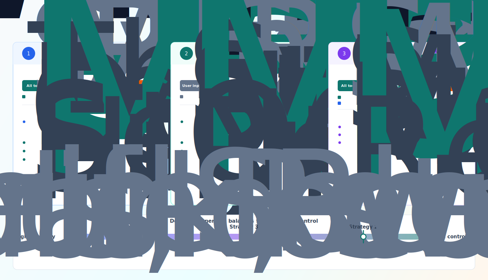

# Lesson IV: Tool Mechanisms

## Course Introduction

Lesson III explained the minimal Agent loop:

```text
Agent = LLM decision-making + tool/environment interaction + state management + loop control
```

Lesson IV zooms in on the part that connects "decision" to "execution": **tool and environment interaction**.

When people build their first Agent, they often assume Tool Use means "connect a few functions to the model." But once you run real tasks, problems appear quickly:

- The model has a search tool, but answers from memory when it should look something up.
- A tool succeeds, but returns 5,000 lines of logs. The next context window is flooded, and the model forgets the user's original instruction.
- The model invents a plausible file path outside the workspace. If the Runtime does not block it, the Agent may read files it should never touch.
- The user says, "Help me send an email." The model calls `send_email` directly, without confirming the recipient or previewing the content.

These failures are not simply caused by a weak model. The deeper issue is this: **a tool call is not an isolated API request. It is a runtime mechanism that must be designed.**

Starting from the Function Calling history covered in Lesson II, this lesson expands tool use into a complete chain:

```text
LLM Decision → Tool Selection → Parameter Generation
    → Permission Check → Tool Execution
    → Observation / Feedback → State Update
```

Every step can fail, and every step needs a corresponding safeguard. The goal of Lesson IV is not to help you connect more tools. The goal is to help you design tool use as a system mechanism that is **selectable, executable, controllable, reusable, and auditable**.

---

## Learning Objectives

After this lesson, you will be able to:

1. **Draw the full tool-call chain** — understand each step from model decision to tool execution to state update, including common risks.
2. **Design clear tool definitions** — write tool descriptions and parameter schemas that help the model understand when to use a tool and when not to.
3. **Diagnose tool-selection failures** — distinguish missed calls, unnecessary calls, wrong-tool selection, guessed parameters, and repeated calls, then locate the root cause.
4. **Implement tool execution and result injection** — use basic patterns for parameter validation, timeouts, retries, structured errors, and result summaries.
5. **Design tool permission policies** — control high-risk actions with risk levels, deny-first rules, least privilege, and audit logs.
6. **Design Human-in-the-loop checkpoints** — decide which tool actions require human confirmation, editing, or takeover.
7. **Place Function Calling, MCP, Tool, and Skill correctly** — understand which part of the tool chain each concept solves.
8. **Turn repeated tool combinations into Skills** — capture task experience, default steps, failure handling, and reuse boundaries.

---

## Contents

- [Course Introduction](#course-introduction)
- [Learning Objectives](#learning-objectives)
- [Chapter 1: How Agents Call Tools](#chapter-1-how-agents-call-tools)
  - [1.1 A Tool Call Is Not Just an API Request](#11-a-tool-call-is-not-just-an-api-request)
  - [1.2 The Tool-Call Chain](#12-the-tool-call-chain)
  - [1.3 From Function Calling to a Tool Mechanism](#13-from-function-calling-to-a-tool-mechanism)
- [Chapter 2: Tool Definitions — Teaching the Model What a Tool Is](#chapter-2-tool-definitions--teaching-the-model-what-a-tool-is)
  - [2.1 What a Tool Definition Really Does](#21-what-a-tool-definition-really-does)
  - [2.2 Tool Names, Descriptions, and Parameter Schemas](#22-tool-names-descriptions-and-parameter-schemas)
  - [2.3 Return Values and Error Structures](#23-return-values-and-error-structures)
  - [2.4 Tool Granularity: Atomic vs Composite](#24-tool-granularity-atomic-vs-composite)
  - [2.5 Design Principles for Good Tools](#25-design-principles-for-good-tools)
- [Chapter 3: Tool Selection — Teaching the Model When to Use Which Tool](#chapter-3-tool-selection--teaching-the-model-when-to-use-which-tool)
  - [3.1 The Three Questions Behind Tool Selection](#31-the-three-questions-behind-tool-selection)
  - [3.2 Three Routing Strategies](#32-three-routing-strategies)
  - [3.3 Candidate Set Management: Do Not Show Every Tool to the Model](#33-candidate-set-management-do-not-show-every-tool-to-the-model)
  - [3.4 Failure Types and Debugging](#34-failure-types-and-debugging)
- [Chapter 4: Execution and Result Injection — Getting Tool Results Back Into the Loop](#chapter-4-execution-and-result-injection--getting-tool-results-back-into-the-loop)
  - [4.1 The Runtime Is the Real Executor](#41-the-runtime-is-the-real-executor)
  - [4.2 Parameter Validation, Timeouts, Retries, and Idempotency](#42-parameter-validation-timeouts-retries-and-idempotency)
  - [4.3 Structured Errors](#43-structured-errors)
  - [4.4 Result Handling: Summaries, Pagination, Truncation, and Resources](#44-result-handling-summaries-pagination-truncation-and-resources)
  - [4.5 Observation: Evidence for the Next Decision](#45-observation-evidence-for-the-next-decision)
- [Chapter 5: Permissions and Security — Keeping Tool Calls Under Control](#chapter-5-permissions-and-security--keeping-tool-calls-under-control)
  - [5.1 Why Tool Permissions Are Not Optional](#51-why-tool-permissions-are-not-optional)
  - [5.2 Risk Levels and Default Policies](#52-risk-levels-and-default-policies)
  - [5.3 Deny-first and Least Privilege](#53-deny-first-and-least-privilege)
  - [5.4 Progressive Authorization and Audit Logs](#54-progressive-authorization-and-audit-logs)
- [Chapter 6: Human-in-the-loop — Bringing People Into High-risk Decisions](#chapter-6-human-in-the-loop--bringing-people-into-high-risk-decisions)
  - [6.1 The Model Should Not Decide Everything Alone](#61-the-model-should-not-decide-everything-alone)
  - [6.2 Triggers and Intervention Methods](#62-triggers-and-intervention-methods)
  - [6.3 Confirmation Interfaces and Feedback Loops](#63-confirmation-interfaces-and-feedback-loops)
- [Chapter 7: MCP — Standardizing Tool Integration](#chapter-7-mcp--standardizing-tool-integration)
  - [7.1 What Happens When the Tool List Grows](#71-what-happens-when-the-tool-list-grows)
  - [7.2 The Division of Labor Between MCP and Function Calling](#72-the-division-of-labor-between-mcp-and-function-calling)
  - [7.3 Tools / Resources / Prompts](#73-tools--resources--prompts)
  - [7.4 When to Introduce MCP](#74-when-to-introduce-mcp)
- [Chapter 8: Skill — Packaging Repeated Tasks Into Capabilities](#chapter-8-skill--packaging-repeated-tasks-into-capabilities)
  - [8.1 From Rethinking Every Time to Packaging Experience](#81-from-rethinking-every-time-to-packaging-experience)
  - [8.2 The Structure of a Skill](#82-the-structure-of-a-skill)
  - [8.3 Skill vs Tool vs Workflow](#83-skill-vs-tool-vs-workflow)
- [Exercises](#exercises)
- [Runnable Example](#runnable-example)
- [Acceptance Criteria](#acceptance-criteria)
- [References](#references)

---

## Chapter 1: How Agents Call Tools

### 1.1 A Tool Call Is Not Just an API Request

Recall Toolformer and Function Calling from Lesson II. Toolformer showed that models can learn when to call APIs. Function Calling turned that idea into an engineering interface: instead of saying "you should query the database," the model can output a structured call such as `{"tool": "query_db", "arguments": {...}}`.

But there is an important jump here. In Function Calling, the model only produces **the intent to call a tool**. The Runtime performs the actual execution. This division means that there is a whole chain of engineering work between "the model wants to call this tool" and "the tool result is available for the next decision."

If you reduce tool use to "the model outputs a tool name → the program calls an API → the result is returned," you miss the important questions:

- How does the model know which tools exist?
- How does the model know when it should use a tool, and when it should not?
- When several tools look relevant, how does the model choose?
- Can you trust the parameters generated by the model? What if it invents a filename that does not exist?
- What should happen when a tool fails?
- What if the tool result is so long that it pushes important context out of the window?
- If a tool has real-world impact, such as sending email, deleting files, or placing orders, who approves it?
- When multiple tools are repeatedly used together for the same task type, how do you turn that pattern into something reusable?

These problems cannot be solved only by making the model stronger. They require systematic Runtime design.

### 1.2 The Tool-Call Chain

Expanded fully, tool calling is a seven-step chain:


This chain maps directly back to the minimal loop from Lesson III. It is the "tool/environment interaction" step opened up into its internal parts.

### 1.3 From Function Calling to a Tool Mechanism

Lesson II traced the evolution of tool use: Toolformer (February 2023) showed that models can learn to use tools; ChatGPT Plugins (March 2023) turned "AI can take actions" into a mainstream product experience; Function Calling (June 2023) standardized the interface for model-generated tool calls; MCP (2024) aims to standardize tool discovery and connection.

Lesson IV stands on top of those milestones and focuses on one practical question: **when you actually want a model to call tools inside your own system, which mechanisms do you need to design?**


---

## Chapter 2: Tool Definitions — Teaching the Model What a Tool Is

### 2.1 What a Tool Definition Really Does

A tool definition is the model's only entry point into understanding a tool. The model does not know how your function is implemented, what is inside your database, or what limits your API has. It only knows what you tell it.

That means the quality of the tool definition directly determines the ceiling of tool use. A vague description makes the model hesitate or misuse the tool. Missing parameter constraints invite the model to guess. Inconsistent error formats leave the model staring at `"failed"` with no clue what to do next.

A tool definition should answer six questions:

- What can this tool do?
- What can this tool not do?
- When should it be used, and when should it not be used?
- Which parameters does it require? What does each parameter mean, and what constraints does it have?
- What does a successful result look like?
- What does a failed result look like, and what information helps the next decision?

### 2.2 Tool Names, Descriptions, and Parameter Schemas

At minimum, a tool definition contains a name, a description, and a parameter schema. Here is a well-formed JSON Schema-style tool definition in Python:

```python
TOOL_READ_FILE = {
    "type": "function",
    "function": {
        "name": "read_file",
        "description": (
            "Read a UTF-8 text file under the workspace. "
            "Use this tool when the user asks to view, read, or inspect a file. "
            "Important: this tool can only read files inside the workspace. "
            "It cannot read system files or external paths."
        ),
        "parameters": {
            "type": "object",
            "properties": {
                "path": {
                    "type": "string",
                    "description": "Path relative to the workspace, for example 'notes.md'"
                }
            },
            "required": ["path"]
        }
    }
}
```

Design points:

- **Make the name specific.** Avoid names such as `do_task`, `helper`, or `process`. The model forms its first impression from the name.
- **Describe both when to use and when not to use the tool.** This is often more important than parameter details. The model first decides whether the tool is appropriate, then decides how to call it.
- **Give parameters types, constraints, and examples.** Do not leave room for the model to guess.
- **Make tool boundaries clear.** If `search_web` and `search_database` are described too similarly, the model may choose randomly.

Compare these two definitions:

```python
# Bad: too vague for the model to know when to use it
BAD_TOOL = {
    "name": "process_data",
    "description": "Process data",
    "parameters": {"properties": {"input": {"type": "string"}}}
}

# Good: clear scenario, boundary, and constraints
GOOD_TOOL = {
    "name": "summarize_document",
    "description": (
        "Summarize text content into a specified number of bullet points. "
        "Use this when the user asks to summarize, condense, or extract key points. "
        "Important: first obtain the content with read_file. Do not call this tool "
        "when no document content is available."
    ),
    "parameters": {
        "type": "object",
        "properties": {
            "content": {
                "type": "string",
                "description": "The text to summarize, usually returned by read_file"
            },
            "num_points": {
                "type": "integer",
                "minimum": 1,
                "maximum": 10,
                "default": 5,
                "description": "Number of bullet points, from 1 to 10. Default: 5"
            }
        },
        "required": ["content"]
    }
}
```

### 2.3 Return Values and Error Structures

Tool return values also need a consistent format. If successful calls return natural language and failed calls return raw exception stacks, both the model and the Runtime become harder to control.

A common pattern is to use a unified structured result:

```python
from dataclasses import dataclass
from typing import Any

@dataclass
class ToolResult:
    """Unified tool result structure."""
    status: str                          # "success" | "error"
    summary: str                         # Short summary injected into context
    data: Any | None = None              # Full data, possibly large
    error: dict[str, str] | None = None  # Error details when status == "error"

    @classmethod
    def success(cls, summary: str, data: Any = None) -> "ToolResult":
        return cls(status="success", summary=summary, data=data)

    @classmethod
    def error(cls, code: str, message: str,
              retryable: bool = False,
              suggested_action: str = "") -> "ToolResult":
        return cls(
            status="error",
            summary=message,
            error={
                "code": code,
                "message": message,
                "retryable": str(retryable).lower(),
                "suggested_action": suggested_action,
            }
        )
```

The value of a structured result is direct: when the model sees `error.code == "file_not_found"` and a `suggested_action`, it can make a targeted next decision instead of receiving a vague "failed" and guessing.

### 2.4 Tool Granularity: Atomic vs Composite

Tool granularity is one of the easiest design decisions to overlook, but it has a major impact.


### 2.5 Design Principles for Good Tools

Good tools usually share these traits:

- **Atomicity**: one tool should perform one clear category of action. Do not make a single tool both read files and send emails.
- **Description as documentation**: the tool description is the model's main, and often only, documentation.
- **Clear boundaries**: state when the tool should be used and when it should not. The second part matters as much as the first.
- **Structured results**: success and failure use a consistent format; errors include a code, reason, and suggested next step.
- **Explicit retry semantics**: failures tell the model whether retrying makes sense.
- **Controlled side effects**: actions such as writing, deleting, sending, or paying must go through permission checks. They should not execute automatically by default.
- **Observability**: every call records parameters, result, and duration.

---

## Chapter 3: Tool Selection — Teaching the Model When to Use Which Tool

### 3.1 The Three Questions Behind Tool Selection

Tool selection answers three questions at one decision point:

```text
When should a tool be used? → Which tool should be used? → How should the parameters be filled?
```

If any one of these steps fails, the tool call fails. The root cause is often not "the model is bad"; it is usually a problem in the tool definition, context, or routing design.

For example, the user says:

```text
Please summarize notes.md.
```

The correct behavior and common failures:

```text
Correct: read_file("notes.md") → obtain content → return summary
Error 1: summarize without reading the file        ← missed tool call / hallucination
Error 2: search_web("notes.md")                    ← wrong tool / unclear boundary
Error 3: read_file("note.md")                      ← guessed parameter
Error 4: call read_file again after it succeeded   ← repeated call / no progress check
```

### 3.2 Three Routing Strategies

Consider a common production scenario. In the first week, an Agent has only three tools: `read_file`, `search_web`, and `calculator`. The model usually chooses well. Two months later, the tool list has grown to 40 tools: file reading and writing, code search, web search, database queries, email, ticket creation, deployment, rollback, refunds, user-profile lookup, and more. If you still put every tool into the context and tell the model to "figure it out," failures will rise.

The problem is not only wrong choices. More tools consume more context. Similar tools blur boundaries. High-risk and low-risk tools mixed together make permission control dangerous. In production, the core routing question is not "is the model smart enough?" It is:

```text
Within what scope should the system allow the model to decide?
```

There are three common routing strategies. They differ mainly in who holds the decision power.

**Strategy 1: model-selected routing.** Inject the tool list into context and let the model decide whether to call a tool and which one to call.

**Strategy 2: rule-based routing.** Code selects the tool based on input features.

**Strategy 3: hybrid routing.** Rules first narrow the candidate set; the model chooses inside that smaller set.

In practice, hybrid routing is the most common production choice: **the system narrows the scope, then the model makes the semantic choice.**



### 3.3 Candidate Set Management: Do Not Show Every Tool to the Model

Candidate set management answers a deeper question: **which tools should the model see at this step?**

In some cases, the model should not decide whether a tool is needed.

**Tools should be mandatory** when the user asks for real-time data, asks to read a file, asks for precise calculation, or asks to verify an external environment. Without tool use, the model is likely to produce a plausible but unverifiable answer from memory or language patterns.

**Tools should be forbidden** when the user is only chatting or asking for a conceptual explanation, when the user requests an unauthorized action, when the task is already complete, or when a high-risk action has not been confirmed. Calling tools in these cases either wastes resources or creates security risk.

Most cases fall between mandatory and forbidden. They should go through candidate filtering instead of exposing every tool to the model.

#### Progressive Disclosure: Show the Index First, Then the Details

Claude Code and Agent Skills use an idea worth borrowing: **progressive disclosure**. The key is not a specific file format, but a context-management principle:

```text
Do not expose every capability detail at the beginning.
Expose a capability index first.
When the model decides something is relevant, load the concrete instructions.
When execution is needed, read deeper documents, examples, or scripts.
```

Applied to tool mechanisms, this becomes a three-layer model:


This solves two problems. First, it saves context: an Agent can have many tools, but the current turn does not need every tool description. Second, it reduces interference: the model chooses only among tools relevant to the current task, instead of being distracted by unrelated capabilities.

#### How Hybrid Routing Filters Tools From Context

Candidate filtering is not simple keyword matching. A reliable router looks at seven kinds of context:

- **Intent**: is the user asking to query, write, calculate, search, execute a command, or confirm something?
- **Task phase**: is the current phase exploration, reading, analysis, modification, verification, submission, or completion?
- **Resource scope**: does the task involve local files, the current project, external web pages, a database, or a third-party API?
- **User permissions**: does the user have read, write, execute, or production-environment permissions?
- **Risk level**: is the tool read-only, reversible write, irreversible write, external side effect, or high-risk operation?
- **Context evidence**: is the current information sufficient, or must the system read a real file, query live data, or verify the environment?
- **History**: what was just called? Did it fail? Is the loop repeating the same tool without progress?

Example:

```text
User request: Please look at how notes.md explains tool mechanisms.

Context judgment:
- Intent: read + analyze
- Phase: exploration / reading
- Resource scope: local file
- Permission: read allowed, write not allowed
- Risk: low, read-only
- Evidence: must read the real file; cannot summarize from nothing

Candidate tools:
- read_file
- list_files, if the path is unclear

Filtered-out tools:
- write_file, because the user did not ask for changes
- search_web, because the user named a local file
- send_email, because it is unrelated and has external side effects
- deploy_project, because it is unrelated and high risk
```

The model is no longer choosing freely among dozens of tools. It is choosing within a small set: "the path is clear, so call `read_file`."

The most important conclusion in this section is: **tool routing should not hand all decision power to the model. It should split decision power across layers.** The system defines the candidate scope, the model makes the semantic choice inside that scope, and the Runtime validates permissions and parameters before execution. The more tools and risk you have, the more important candidate set management and progressive disclosure become.

### 3.4 Failure Types and Debugging

When tool selection fails, do not start by tweaking the prompt. First classify the failure:

| Failure type | Symptom | Common root cause | Debugging direction |
|---|---|---|---|
| Missed tool call | The task needs data, but the model does not call a tool | Tool description is too weak; the model does not know the tool applies | Strengthen usage scenarios in the description |
| Unnecessary tool call | The model calls search during casual chat | Tool description is too tempting, or the prompt lacks constraints | Add "do not use" scenarios |
| Wrong tool | The task needs file reading, but the model searches the web | Tool boundaries overlap; descriptions are too similar | Separate the tools by usage scenario |
| Guessed parameter | The model invents a filename or ID | Schema constraints are weak, or context lacks required information | Strengthen schema constraints and check required context |
| Repeated call | The same tool is called repeatedly with no new result | Missing loop control and progress detection | Add repeat detection at the Runtime layer |

A concrete debugging case:

```text
Problem: The user says "Help me see what notes.md says",
but the model calls search_web("notes.md").

Root-cause analysis:
1. Check context: the model received both read_file and search_web.
2. Check tool descriptions: read_file only says "Read a file"; it does not explain
   how it differs from search_web.
3. Check semantic boundaries: neither tool clearly states applicable and
   inapplicable scenarios, so the model cannot distinguish them.

Fix:
- Add to read_file: "Use this tool when the user specifies a concrete filename,
  for example 'read notes.md'."
- Add to search_web: "Use this tool when the user asks for broad or current
  information from the web. Do not use it to read local files specified by the user."
```

The debugging principle is: **rule out tool-definition problems first, adjust the prompt second, and question model capability last.**

---

## Chapter 4: Execution and Result Injection — Getting Tool Results Back Into the Loop

### 4.1 The Runtime Is the Real Executor

When the model generates a tool call, the tool has not yet run. The model has only said, "I want to call `read_file` with `notes.md`." The Runtime is responsible for reading the file, handling errors, and formatting the result.

The Runtime's responsibilities during tool execution:

```python
execute_tool_call(tool_name, arguments, tools, permissions, logger):
    # 1. Check whether the tool exists.
    #    If not, return a tool_not_found error.
    # 2. Validate parameters: required fields, types, and constraints.
    #    If validation fails, return a specific validation error.
    # 3. Check permissions: deny has priority, default is deny.
    #    If permission fails, return permission_denied.
    # 4. Write an audit log: who called which tool, with which arguments, and when.
    # 5. Execute the tool.
    #    On success, return a result.
    #    On exception, return a structured error with a retryable flag.
```

This is the Lesson III principle expressed at the tool layer: **the model decides; the Runtime executes.** The model should not be able to bypass permission checks, and it should not decide on its own that "if the file cannot be read, just ignore it."

### 4.2 Parameter Validation, Timeouts, Retries, and Idempotency

Parameter validation before execution is the first defense against bad tool calls:

```python
validate_params(tool_name, arguments, tools):
    # 1. Read required and properties from the tool's parameter schema.
    # 2. Iterate over required fields.
    #    If a field is missing, return missing_required.
    # 3. Iterate over arguments.
    #    Check type matches: integer cannot receive string.
    #    Check enum constraints: value must be in the allowed set.
    # 4. Return None if everything passes.
    #    Return a structured error for any failure.
```

Tool execution also needs timeout and retry protection:

```python
# Timeout: each tool has a maximum execution time. Interrupt on timeout.
# Retry: retry only idempotent operations, such as read_file.
# Do not retry non-idempotent operations, such as send_email.
# Apply both through decorators or middleware, not inside each tool function.

@timeout(30s)
@retry(max=2, backoff=exponential)
query_database(sql)  # read-only query, idempotent, safe to retry

@timeout(10s)
send_email(to, subject, body)  # non-idempotent, no retry, avoids duplicate sends
```

The key retry question is: **will the result be consistent if this operation runs again?** Reading a file can be retried. A read-only database query can be retried. Sending an email should not be retried blindly, because it may send twice. Creating an order should not be retried blindly, because it may charge twice.

### 4.3 Structured Errors

When a tool fails, the quality of the returned information determines the quality of the model's next decision.

Compare two error formats:

```python
# Bad: the model cannot know what to do next
"Error: failed"

# Good: the model can reason about the next step
{
  "status": "error",
  "error": {
    "code": "permission_denied",
    "message": "The file '/etc/passwd' is outside the allowed workspace scope.",
    "retryable": false,
    "suggested_action": "Choose a file under the workspace directory and try again."
  }
}
```

A structured error should contain at least five fields: error code (`code`), readable message (`message`), retryability (`retryable`), suggested next step (`suggested_action`), and whether user intervention is needed (`needs_user`). These fields let the model make an evidence-based next decision instead of guessing from the word "failed."

### 4.4 Result Handling: Summaries, Pagination, Truncation, and Resources

Tool results are often long: search returns 20 pages, a database query returns 1,000 rows, a file has 100,000 words, or test logs contain thousands of lines. If everything is injected into context, the window fills up and important information is buried.

| Method | Best fit |
|---|---|
| Summary | Results are long, but only key information is needed, such as search or API responses |
| Pagination | Result lists are long and need step-by-step inspection, such as database rows |
| Truncation | Only the beginning and end matter, such as logs or long files |
| Convert to resource | Raw result is written to a temporary file and the model receives a reference path |
| Structured extraction | Only extract relevant fields, error codes, or matches |

### 4.5 Observation: Evidence for the Next Decision

The previous sections covered how tools run and how results are handled. One key question remains: **when a tool result returns to the model, how does the model use it?**

Observation has a special position in the tool-call chain. It is both the end of the previous turn, because the tool has finished, and the start of the next turn, because the model must decide based on it. This dual role means Observation quality directly affects the whole loop.

#### 4.5.1 The Purpose of Observation: Evidence for the Next Decision

Suppose the model calls `read_file("notes.md")`, but the file does not exist.

**Bad Observation:**

```text
Error: failed
```

The model cannot know whether the file is missing, permission is denied, disk is full, or the network is down. It can only guess. A wrong guess leads to a wrong next action, and the user sees an Agent behaving incoherently.

**Good Observation:**

```json
{
  "status": "error",
  "error": {
    "code": "file_not_found",
    "message": "The file 'notes.md' does not exist in the workspace.",
    "retryable": false,
    "suggested_action": "Confirm the file path, or use list_files to inspect available files in the workspace."
  }
}
```

Now the model can make a reasonable next move:

```python
Thought: The file does not exist. I should list files in the workspace so the user can see available options.
Action: list_files()
Observation: ["notes.txt", "readme.md", "src/"]
Thought: There is no notes.md, but there is notes.txt. The user may have remembered the filename incorrectly.
Action: ask_user("I did not find notes.md, but I found notes.txt. Did you mean that file?")
```

The core principle is: **Observation is not just a report of what happened. It is evidence for the next decision.** It should let the model decide what to do next without guessing.

#### 4.5.2 Four Dimensions of Observation Design

- **Information completeness.**
- **Structural consistency.**
- **Context awareness.**
- **Model actionability.**



#### 4.5.3 Common Observation Design Mistakes

| Mistake | Symptom | Consequence | Fix |
|---|---|---|---|
| **Too brief** | Returns only `"ok"` or `"failed"` | The model cannot choose the next step and starts guessing | Return structured status, summary, and context hints |
| **Too verbose** | Injects all 5,000 log lines into Observation | Context is flooded and the model forgets earlier key information | Summarize or truncate using the strategies in 4.4 |
| **Inconsistent format** | Every tool returns a different shape | The model must adapt each time, increasing mistakes | Standardize on `{status, summary, data, error}` |
| **Missing context** | Says "found 3 results" without explaining what they are or how they relate to the task | The model cannot judge the meaning of the result | Add a `context_hint` field |
| **Treating empty results as errors** | `search` finds no matches and returns error | The model thinks the tool broke and may switch tools or give up | Separate "tool failed" from "tool succeeded but found no matches" |
| **Undifferentiated error codes** | Every failure returns `"error"` | The model cannot distinguish temporary failures from permanent ones | Use `retryable` and specific error codes |

---

## Chapter 5: Permissions and Security — Keeping Tool Calls Under Control

### 5.1 Why Tool Permissions Are Not Optional

Once tool calls can affect the outside world, permissions and security must be designed from day one. An Agent may read private files, write or delete files, query user data, send messages, change configuration, create orders, trigger payments, or publish content.

The danger is not that the model has malicious intent. The danger is that **the model does not understand consequences**. It does not see "this operation deletes three years of user data." It sees a probability distribution where the next token might be `DELETE`.

### 5.2 Risk Levels and Default Policies

Start by assigning risk levels to tools:

```python
Risk levels, from low to high:
  L1 READ_ONLY_LOW   — Read public information, search the web       → auto
  L2 READ_ONLY_MED   — Read user files, query databases              → auto
  L3 WRITE_LOW       — Write drafts, generate local temporary files  → confirm
  L4 WRITE_HIGH      — Modify user files, update database records    → confirm
  L5 DANGEROUS       — Delete, pay, publish, production config       → deny
```

Risk levels are not permanent labels. They also depend on the target object, operation scope, and user authorization. Deleting a temporary file is not the same as deleting production data. Updating one field is not the same as updating an entire table.

### 5.3 Deny-first and Least Privilege

Permission design has two core principles:

```text
Deny-first: deny by default; allow only when explicitly permitted.
Least privilege: give the Agent only the smallest set of tools, data, and scope needed for the current task.
```

Implementation sketch:

```python
PermissionChecker:
    rules = []   # deny rules have higher priority than allow rules

    allow(tool, condition=None)   # Add an allow rule
    deny(tool, condition=None)    # Add a deny rule

    check(tool_name, arguments):
        for rule in rules:
            if rule is deny and match(rule, tool_name, arguments):
                return False          # deny match → reject immediately
        for rule in rules:
            if rule is allow and match(rule, tool_name, arguments):
                return True           # allow match → permit
        return False                  # no match → deny by default

# Example configuration
checker.allow("read_file", path in "workspace/")
checker.deny("read_file",  path contains "secrets")
checker.allow("write_file", path in "workspace/output/")
checker.deny("delete_file")               # fully forbidden
checker.deny("send_email")
# Unlisted tools → denied by default
```

The key point is: **deny rules override allow rules, and unlisted tools are denied by default.** This makes the security boundary clear. You do not need to worry about forgetting to block a dangerous tool, because tools without explicit permission cannot run.

### 5.4 Progressive Authorization and Audit Logs

Agent products should not ask users to configure many permanent permissions at the beginning. Progressive authorization is usually better:

- Low-risk read-only actions can run automatically.
- Medium-risk write actions ask for confirmation the first time; the user may choose "remember for this session."
- High-risk actions require confirmation every time and cannot be remembered.
- Users can revoke granted permissions at any time.

Audit logs are the foundation of tool-call safety. Without logs, you cannot investigate failures:

```json
{
  "timestamp": "2026-06-30T10:42:18Z",
  "user_id": "user_123",
  "task_id": "task_20260630_001",
  "tool_call_id": "call_0007",
  "tool_name": "write_file",
  "arguments": {
    "path": "output/summary.md",
    "content_preview": "Lesson IV tool mechanism summary...",
    "content_sha256": "9f86d081884c7d659a2feaa0c55ad015"
  },
  "risk_level": "WRITE_LOW",
  "permission": {
    "result": "confirmed_by_user",
    "policy": "confirm_on_first_write",
    "confirmed_by": "user_123",
    "confirmed_at": "2026-06-30T10:42:21Z",
    "remember_scope": "session"
  },
  "execution": {
    "result": "success",
    "duration_ms": 184,
    "error": null
  }
}
```

Each audit record answers: who acted, when, in which task, which tool was requested, which arguments were used, what the permission check returned, who confirmed it, and what happened during execution. This is not only for compliance. It is also the basis of debugging and user trust.

---

## Chapter 6: Human-in-the-loop — Bringing People Into High-risk Decisions

### 6.1 The Model Should Not Decide Everything Alone

At this point in the tool mechanism, one more control point matters: **which actions can the model decide alone, and which actions require human confirmation?**

The answer is: when an action is irreversible, affects real users, or the model is not confident enough, bring a human into the loop.

Human-in-the-loop is not a temporary patch for weak Agents. It is **a structural control point in the tool mechanism**. It acknowledges a basic fact: the model does not understand consequences, and the final responsibility belongs to people.

### 6.2 Triggers and Intervention Methods

Common triggers:

- High-risk actions, such as deletion, payment, publishing, or sending messages.
- The model signals uncertainty or low confidence.
- Permission is missing, but the user may grant it.
- The action is irreversible.
- Parameters are ambiguous and the model would be guessing.

Human intervention is not only "approve or reject." A complete intervention design includes approving execution, rejecting the action, modifying parameters, editing the plan, asking for an explanation, taking over execution, rolling back results, and providing missing information.

### 6.3 Confirmation Interfaces and Feedback Loops

For high-risk confirmation, the interface should show at least: what the action is, the target object, the impact scope, the parameters, whether the action is reversible, what happens on failure, and why the Agent recommends it. Users need enough context to judge. A bare "Allow?" button is not enough.

User feedback must flow back into Agent state:

```python
handle_user_feedback(state, feedback):
    # Store user feedback in state so it affects the next decision.
    state.user_feedback = feedback
    state.history.append({step, type: "user_feedback", feedback})

    if feedback.type == "rejected":
        # User rejected the action.
        # Record the reason so the model can adjust next turn.
        state.context_hint = "The previous action was rejected. Reason: {reason}"
    elif feedback.type == "modified":
        # User changed the parameters.
        # Re-execute with the modified arguments.
        state.pending_action = {tool, arguments: modified_args}
    return state
```

If feedback does not enter state, the Agent may make the same decision from the old context and trigger the same confirmation again. To the user, that feels like arguing with a system that has no memory.

---

## Chapter 7: MCP — Standardizing Tool Integration

### 7.1 What Happens When the Tool List Grows

The previous chapters assumed that tools are manually defined and registered in code. That works when there are only a few tools, perhaps 3 to 10. But as the number and sources of tools grow, new problems appear:

- Every tool has a different integration method, such as REST API, gRPC, database connection, or local function.
- Tool description formats are inconsistent: some use OpenAPI, some use custom JSON, and some have no documentation.
- Tools need dynamic discovery: a tool may exist today and disappear tomorrow.
- Different Agents or applications need to reuse the same tools, but each one has to write its own integration code.

This is like needing to rebuild the electrical socket every time you buy a new appliance. It does not scale.

### 7.2 The Division of Labor Between MCP and Function Calling

MCP, the Model Context Protocol released by Anthropic in 2024, addresses the problem of standardized tool integration. To understand its role, separate it from Function Calling:

| Concept | Problem solved | Layer |
|---|---|---|
| Function Calling | How the model expresses "which function I want to call, and with which arguments" | Model interface layer |
| MCP | How tool services are discovered, described, called, and reused | Tool integration layer |

They are not competitors. They work together. An MCP Server exposes tools. The Agent Runtime discovers and calls those tools through standard interfaces, converts tool descriptions into the Function Calling format the model can understand, and executes the model's selected tool through MCP.

### 7.3 Tools / Resources / Prompts

MCP defines three core objects. The example below shows them in a complete MCP Server:

```python
# MCP Server example: a "file manager" service

server = Server("file_manager")

# 1. Tools — executable actions with names, descriptions, and parameter schemas
@server.tool()
def read_file(path: str) -> str:
    """Read a text file under the workspace. Use when the user specifies a concrete filename."""

@server.tool()
def search_files(query: str, path: str) -> list:
    """Search file contents. Use when the user asks to find whether files mention X."""

# 2. Resources — readable data resources, read-only, accessed by URI
@server.resource("docs://{name}")
def get_document(name: str) -> str: ...

@server.resource("config://app")
def get_app_config() -> dict: ...

# 3. Prompts — reusable prompt templates, loaded for specific tasks
@server.prompt()
def code_review_template(diff: str) -> str:
    """Code review template defining review dimensions and output format."""

# Startup: two transport options
server.run(transport="stdio")   # local subprocess, suitable for development and debugging
server.run(transport="http")    # HTTP + SSE, suitable for production and multi-Agent sharing
```

This example shows the shape of an MCP Server. Notice the two transport options:

- **stdio**: the server starts as a subprocess and communicates with the client through standard input and output. This is good for local development: simple and no network setup, but the server lifecycle is tied to the client process.
- **HTTP/SSE**: the server runs as an independent HTTP service. The client connects through HTTP and Server-Sent Events. This is better for production: the server can be deployed independently, scaled horizontally, and shared by multiple Agents.

The three MCP objects play different roles:

- **Tools** (`read_file`, `search_files`): executable actions the Agent can call. Each tool has a name, description, and parameter schema, often generated from type annotations. This corresponds to the tool definitions discussed earlier, with definition and execution packaged in the same server.
- **Resources** (`docs://{name}`, `config://app`): readable data resources. Tools perform actions; resources expose data. Resources are read-only. The Agent can read `docs://readme`, but it cannot modify it.
- **Prompts** (`code_review_template`): reusable prompt templates. Unlike a system prompt, an MCP prompt is task-level. The Agent loads it when needed for a specific task, rather than always carrying it in context.

For Agent developers, MCP turns "integrate a new tool" from "write a new custom integration" into "connect to an MCP Server." That server can be deployed independently, updated independently, and shared across Agents, much like an editor connects to language services through LSP.

#### 7.3.1 MCP Client: How the Agent Side Connects and Calls

The server defines tools. The client discovers, connects, registers, and calls them. Here is how an MCP Client might sit inside an Agent Runtime:

```python
# MCP Client responsibilities: connect → discover → register → call

class MCPToolProvider:
    clients: dict   # server_name → Client connection
    tools: dict     # tool_name → {schema, callable}

    # ── Two transport modes ──
    connect_stdio(name, command, args):
        # Start a local subprocess and communicate through standard input/output.
        # Best for local development with zero network setup.

    connect_http(name, url):
        # Connect to a remote HTTP server and maintain an SSE channel.
        # Best when the server is independently deployed and shared by multiple Agents.

    # ── Two registration modes ──
    discover_and_register(server, client):
        # After connection, call list_tools() to discover and dynamically register tools.
        # Benefit: when the server adds tools, the client does not need code changes.

    register_static(server, url, tool_defs):
        # Declare tool schemas up front and connect lazily on first call.
        # Benefit: startup does not depend on the server being online.

    # ── Tool call ──
    call_tool(server, tool, args):
        # Call the remote tool through MCP and return a unified result.

# ── Usage inside the Agent loop ──
provider = MCPToolProvider()
provider.connect_stdio("file_manager", "python", ["mcp_server.py"])
provider.connect_http("weather", "http://tools.internal:8090/sse")

# Merge all tools into one Function Calling schema.
# The model sees a single unified tool list.
all_tools = {**provider.tools, **local_tools}
```

This client example shows the full MCP flow inside an Agent.

**Two transport modes:**

- `connect_stdio`: starts a local subprocess and communicates through standard input/output. This is good for local development and debugging.
- `connect_http`: connects to a remote HTTP server, usually through an `/sse` endpoint for Server-Sent Events. This is good for production, where servers can be deployed, shared, and scaled independently.

**Two registration modes:**

- **Dynamic discovery** (`discover_and_register`): after connecting, call `list_tools()` to fetch the tool list. The client does not need code changes when the server adds tools. The downside is that the client must connect before it knows what exists.
- **Static declaration** (`register_static`): declare the schemas up front and delay the actual MCP connection until the first call. This is useful when the tool list is stable or the server may be temporarily unavailable. The Agent does not need to wait for every server at startup.

**Shared principle:** regardless of transport or registration mode, the model still sees a unified Function Calling format. MCP standardizes integration; it does not change the interaction model between the model and tools.

### 7.4 When to Introduce MCP

MCP is useful when:

- Tools come from multiple external services with different integration methods.
- Multiple Agents or applications need to reuse the same tool set.
- Tools need dynamic discovery or hot updates.
- The team wants to deploy and maintain tool services independently.

MCP is usually unnecessary when:

- You only have two or three local functions. This is the stage used in Lesson III and in this lesson's exercises.
- Tool boundaries are still unstable and definitions are changing frequently.
- You are still learning the minimal loop and should avoid protocol-layer complexity.

This lesson introduces MCP not because you should immediately build an MCP system, but so you know where it fits and what problem it solves. When your tool count grows from 5 to 50, you will know which direction to move.

---

## Chapter 8: Skill — Packaging Repeated Tasks Into Capabilities

### 8.1 From Rethinking Every Time to Packaging Experience

Suppose you notice that your Agent always follows the same pattern for code review:

```text
1. Read git diff.
2. Identify change type: added, modified, or deleted.
3. Inspect each file for potential bugs.
4. Check whether test coverage is enough.
5. If the change touches a critical path, run relevant tests.
6. Organize review output by severity.
```

If the model has to rethink these steps every time, it wastes tokens and sometimes misses steps. Skill solves this problem: **package stable tool combinations and task experience into a reusable capability unit.**

A Tool answers "what action can be performed?" such as reading a file or running tests. A Skill answers "how should a type of task be completed?" such as code review, document summarization, or data analysis. The relationship is like a screwdriver and furniture assembly instructions: the former is a tool; the latter tells you which tools to use, in what order, and how to handle problems.

### 8.2 The Structure of a Skill

A Skill usually contains:

```python
CODE_REVIEW_SKILL = {
    name: "code_review"
    description: "Review a git diff for bugs, security issues, test coverage, and code quality."
    when_to_use: "When the user asks for a review, code review, or PR inspection."
    when_not_to_use: "When the user only asks what code means or asks you to write new code."
    tools_needed: [read_file, run_shell, search_text]

    recommended_steps:
        1. git diff → get changes
        2. Identify change type and scope: added/modified/deleted, affected modules
        3. read_file per file → inspect logic changes and edge cases
        4. search_text → check test coverage
        5. run_shell → run key tests, only when changes touch critical paths
        6. Organize output by severity: Critical > Major > Minor > Suggestion

    failure_handling:
        git_diff_empty → "Tell the user there are no changes and confirm the branch."
        test_not_found → "Mark missing test coverage, but do not block the review."
        diff_too_large → "Summarize first, then review in chunks."

    disabled_scenarios:
        - Do not use outside a git repository.
        - Do not use to review binary files.
}
```

A Skill is not a fixed process. The model can decide whether to follow the recommended steps fully or adjust them based on context. That is the key difference from a Workflow. A Workflow says, "you must follow this order." A Skill says, "experience suggests this path, but you may adapt it."

### 8.3 Skill vs Tool vs Workflow

These three concepts are easy to confuse:

| Concept | Essence | Who decides execution? | Examples |
|---|---|---|---|
| Tool | Atomic action | Runtime executes; model selects | `read_file`, `run_tests` |
| Skill | Reusable task capability package | Model decides whether to use and how to adapt it | Code review, document summarization |
| Workflow | Fixed execution process | System preset; steps cannot be skipped | Submit → approve → publish |

The boundary of a Skill is important. It should make the Agent more efficient, but it must not make users or developers lose control. If a Skill hides many invisible operations, such as silently modifying files or sending notifications, it becomes a black-box risk.

---

## Exercises

### Exercise 1: Design Five Tool Definitions

Extend the minimal Agent from Lesson III with five tools. For each tool, write the tool name, description including applicable and inapplicable scenarios, parameter schema including types, constraints, and defaults, return structure for success and failure, and risk level.

### Exercise 2: Analyze Tool-selection Failures

Design five user tasks. For each task, predict what kind of tool-selection failure the model might make and how you would debug it. Cover at least: missed tool call, unnecessary tool call, wrong tool, guessed parameter, and repeated call.

### Exercise 3: Implement a Permission-aware Tool Executor

Using the code patterns in 4.1 and 5.3, implement an `execute_tool_call` function with parameter validation, permission checks, timeouts, and structured errors. Configure a deny-first permission policy for at least four tools.

### Exercise 4: Design a Skill

Choose a common task, such as code review, document summarization, data analysis, or competitor research, and design a complete Skill definition. Include recommended steps, failure handling, and disabled scenarios.

### Exercise 5: Design Human-in-the-loop Checkpoints

For the scenario "the Agent generates and sends a customer email based on user input," design confirmation checkpoints: when they trigger, what information they display, how the user can edit the action, and how the Agent continues after rejection.

---

## Runnable Example

After finishing this lesson's exercises, compare your work with the runnable Lesson IV tool mechanism example:

- [Lesson IV tool mechanism example](../examples/course-04-tool-mechanism/README.md)

This example builds on the minimal Agent loop from Lesson III. It adds tool definitions, parameter schemas, deny-first permission policies, a tool executor, structured errors, result truncation, idempotent retries, and audit logs. It provides both Python and Node.js versions so you can compare how the Runtime turns tool calls into a controlled mechanism.

---

## Acceptance Criteria

- [ ] I can draw the full tool-call chain and mark typical failure points in tool selection, parameter generation, execution, Observation, and State Update.
- [ ] I can design tool definitions for a real task, including description, parameter schema, return structure, risk level, and usage boundaries.
- [ ] I can diagnose tool-selection failures and distinguish tool-definition problems, candidate-routing problems, missing context, and model judgment errors.
- [ ] I can implement a controlled tool executor covering parameter validation, deny-first permissions, timeouts, structured errors, result summaries, and audit logs.
- [ ] I can explain what MCP, Tool, Skill, Workflow, and Human-in-the-loop each solve, and choose the right mechanism for a concrete scenario.

---

## References

- OpenAI Function Calling
  <https://platform.openai.com/docs/guides/function-calling>
- Anthropic Tool Use
  <https://docs.anthropic.com/en/docs/agents-and-tools/tool-use>
- Model Context Protocol
  <https://modelcontextprotocol.io/>
- Anthropic Building Effective Agents
  <https://www.anthropic.com/engineering/building-effective-agents>
